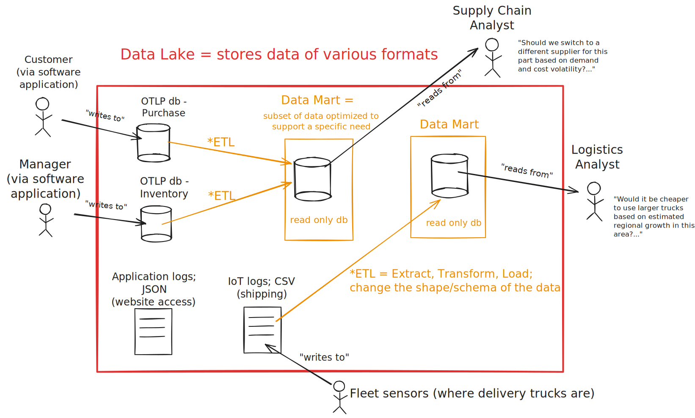

~.toc

- [Data Access Patterns](#data-access-patterns)
  - [Online Transaction Processing (OLTP)](#online-transaction-processing-oltp)
    - [OLTP is designed for:](#oltp-is-designed-for)
    - [OLTP is optimized for:](#oltp-is-optimized-for)
    - [OLTP has the following properties:](#oltp-has-the-following-properties)
  - [Online Analytical Processing (OLAP)](#online-analytical-processing-olap)
    - [OLAP is designed for:](#olap-is-designed-for)
    - [OLAP is optimized for:](#olap-is-optimized-for)
    - [OLAP has the following properties:](#olap-has-the-following-properties)
- [Extracting Value from Data](#extracting-value-from-data)
  - [Data Lake](#data-lake)
  - [Extract, Transform, Load (ETL)](#extract-transform-load-etl)
  - [Data Mart](#data-mart)

/~

# Data Access Patterns

Data may be considered to follow an OLTP or OLAP pattern. These have very different requirements and purposes.

## Online Transaction Processing (OLTP)

What we've covered so far has been focused on OLTP.

### OLTP is designed for:

- Operational / line-of-business applications
- Consumer facing applications

### OLTP is optimized for:

- Fast, concurrent, transactional **writes** (insert, update, delete)
- Normalized schema to eliminate redundancy
- Holds current state of the system
- Protects data integrity!

### OLTP has the following properties:

- Highly normalized
- Highly consistent

_In OLTP the schema designed to keep the data clean and consistent, and prevent data anomalies._

~.focusContent.note

Where OLTP fails for decision support:

- Time span: Often holds current state only
- Granularity: Uses many transactions (queries can "block" other queries, causing performance issues)
- Dimensionality: Normalized → many joins (a simple business question requires a complex query)

/~

## Online Analytical Processing (OLAP)

OLAP often falls under the heading of "**Business Intelligence (BI)**".

### OLAP is designed for:

- Data exploration
- Reporting
- Dashboards
- Analytics
- ...

### OLAP is optimized for:

- Fast concurrent **reads**
- Long-term storage
- Support the needs of a specific business domain (e.g. sales, human resources, logistics, etc.)

### OLAP has the following properties:

- Highly denormalized (tables may be "flat" and look more like the result of a specific SQL query)
- May have calculated and/or derived attributes
- May have many different "views" of the same underlying data
- May have historical or archival data
- Is designed "with the end user in mind"

_In OLAP the schema is designed to answer a specific business question (or set of questions)._

# Extracting Value from Data

<figure>
  
</figure>

## Data Lake

<figure>
  
</figure>

A **data lake** is a cheap scalable place for raw or lightly processed copies from many systems.

May contain:

- Copy of OLTP data (backups, historical, archive data)
  - Application data
- Raw data from non-relational sources (e.g. JSON, XML, CSV, etc.)
  - Logs, events, etc.
- Unstructured data (e.g. images, videos, audio, etc.)
  - Documents, emails, etc.

~.focusContent.note

**Schema-on-read** - unlike more refined points that come later in the system, in a data lake the schema is "raw" and not defined in advance. A schema can be created on the fly as data is consumed.

/~

## Extract, Transform, Load (ETL)

An **ETL** process is a way to extract data from a source system and transform it into a format that is suitable for consumption.

ETL processes are often used to "pipeline" data from a source system to a data warehouse.

- External system to data lake
- Data lake to data warehouse / data mart

The end goal of ETL is to make the data specific, useful, and accessible to the people who need it.

## Data Mart

<figure>
  
  <figcaption>
    Note: I have skipped the explanation of "data warehouse", which is just another intermediate aggregation point in the data pipeline.
  </figcaption>
</figure>

A **data mart** is a repository of data that is typically designed for use by a specific audience for analytical purposes.

Data from a larger dataset is "reshaped" to fit the querying needs of a specific audience. This often involves denormalizing the data - shaping the data to answer a specific business question.

By the time data is used for reporting or exploration, it might be a full copy, a filtered slice, or a blend of sources - depending on who needs it and what they're doing.

> The tradeoff is introducing redundancy in the data to make it more efficient to query.
