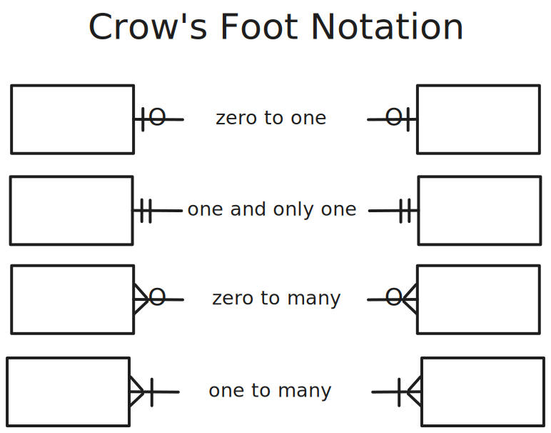

~.toc

- [Cardinality](#cardinality)
  - [Connecting Entities with Cardinality Notation](#connecting-entities-with-cardinality-notation)
  - [Crow's Foot Notation](#crows-foot-notation)
  - [Exercises](#exercises)
  - [Shorthand Notation](#shorthand-notation)

/~

# Cardinality

We've seen how entities can be related to other entities using foreign keys.

**Cardinality** describes how many instances of one entity can be associated with one instance of another entity.

## Connecting Entities with Cardinality Notation

Quantifiers are arranged in pairs to show minimum and maximum possible values. Let's say we have the quantifiers 0 and 1.

This translates to:

> For some entity X there may be at minimum 0 and at maximum 1 instance of entity Y.

## Crow's Foot Notation

**Crow's Foot Notation** provides a quick visual way to identify the cardinalities in a relationship.

The symbol on the inside is the minimum value, and the symbol on the outside is the maximum value.

<figure>
  
</figure>

~.focusContent.example

**Person to Vehicle**

There will be a pair of quantifiers for each direction of the relationship. These are placed at the edges of the relationship.

<figure>
  
</figure>

- Each person is associated with at minimum zero and at most many vehicles.
- Each vehicle is associated with at minimum one and at most one person.

/~

## Exercises

Let's try drawing crow's foot notation for a couple of exercises.

~.focusContent.exercise

**Person to Driver's License**

> A person can have at minimum zero and at most one driver's license.
> A driver's license can be associated with at minimum one and at most one person.

/~

~.focusContent.exercise

**Author to Book**

> An author can be associated with at minimum zero and at most many books.
> A book can be associated with at minimum one and at most one author.

/~

## Shorthand Notation

ERDs should have the full descriptive quantifiers for cardinality; however, it is common to use the following shorthand notations when discussing a relationship at a high level:

| Shorthand | Description  |
| --------- | ------------ |
| 1:1       | One to One   |
| 1:M       | One to Many  |
| M:N       | Many to Many |

In this shorthand, the minimum values are omitted.

~.focusContent.example

**1:1 vs 1:M Scenarios**

From our examples above:

There is a 1:1 relationship between person and driver's license. We ignore the fact that ther may be zero instances of driver's license when casually describing the relationship.

There is a 1:M relationship between author and book. We ignore the fact that there may be zero instances of book when casually describing the relationship.

/~
