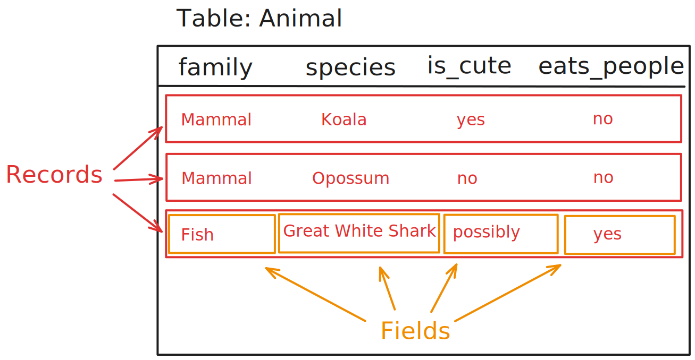

~.toc

- [The Data Hierarchy](#the-data-hierarchy)
  - [Database (Relational)](#database-relational)
  - [Object-Oriented](#object-oriented)

/~

# The Data Hierarchy

Data in an information system is organized into a hierarchy of levels of detail.

Various terms are used, mostly interchangeably, to describe the levels of detail within this hierarchy.

## Database (Relational)

These are the terms that we use to describe data in a "traditional" relational database.

**Database > Table (Entity) > Record (Row) > Field (Column)**

~.firstColLabels

| Term             | Description                                     |
| ---------------- | ----------------------------------------------- |
| Database         | A collection of related tables                  |
| Table (Relation) | A collection of records with the same structure |
| Record (Row)     | A single instance of an entity                  |
| Field (Column)   | A value describing an instance                  |

/~

_Instructor note: I have more commonly heard the terms outside of parenthesis used. These are the terms that I will use._

<figure>
  
</figure>

<figure>

## Object-Oriented

Some terms from object-oriented programming are used to describe data in the data hierarchy. These terms are not used in relational databases, but you will see them in certain file formats (like JSON and XML), and in NoSQL databases.

**Package > Class (Entity) > Instance/Object > Attribute/Property**

~.firstColLabels

| Term               | Description                                  |
| ------------------ | -------------------------------------------- |
| Package            | A group of related classes                   |
| Class              | A blueprint or template for creating objects |
| Instance/Object    | A specific occurrence of a class             |
| Attribute/Property | A value describing an instance               |

/~

\*_Package is not a focus in this course, but is the closest correlate to database._

<figure>
  
</figure>
