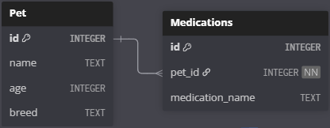

~.toc

- [Document Databases](#document-databases)
  - [Definition](#definition)
  - [Example Databases](#example-databases)
  - [Use Cases](#use-cases)
    - [Self-Contained Data Structure](#self-contained-data-structure)
    - [Hierarchical Data](#hierarchical-data)
    - [Flexible Data](#flexible-data)
    - [Distributed Data](#distributed-data)

/~

# Document Databases

## Definition

**Document databases** store data in documents - self-contained units of data with a flexible structure. This is why JSON is often used to represent documents in document databases.

In contrast to relational databases, which store data in highly structured tables with strictly defined schemas (table and relationship definitions), document databases may contain hierarchies within one "entity".

## Example Databases

<figure>
    <span>
        
    </span>
</figure>

- MongoDB
- Couchbase
- Firebase
- Elasticsearch
- ...

## Use Cases

### Self-Contained Data Structure

Document databases are designed to encapsulate all of the data for an entity rather than "spreading it out" across multiple tables.

Imagine you have a "pet" entity:

`Pet: { id, name, age, breed }`.

You need a way to track the medications for the pet. In a relational database, you would add a new table with a foreign key to the pet:

`Medications: { id, pet_id, medication_name }`.

_Relational Model_

<figure>
    <span>
        
    </span>
</figure>

_Document Model_

In a document database, you can simply add a new property to the document Here is an example pet document:

```json
{
  "id": 1,
  "name": "Spot",
  "age": 1,
  "breed": "Lab",
  "medications": ["Bravecto", "Interceptor"]
}
```

Notice how the document can contain hierarchies - the medications list is a property of the pet document, not a separate table.

~.focusContent.demo

**Firestore Cloud Console**

In this demo your instructor will show you one implementation of a document database - Google's Firestore database.

_Web Application:_ [Step Into Python](https://stepintopython.web.app/)

Show how each exercise is a document in the database, and how attributes map to the UI.

_Application code:_ [App.tsx](https://github.com/mpjovanovich/step-into-python/blob/main/src/App.tsx). See `fetchExercises()` function

Show how a library call is used to fetch the exercises.

/~

### Hierarchical Data

As seen above, a document is a collection of attributes and values.

Since attributes may have another object as a value, this allows for hierarchical data to be stored in a document:

```json
{
  "id": 1,
  "name": "Spot",
  "age": 1,
  "medications": [
    {
      "id": 1,
      "name": "Bravecto",
      "dates_taken": ["2025-10-06", "2025-11-01"]
    },
    {
      "id": 2,
      "name": "Interceptor",
      "renew_date": "2025-12-01"
    }
  ]
}
```

### Flexible Data

Document databases are especially useful for data that is not well defined, such as when:

- We don't know which attributes will be present
- We don't know whether attributes will likely be added, changed, or removed in the future

In a relational database it's an expensive operation to modify the table structure, and it runs a higher risk of breaking the application and introducing bugs.

### Distributed Data

When there is a large volume of data that needs to be available in several regions, document databases can offer better performance than relational databases due to their simpler architecture.
