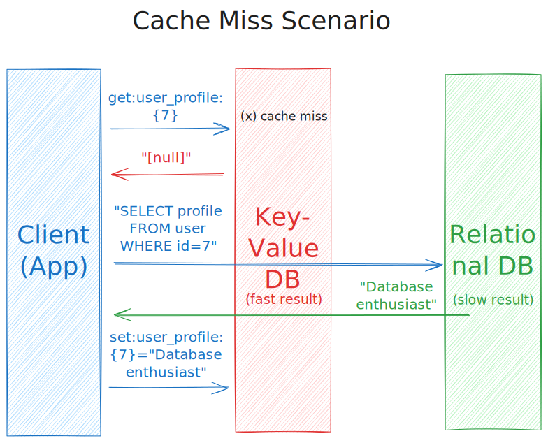
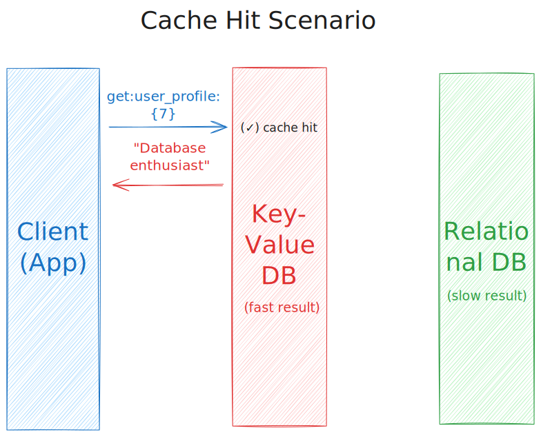

~.toc

- [Key-Value Databases](#key-value-databases)
  - [Definition](#definition)
  - [Example Databases](#example-databases)
  - [Use Cases](#use-cases)
    - [Simple Read and Write](#simple-read-and-write)
    - [High Speed Caching Layer](#high-speed-caching-layer)

/~

# Key-Value Databases

## Definition

**Key-value databases** store data in key-value pairs.

If you have used a Python dictionary before (or from any other programming language), you are familiar with the concept of a value that is retreivable by a unique key; it's simply a lookup table.

The values can be any data type that is supported by the database.

## Example Databases

<figure>
    
        
    
</figure>

- Redis
- DynamoDB
- Couchbase
- ...

## Use Cases

### Simple Read and Write

Key-value databases are designed for extremely fast reads and writes based on a key lookup. The database essentially "saves" any value that's provided using the key as the name to find it with. This makes them very flexible.

~.focusContent.example

**Video View Counts**

Imagine a web application like YouTube or TikTok. Your job is to keep track of the number of views for each video. A key-value database is a good fit for this use case, because:

- The data is fetched and updated frequently; every time a video is played or someone loads the page
- The data does not have complex relationships; it's simply a count of views for a given video

| Key                         | Value  |
| --------------------------- | ------ |
| "video_cat_eating_sandwich" | 134    |
| "video_cat_sleeping"        | 242    |
| "video_cat_insulting_owner" | 999999 |

The application driving what appears on the screen is simply retrieving the value for a given key.

/~

~.focusContent.example

**Recipe Ingredients**

Since we can store any data type, we can use a key-value database to store recipe information that has been serialized into a JSON string.

| Key         | Value                                                                 |
| ----------- | --------------------------------------------------------------------- |
| "apple_pie" | `{"category":"desserts","ingredients":["banana", "apple", "orange"]}` |
| "leek_soup" | `{"category":"soups","ingredients":["leek", "water", "salt"]}`        |

The application then just needs to fetch a recipe by key, and deserialize the JSON string into a JavaScript object.

This way we don't have to create a rigid "recipe" table in a relational database. If we want to add new properties to a recipe, we can simply add them to the JSON string without needing to modify a whole table schema.

/~

### High Speed Caching Layer

Key-value databases are often used as a caching layer for relational databases. This is because it is much faster to look up a query result that has already been computed and stored in the key-value database than it is to run the query again from scratch.

_**Cache Miss:**_

Related file: [cache_miss.excalidraw](files/cache_miss.excalidraw)

<figure>
    
        
    
</figure>

The first time the application requests the data, the key-value database will not have the data in the cache.

1. Application requests data from the key-value database for a given key, "user_profile{7}".
2. The key-value database does not have the data in the cache (a "cache miss").
3. The application runs the query against the relational database.
4. The application stores the data in the key-value database for future requests.

_**Cache Hit:**_

Related file: [cache_hit.excalidraw](files/cache_hit.excalidraw)

<figure>
    
        
    
</figure>

1. Application requests data from the key-value database for a given key, "user_profile{7}".
2. The key-value database has the data (a "cache hit"), and returns the value to the application.
