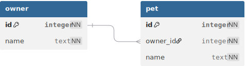

~.toc

- [Natural and Surrogate Keys](#natural-and-surrogate-keys)
  - [Natural Keys](#natural-keys)
    - [Compound Keys](#compound-keys)
  - [Surrogate Keys](#surrogate-keys)
    - [Advantages of Surrogate Keys](#advantages-of-surrogate-keys)
    - [Mental Model for Surrogate Keys](#mental-model-for-surrogate-keys)

/~

# Natural and Surrogate Keys

We learned that each record in a table must have a unique identifier called the **primary key**. What we choose for that key has consequences for the database system.

## Natural Keys

A **natural key** is a unique key that is already present from attributes in the entity:

| Entity         | Natural Key            | Example           |
| -------------- | ---------------------- | ----------------- |
| US Citizen     | Social Security number | 123-45-6789       |
| College Course | Course code            | DBMS 110          |
| Customer       | Email address          | dataLord@info.com |
| Book           | ISBN number            | 9780134214298     |

### Compound Keys

For many entities, there is no single attribute that can uniquely identify the entity. In these cases, we can use a **compound key**, which is a combination of two or more attributes.

| Entity       | Compound Key                  | Example                     |
| ------------ | ----------------------------- | --------------------------- |
| County       | County name and state         | Hamilton, IN                |
| Product      | Product name and manufacturer | banana (organic), Dole Inc. |
| Phone Number | Phone number and type         | 555-555-1234, home          |

~.focusContent.note

**Cautionary Note**

Compound keys in an entity often indicate that the entity is a good candidate to be split into multiple entities. We will do this later when we cover **normalization** techniques.

It's still good to know how to identify compound keys, as you will often encounter data that is in this format.

/~

## Surrogate Keys

Many databases make use of surrogate keys. A **surrogate key** is an artificially created field used to uniquely identify an entity.

This is almost always in the form of an integer that simply increments by 1 for each new entity. Many "number" or "code" fields that you encounter in systems are really surrogate keys:

| Entity        | Surrogate Key | Example                     |
| ------------- | ------------- | --------------------------- |
| Product       | Product ID    | banana (organic), Dole Inc. |
| Employee      | Employee ID   | 23885                       |
| Banking Check | Check number  | 2005                        |

### Advantages of Surrogate Keys

- **Simplicity**
  - Surrogate keys are simple to understand and use.
- **Data Integrity**
  - Surrogate keys are guaranteed to be unique.
- **Performance**
  - Surrogate keys are often _indexed_ by the database system for quick lookups, which can improve performance.

### Mental Model for Surrogate Keys

Imagine you have the following two simplified entities, each using "id" fields as surrogate keys.

<figure>
  
</figure>

You might think of it in the following way:

- "Each owner has unique id and a name."
- "Each pet has unique id and a name."
- "Each pet's owner_id field references (points to) the id of the pet's owner."

~.focusContent.exercise

**Examining the Data**

Using the entities above, let's look at some possible data:

_Owner_

| id  | name              |
| --- | ----------------- |
| 1   | George Washington |
| 2   | Crazy Susan       |
| 3   | Marie Curie       |

_Pet_

| id  | name     | owner_id |
| --- | -------- | -------- |
| 1   | Spot     | 1        |
| 2   | Fluffy   | 3        |
| 3   | Floppy   | 3        |
| 4   | Feathers | 3        |
| 5   | Big Rex  | 2        |

1. Which pets belong to George Washington?
2. Which pets belong to Crazy Susan?
3. Which pets belong to Marie Curie?

/~
