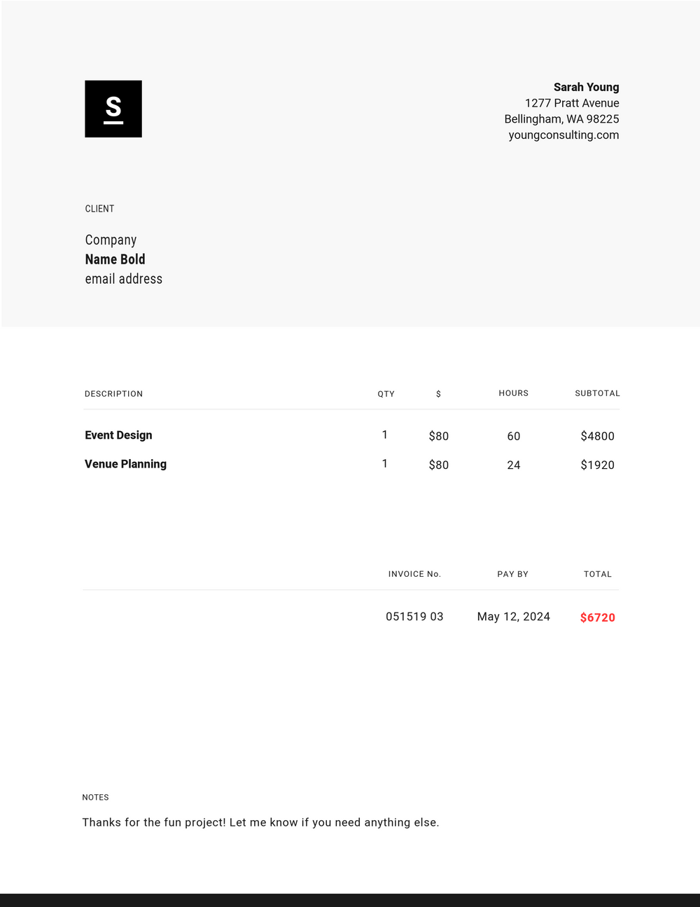

~.toc

- [What is Normalization?](#what-is-normalization)
  - [Motivation](#motivation)
    - [The Problem with Raw Data](#the-problem-with-raw-data)
    - [The Benefits of Normalization](#the-benefits-of-normalization)
  - [Analyzing Requirements Documents](#analyzing-requirements-documents)
    - [Example1: Data Dump](#example1-data-dump)
- [Employee Data Export - Messy Data Dump Example](#employee-data-export---messy-data-dump-example)
    - [Example2: Invoice](#example2-invoice)

/~

# What is Normalization?

**Normalization** is the process of organizing data in a database to reduce redundancy and improve data integrity.

## Motivation

### The Problem with Raw Data

Raw data often comes in a format that is not ideal for storing in a database. This data might contain:

_Bad Data_

- Unintentionally duplicated data
- Inconsistent verbiage (e.g. "car" vs "vehicle")
- Inconsistent casing
- Blanks and empty values
- Typos and misspellings

_Processed or "Grouped" Data_

- Derived / calculated data
- Intentionally duplicated data
- Combined fields that could be further split into multiple fields (e.g. "Full Name")

### The Benefits of Normalization

Normalization helps to ensure that the data are consistent and accurate so that:

- Entities are structured logically and consistently
- Attributes are defined and used consistently
- SQL queries provide accurate and consistent results
- Application logic is more likely to be correct (no bugs from incorrect data)

## Analyzing Requirements Documents

When building an information system we often start with reports or physical documents that describe the data that we need to store.

### Example1: Data Dump

Data that is _exported_ from one system to be _imported_ into another system often comes in the form of a "bulk export" or "data dump". This data requires cleaning before it can be used in the new system.

# Employee Data Export - Messy Data Dump Example

| employee_id | full_name     | dept    | hire_date  | salary     | phone          | manager_name  |
| ----------- | ------------- | ------- | ---------- | ---------- | -------------- | ------------- |
| 001         | John Smith    | IT      | 2020-01-15 | $75,000    | (555) 123-4567 | Sarah Johnson |
| 002         | Jane Doe      | IT      | 2020-01-15 | $75,000    | 555.123.4567   | Sarah Johnson |
| 003         | Mike Brown    | IT      | 2019-03-22 | $82,500.00 | 555-987-6543   | Sarah Johnson |
| 004         | Sarah Johnson | HR      | 2018-07-10 | $95,000    | (555) 456-7890 | NULL          |
| 005         | Lisa Wilson   | Finance | 2022-02-14 | $72,000    | 555 321 9876   | Robert Davis  |
| 007         | Robert Davis  | Finance | 2017-05-30 | $105,000   | (555) 654-3210 | Sarah Johnson |
| 008         | Tom Anderson  | IT      | 2021-08-12 | $71,000    | 555-147-2583   | unknown       |
| 009         | Emily Clark   | HR      | 2020-09-01 | $69,500    | (555) 789-0123 | Sarah Johnson |
| 010         | David Lee     | IT      | 2019-12-01 | $78,000    | 555.258.1470   | Mike Brown    |

~.focusContent.exercise

**Cleaning Up Messy Data**

Looking at the data above, what are some potential issues with the data?

Think about how the data will likely be put into a database.

/~

### Example2: Invoice

Reports often contain **derived data** - data that is calculated or computed based on other data.

<figure>
    
</figure>

~.focusContent.exercise

**Identifying Derived Data**

What entities can we start to identify in invoice above?

Which data in the invoice could be derived (calculated) from other data?

/~
