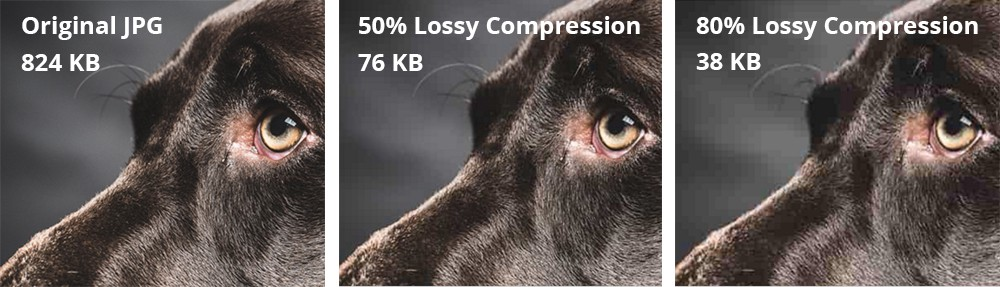

~.toc

- [Software Applications: Types, Uses, and Management](#software-applications-types-uses-and-management)
  - [Types of Applications](#types-of-applications)
    - [Classification of Applications](#classification-of-applications)
      - [Local vs Remote](#local-vs-remote)
      - [Native vs Web](#native-vs-web)
    - [Design Considerations](#design-considerations)
    - [Productivity Applications](#productivity-applications)
    - [Graphics Technologies](#graphics-technologies)
      - [Bitmap/raster graphics](#bitmapraster-graphics)
      - [Vector graphics](#vector-graphics)
      - [Compression](#compression)
  - [Software Business \& Management](#software-business--management)
    - [Payment Models](#payment-models)
    - [Software Distribution Channels](#software-distribution-channels)
    - [Target Markets](#target-markets)
    - [Software Updates and Versioning](#software-updates-and-versioning)

/~

# Software Applications: Types, Uses, and Management

## Types of Applications

### Classification of Applications

Applications may run in a variety of environments, and often it takes multiple machines working together to run a single application.

~.focusContent.note

The line between one category and another can be blurry. There are very few applications that do not use the Internet in some way.

/~

#### Local vs Remote

- **Local**: Applications installed and executed directly on the device's hardware
- **Remote**: Applications that run on a remote server and are accessed over a network, usually through a web browser

#### Native vs Web

- **Native**: Applications built specifically for one operating system or platform, using that platform's own tools and APIs
- **Web**: Applications built using web technologies (HTML/CSS/JavaScript)

~.focusContent.exercise

**Real-World Examples:**

- **Local + Native**: Adobe Photoshop, Microsoft Word (desktop)
- **Remote + Web**: Google Docs, Netflix in browser
- **Local + Web**: Spotify desktop app, Slack desktop app (hybrid)
- **Mobile + Native**: Instagram (iOS/Android app)

/~

### Design Considerations

- **Mobile-first design**: Prioritizing mobile device interfaces
- **Responsive design**: Adapting interfaces to different screen sizes
- **Cross-platform development**: Tools for building across multiple platforms
- **Accessibility (a11y)**: Designing for users with visual, auditory, motor, or cognitive impairments (e.g., screen-reader support, sufficient color contrast, keyboard navigation)
- **Localization (i18n)**: Adapting software for different languages, regions, and cultural conventions

~.focusContent.note

**Why Accessibility Matters**

Many organizations are legally required to meet accessibility standards (e.g., WCAG) for their software and websites, similar to physical accessibility requirements for buildings. Ignoring accessibility isn't just an ethical gap - it's a compliance risk.

/~

### Productivity Applications

Commonly used office software are called **productivity applications**. These include:

- Word processing
- Spreadsheets
- Presentation software
- Email
- Calendar
- Chat & video conferencing (e.g., Slack, Microsoft Teams, Zoom)
- Cloud storage & real-time collaboration (e.g., shared drives, co-authoring, version history)
- AI-assisted tools (e.g., Copilot in Office, Gemini in Google Workspace) - increasingly built directly into the categories above rather than standing apart as their own product

~.focusContent.demo

**Spreadsheet Tips and Tricks:**

Demo1: Basic Formulas

| Tax Rate:   | 15%     |                  |                |
| ----------- | ------- | ---------------- | -------------- |
| Item        | Price   | Tax Amount       | Total          |
| ----------- | ------- | ---------------- | -------------- |
| Item 1      | 10.00   | =B3\*$B$1        | =B3+C3         |
| Item 2      | 25.00   | =B4\*$B$1        | =B4+C4         |
| Item 3      | 15.00   | =B5\*$B$1        | =B5+C5         |
| Item 4      | 50.00   | =B6\*$B$1        | =B6+C6         |
| Grand Total |         |                  | =SUM(D3:D6)    |

AI tools can now generate formulas like these for you - but you still need to be able to read a formula and verify it's doing what you expect. Treat the walkthrough below as building that "read and verify" skill.

Demo2: [Kaggle CVE 2024 Database: Exploits, CVSS, OS](https://www.kaggle.com/datasets/manavkhambhayata/cve-2024-database-exploits-cvss-os)

- Auto set column widths
- Bold top row
- Freeze top row
- Filter OS to "Google Android 13.0, Google Android 12.0"
- Sort by CVSS
- Remove filter

/~

~.focusContent.note

Several common keyboard shortcuts are fairly universal, and are essential for productivity. Here are my recommendations in order of priority:

| Shortcut | Action        |
| -------- | ------------- |
| Ctrl+S   | Save          |
| Ctrl+Z   | Undo          |
| Ctrl+C   | Copy          |
| Ctrl+X   | Cut           |
| Ctrl+V   | Paste         |
| Ctrl+A   | Select all    |
| Ctrl+F   | Find          |
| Ctrl+B   | Bold          |
| Ctrl++   | Increase zoom |
| Ctrl+-   | Decrease zoom |

/~

### Graphics Technologies

#### Bitmap/raster graphics

<figure>
    
        
    
</figure>

Pixel-based images. Best for smooth gradients and natural images like photographs.

- JPEG
- PNG
- GIF
- WebP

~.focusContent.note

**Choosing a Raster Format**

| Format | Best For                                             |
| ------ | ---------------------------------------------------- |
| JPEG   | Photographs; smaller files, some quality loss        |
| PNG    | Images needing transparency; lossless                |
| GIF    | Simple animations; limited color palette             |
| WebP   | Modern general-purpose format; smaller than JPEG/PNG |

/~

#### Vector graphics

<figure>
    
        
    
</figure>

Mathematical formula-based images. Best for simple shapes with hard edges (illustrations, logos, diagrams) and text.

- SVG

~.focusContent.exercise

**Examining an SVG Image**

Let's try saving the SVG image above and opening it in a text editor to see the mathematical formula that defines it!

/~

#### Compression

Compression is the process of reducing the size of a file or data. This is useful for saving space and for transmitting data more quickly.

Compression isn't limited to images - general-purpose archive formats like ZIP and 7z compress any kind of file losslessly, while formats like MP3 (audio) and MP4/H.264 (video) use lossy compression to shrink media files.

<figure>
    
        
    
</figure>

There are two types of compression:

| Compression Type | Description                                                                                                                |
| ---------------- | -------------------------------------------------------------------------------------------------------------------------- |
| Lossless         | The original data can be perfectly reconstructed from the compressed data.                                                 |
| Lossy            | The original data cannot be perfectly reconstructed from the compressed data. Information is discarded during compression. |

It may seem as if we should always use lossless compression, but in many cases, the quality difference is not noticeable, and the file size is significantly reduced.

Lossy compression is most visible in JPEG images, where the image can become _pixelated_ at lower quality settings. These out of place pixels are called _artifacts_.

~.focusContent.lookout

**Sending High Quality Images**

If you've ever saved the image from a text message and tried to open it on a computer with a larger screen, you may have noticed that the image is pixelated. This is because the image was compressed using lossy compression for the smaller screen of the phone.

If you need to send a high quality image to someone, you should send the original image file, not a compressed version.

/~

## Software Business & Management

### Payment Models

- **Perpetual License**: One-time purchase for indefinite use
  - Traditional retail software packages
  - May include optional paid upgrades for new versions
- **Subscription**: Recurring payment for continued access
  - Software as a Service (SaaS)
  - Usually includes continuous updates and cloud features
- **Freemium**: Core features are free, with paid tiers for advanced features or removing limits
  - Common in mobile apps and consumer SaaS
  - May monetize through in-app purchases, ads, or upgrade prompts
- **Volume/Enterprise Licensing**: Businesses purchase licenses in bulk, or a flat "site license," to cover many users at once - often at a discounted per-seat rate

~.focusContent.note

**Licensing Agreements**

Agreeing to pay for software is different from agreeing to its **End User License Agreement (EULA)** or **Terms of Service (ToS)**. These agreements govern how you're allowed to use the software - what data it collects, who's liable if something goes wrong, and whether you can redistribute or reverse-engineer it. Clicking "I Agree" is a legal commitment, even when no money changes hands.

/~

~.focusContent.note

**Open Source Software**

Open source vs. closed source is a separate, independent classification from the payment models above - an open source project can still be sold commercially, and a free product isn't necessarily open source.

Open source software is software who's source code is available to the public, usually online. Although it is often free, it is not always free.

Some advantages of open source software include:

- **Flexibility**: Can be easily modified to meet specific needs
- **Transparency**: Source code is publicly available for scrutiny. Free testing and development by many people.
- **Community**: Many open source projects have large communities of users who contribute to the project.

Example: [GIMP](https://github.com/GNOME/gimp)

/~

### Software Distribution Channels

How software reaches users varies by platform and audience:

- **App Stores**: Centralized marketplaces (Apple App Store, Google Play, Microsoft Store) that handle discovery, installation, and updates
- **Direct Download**: Downloading an installer directly from the vendor's website
- **Enterprise Deployment**: IT departments push software to many devices at once using Mobile Device Management (MDM) or similar tools
- **Package Managers**: Command-line tools (e.g., apt, Homebrew, npm) that install and manage software and its dependencies, common in open source ecosystems

### Target Markets

- **Business-to-Consumer (B2C)**
  - Personal productivity tools (e.g., Microsoft 365 Personal)
  - Mobile apps
  - Consumer creative software
- **Business-to-Business (B2B)**
  - Enterprise software solutions
  - Custom-developed applications
  - Professional tools and services

### Software Updates and Versioning

With **semantic versioning**, software versions are typically written as `MAJOR.MINOR.PATCH`.

- **Major version**: Significant changes to the software. Breaks backward compatibility. Other tools that use this software may not be able to use it after updating.
- **Minor version**: New features or improvements. Compatible with previous version.
- **Patch version**: Bug fixes and security updates. Compatible with previous version.

Software is also often labeled by release stage:

- **Alpha**: Early, unstable version for internal testing
- **Beta**: Feature-complete but still being tested; often released to a limited public audience
- **Release Candidate (RC)**: Believed ready for release, pending final testing
- **Long-Term Support (LTS)**: A release that receives updates and support for an extended period, favored for stability over having the newest features (e.g., Ubuntu LTS)

~.focusContent.lookout

**End-of-Life (EOL) Software**

Every version of software eventually stops receiving updates, including security patches. Running EOL software is a common cause of security breaches - if you're still using something past its support lifecycle, it's time to upgrade.

/~

~.focusContent.exercise

**Check-In: Major, Minor, or Patch?**

Match each change below to the correct type of version bump: **Major**, **Minor**, or **Patch**.

1. Fixed a typo in a menu label
2. Added a new "dark mode" setting that doesn't affect existing features
3. Changed a file input format; as a result, older versions of a connected tool can no longer open the old file format.

/~
