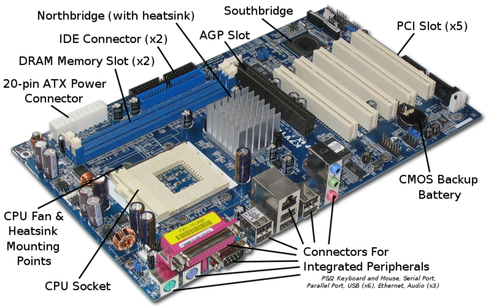
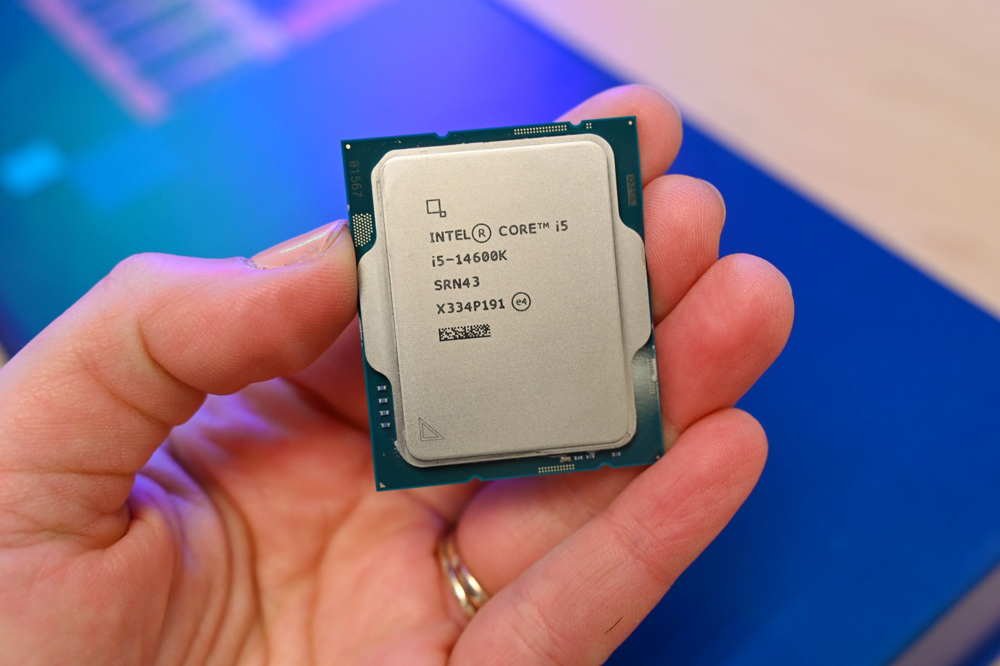
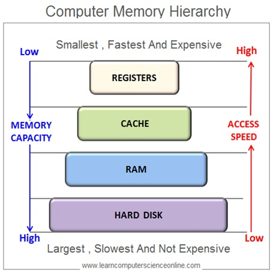
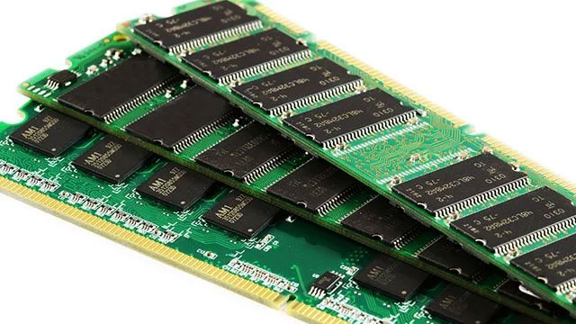

~.toc

- [Computer Hardware: How It Works](#computer-hardware-how-it-works)
  - [Introduction: Understanding the Basics](#introduction-understanding-the-basics)
    - [Bits and Bytes: The Foundation of Computing](#bits-and-bytes-the-foundation-of-computing)
  - [Computer System Components](#computer-system-components)
    - [Form Factors](#form-factors)
    - [Chassis](#chassis)
    - [Motherboard](#motherboard)
    - [System Bus](#system-bus)
    - [CPU (Central Processing Unit)](#cpu-central-processing-unit)
  - [Memory](#memory)
    - [Registers](#registers)
    - [Cache](#cache)
    - [Random Access Memory (RAM)](#random-access-memory-ram)
    - [Storage Devices](#storage-devices)

/~

# Computer Hardware: How It Works

## Introduction: Understanding the Basics

### Bits and Bytes: The Foundation of Computing

- **What are bits?** Single binary digits (0 or 1) - the smallest unit of data
- **What are bytes?** 8 bits grouped together - can represent 256 different values
- **Why it matters:** All data on your computer—text, images, video, programs—is stored and processed as collections of bits and bytes
- **Practical takeaways:**
  - Understanding data sizes helps you make informed decisions about storage needs and processing requirements

## Computer System Components

~.focusContent.note

**Compute vs. I/O Performance**

As we move through these notes, we'll talk about **compute** and **I/O** performance.

- **Compute performance:** Raw processing power (CPU/GPU)
- **I/O (input/output) performance:** How quickly data moves between components
- **Bottlenecks:** System performance is limited by the slowest component
- **Practical takeaways:**
  - Balanced systems perform better than those with one very high-end component but weaker supporting hardware

/~

### Form Factors

- **What is a form factor?** The physical size, shape, and specification of computer hardware
- **Common form factors:**
  - Desktop towers (full, mid, mini)
  - All-in-ones
  - Laptops (standard, ultrabooks)
  - Tablets and convertibles
- **Practical takeaways:**
  - Form factor affects upgradability, portability, and cooling capacity

### Chassis

- **What is it?** The physical case that houses all internal components
- **Functions:**
  - Physical protection
  - Airflow management
  - Component organization
  - Noise reduction
- **Practical takeaways:**
  - A quality chassis improves cooling efficiency and can extend component lifespan

### Motherboard

<figure>
    
        
    
</figure>

- **What is it?** The main circuit board that connects all components
- **Functions:**
  - Provides physical connection points for all components
  - Contains chipsets that control data flow
  - Houses BIOS/UEFI (basic input/output system)
- **Practical takeaways:**
  - The motherboard determines what components are compatible with your system and future upgrade options

### System Bus

- **What is it?** Communication pathways that transfer data between components
  - Not an individual component; it is a specification of the motherboard
- **32-bit vs 64-bit systems:**
  - 64-bit systems can address more RAM (>4GB) and process larger chunks of data per instruction than 32-bit systems
- **Practical takeaways:**
  - 64-bit systems are standard now and necessary for modern computing tasks

### CPU (Central Processing Unit)

<figure>
    
        
    
</figure>

- **What is it?** The "brain" of the computer that executes instructions
- **Key specifications:**
  - Clock speed (GHz)
  - Cores - independent processing units
  - Cache - fast memory for quick data access
- **Heat management:**
  - Heat sinks and fans dissipate heat
  - Thermal paste improves heat transfer
  - Overheating reduces performance and lifespan
- **Practical takeaways:**
  - For most everyday tasks, multi-core performance is more important than raw clock speed

~.focusContent.note

**System Clock and Clock Speed**

- **What is it?** Internal timing mechanism that synchronizes operations
- **Clock speed measurement:**
  - Measured in GHz (billions of cycles per second)
  - Higher is generally better, but not the only factor
- **Practical takeaways:**
  - CPU architecture efficiency often matters more than raw clock speed

/~

## Memory

<figure>
    
        
    
</figure>

~.focusContent.note

**Computer Latency in Perspective**

Computers are so fast that it can be difficult to understand the latency of different components. Let's put the relative latency of different components into a human scale:

| Component          | Latency (Round Trip Fetch) | Activity                                    |
| ------------------ | -------------------------- | ------------------------------------------- |
| CPU Registers      | 1 minute                   | Fetch something from your desk              |
| L1 Cache           | 4 minutes                  | Fetch something from other side of building |
| L2 Cache           | 10 minutes                 | Fetch something from another building       |
| L3 Cache           | 50 minutes                 | Fetch something from a nearby town          |
| RAM                | 4 hours                    | Fetch something from another state          |
| SSD                | 1-2 days                   | Fetch something from across the country     |
| HDD                | 5-7 days                   | Fetch something from another country        |
| Network (Internet) | 2-4 weeks                  | Fetch something from another continent      |

/~

### Registers

**Registers** are temporary storage for the CPU to work with as it performs calculations.

- Registers aren't an individual component; they are built into the CPU.
- Extremely fast, because they are in the "working space" of the CPU.
- Very small amount - roughly 128-256 bytes
- **Practical takeaways:**
  - Registers are fundamental to the operation of the CPU; they are not a specification that is listed by CPU manufacturers.
  - You do not need to consider this specification when buying a CPU for most everyday computing tasks.

### Cache

**Cache** is a type of memory that stores copies of frequently used data from RAM.

- Also not an individual component; it's built into the CPU.
- Cache is faster than RAM, but smaller and more expensive.
- Cache is used to store copies of frequently used data from RAM.
- Avoids need for longer trip to RAM for frequently used data.
- Different types (L1, L2, L3) have to do with the speed of the cache and the size.
- **Practical takeaways:**
  - Cache becomes important for high-performance computing and specialized computers (e.g. servers)
  - When buying a CPU, you can see the cache size as a specification.

### Random Access Memory (RAM)

<figure>
    
        
    
</figure>

- **What is it?** Temporary memory that stores active data for quick access
- **Characteristics:**
  - Volatile (clears when power is off)
  - Much faster than disk storage
  - Different speeds and types (DDR4, DDR5)

**How Much RAM Do You Need?**

| Amount | Typical Use                                                     |
| ------ | --------------------------------------------------------------- |
| 8GB    | Web browsing, office work, light multitasking                   |
| 16GB   | Everyday multitasking, photo editing, moderate gaming           |
| 32GB+  | Video editing, 3D rendering, virtualization, heavy multitasking |

- **Practical takeaways:**
  - Insufficient RAM causes system slowdowns when multitasking
  - Often the most cost-effective upgrade for improved performance
  - Match RAM to your workload - more isn't wasted, but returns diminish quickly past what you actually use

### Storage Devices

- **Types of storage:**
  - HDD (Hard Disk Drive) - mechanical, slower, cheaper per GB
  - SSD (Solid State Drive) - no moving parts, faster, more reliable
  - NVMe drives - fastest current storage technology
- **Disk vs Cloud:**
  - Local storage: faster access, works offline, one-time cost
  - Cloud storage: accessible anywhere, automatic backup, subscription model
- **Practical takeaways:**
  - An SSD for your operating system and programs provides the most noticeable speed improvement for any computer
