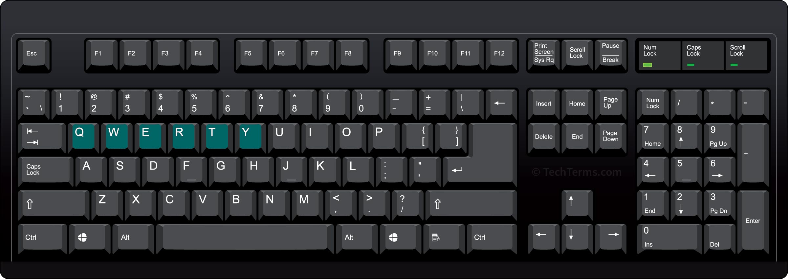
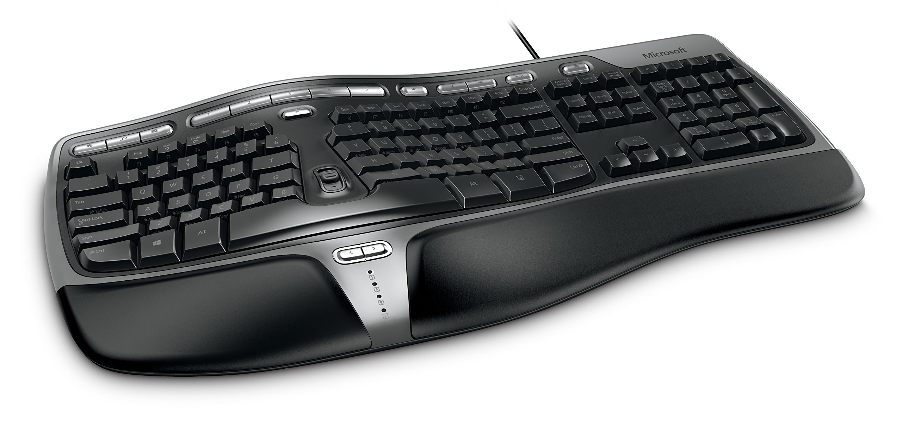
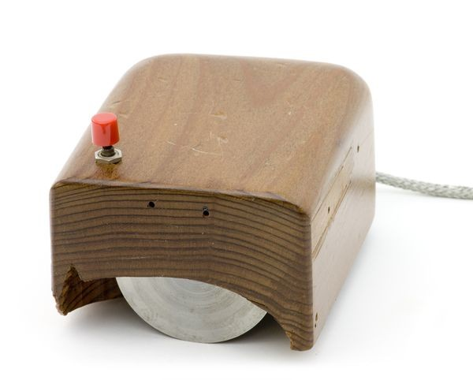
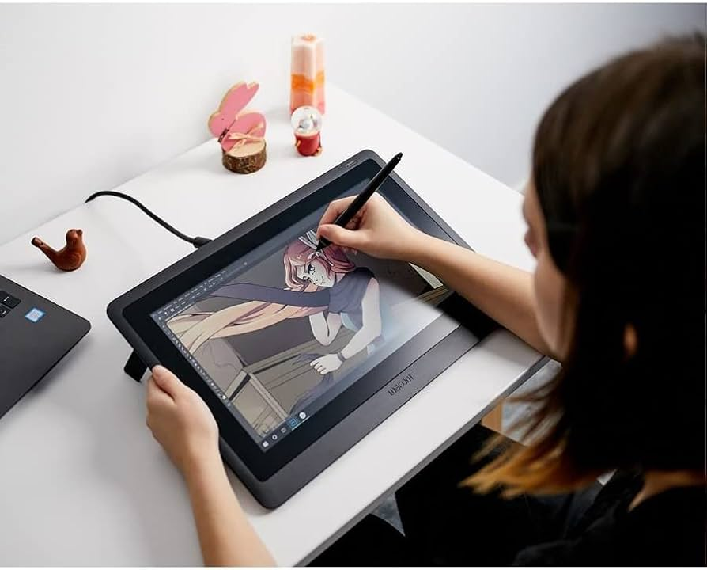
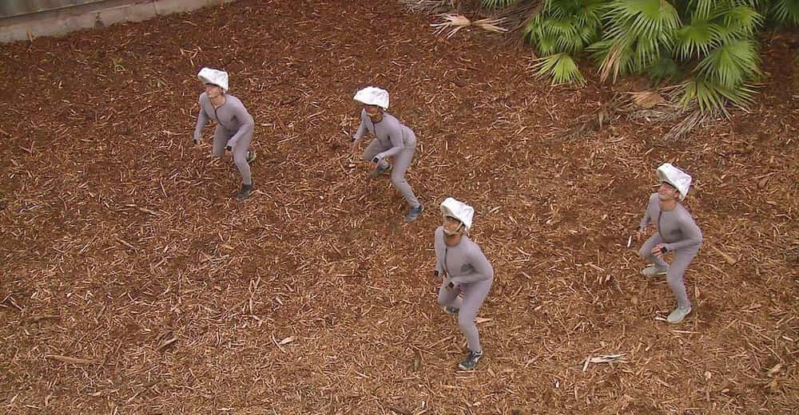
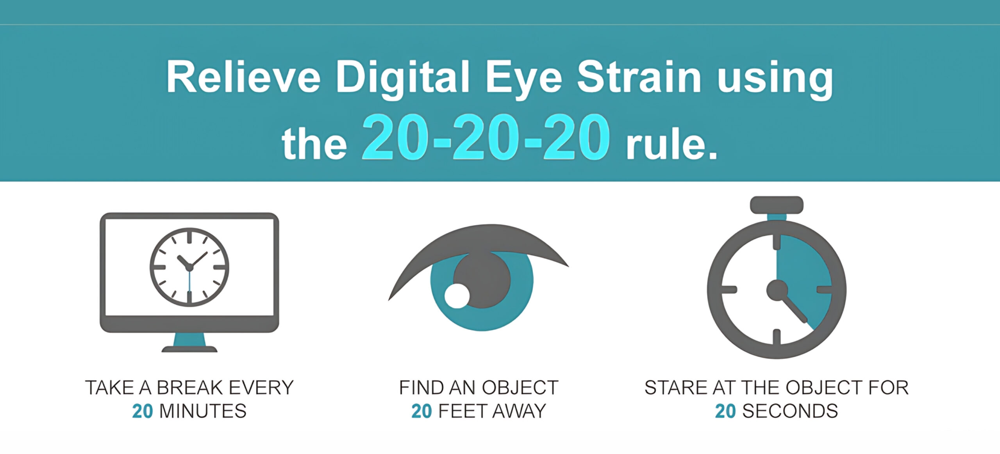
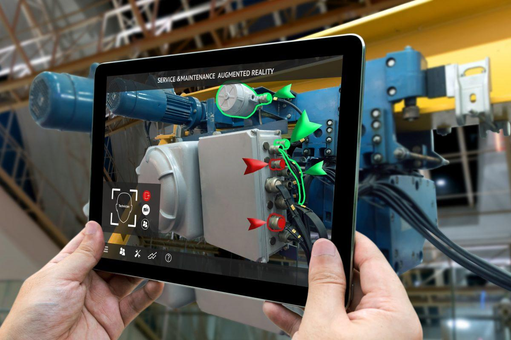

~.toc

- [Input \& Output Technologies](#input--output-technologies)
  - [Input](#input)
    - [Keyboards](#keyboards)
    - [The Mouse](#the-mouse)
    - [Touch Technologies](#touch-technologies)
    - [Pen Input](#pen-input)
    - [Voice and Audio Input](#voice-and-audio-input)
    - [Video and Imaging Input](#video-and-imaging-input)
    - [Motion Input Systems](#motion-input-systems)
    - [Locational Technologies](#locational-technologies)
  - [Output](#output)
    - [Print Technologies and Materials](#print-technologies-and-materials)
    - [Display Technologies](#display-technologies)
    - [Audio Output](#audio-output)
  - [Future Trends and Technologies](#future-trends-and-technologies)
    - [Emerging Input Methods](#emerging-input-methods)

/~

# Input & Output Technologies

IO devices go beyond the keyboard, mouse, and screens. Almost all modern technology has some kind of embedded computer system, which relies on input, and responds with output.

- **Input:** Entering data into the computer system
- **Processing:** The computer's handling of that data
- **Output:** The production of usable information

## Input

### Keyboards

<figure>
    
        
    
</figure>

- One of the first IO devices (before the mouse)
- **Beyond QWERTY:**
  - Dvorak, Colemak, and other alternative layouts — measurably faster typing, never displaced QWERTY
  - Lock-in: retraining cost outweighs the speed gain for almost everyone

<figure>
    
        
    
</figure>

- **Specialized keyboards:**
  - Ergonomic designs: Split, contoured, vertical
  - Programmable keys and customization potential
  - Accessibility: one-handed, large-key, and eye-tracking keyboards

~.focusContent.note

_Why are the Keys this Way?:_

The QWERTY layout was designed in the 1870s to keep the type bars on early typewriters from jamming together when typists hit keys too quickly. Typewriters haven't jammed in decades, but QWERTY outlived the problem it solved by about 150 years — the cost of retraining everyone has always outweighed the benefit of switching.

/~

### The Mouse

<figure>
    
        
    
</figure>

~.focusContent.note

_A Wooden Mouse:_

The first computer mouse was made of wood in the 1960s.

/~

- **Mouse variations:**

  - **_Optical_**: Uses LED light and optical sensor to track movement on most surfaces
  - **_Laser_**: Higher precision tracking using laser technology
  - **_DPI (Dots Per Inch)_**:
    - Specification that determines mouse cursor movement sensitivity; may want higher DPI for precision editing
  - Accessibility: trackball and joystick mice serve users with limited dexterity

- **Touchpads**
  - Multi-touch gesture support (scroll, zoom, rotate)
  - Offer _**gesture**_ support
  - Common in laptops but also available as standalone devices

### Touch Technologies

Most modern touchscreens are _**capacitive**_ — rather than responding to pressure, they detect the electrical conductivity of your finger disrupting the screen's electrical field.

~.focusContent.note

_Why Touchscreens Sometimes Don't Respond:_

Capacitive touch relies on conductivity, so anything that insulates your finger breaks the connection:

- Wearing gloves
- Wet hands
- Plastic screen protectors
- Moisture or pressure around the screen's edges (can disrupt part of the field)

/~

~.focusContent.exercise

**Check-In:**

List one device aside from computers, tables, and phones that uses touch as an input method.

/~

### Pen Input

<figure>
    
        
    
</figure>

- **Professional applications:**
  - Graphics tablets
  - Digital annotation and note-taking
  - Digital signatures
- **Practical takeaway:** Handwritten digital notes improve retention compared to typing (research-backed). This also applies to traditional pen and paper note taking.

### Voice and Audio Input

Voice input lets a device act on spoken language instead of typed or clicked commands.

~.focusContent.note

_Voice Recognition:_

With modern voice regognition, devices are more likely to understand you if you speak naturally than if you over-enunciate.

This is due to _**machine learning**_, which teaches computers how to understand based on actual samples of human speech rather than "dissecting" parts of sounds.

The computer takes into account:

- _**Phonetics**_ - the individual sounds of your speech
- _**Prosody**_ - the rhythm and intonation of your speech
- _**Context**_ - the context of words within speech

/~

- **Real-world applications:**
  - Accessibility: often the primary input method for users with motor impairments
  - Transcription (e.g. YouTube captions)
  - Linguistic translation

### Video and Imaging Input

Cameras and image sensors turn visual information into data a system can act on.

- **Professional applications:**

  - Video conferencing
  - Security cameras
  - Quality control (AI-powered manufacturing inspection)

- **Other interesting applications:**

  - Sports player analysis (facial expressions, movement patterns, stress indicators)
  - Wildlife research (automated species identification)

- **Practical takeaway:** Lighting affects camera quality more than most hardware upgrades. Try adjusting lighting before buying a new webcam.

### Motion Input Systems

<figure>
    
        
    
    <figcaption>
        
Velociraptors...

    </figcaption>
</figure>

~.focusContent.note

_From Medicine to Video_

Motion capture, or "mocap," started as a tool for studying human movement patterns and biomechanics, particularly in fields like gait analysis.

/~

- **Common Applications:**
  - Digital animation
  - Medical rehabilitation (Step and limb movement tracking)
  - Security systems (_**LIDAR = Light Detection and Ranging**_)

### Locational Technologies

GPS uses a network of satellites to determine a device's position on Earth.

~.focusContent.note

_Einstein and GPS:_

GPS satellites must account for Einstein's theory of relativity! The satellites' atomic clocks run slightly faster (about 38 microseconds per day) than Earth-based clocks due to weaker gravitational forces in orbit.

Without compensating for this effect, GPS would cause a position error on Earth of about 11 kilometers per day.

/~

- **Global Positioning System (GPS):**

  - Satellite-based navigation
  - Precision within meters
  - Used in navigation, tracking, and timing applications

- **Indoor Positioning Systems:**

  - RFID/NFC - short-range identification (access cards, payments)
  - QR codes - visual scanning for location/information
  - Wi-Fi/Bluetooth - device tracking and navigation

- **Applications:**

  - Navigation and wayfinding
  - Asset tracking (shipping, fleet tracking, inventory, etc.)
  - Location-based services (recommendations, etc.)
  - Emergency response (search and rescue, COVID-19 contact tracing)
  - _**Geofencing**_ - a virtual boundary around a geographic area that triggers an action when a device enters or leaves it (e.g. an alert when a fleet vehicle leaves its assigned route)

## Output

### Print Technologies and Materials

<iframe width="560" height="315" src="https://www.youtube.com/embed/NM8z7j7yUHE?si=2YvEVFZH036vR3Qp" title="YouTube video player" frameborder="0" allow="accelerometer; autoplay; clipboard-write; encrypted-media; gyroscope; picture-in-picture; web-share" referrerpolicy="strict-origin-when-cross-origin" allowfullscreen></iframe>

- **Paper printers:** Documents, labels, and receipts remain a standard output in business, healthcare, and retail settings
- **3D printers:** Convert a digital model directly into a physical object, used for prototyping and increasingly for manufacturing small production runs

### Display Technologies

- **Modern Display Types:**
  - _**LCD (Liquid Crystal Display)**_ and _**LED (Light Emitting Diode)**_: Common in laptops and monitors
  - _**OLED (Organic Light Emitting Diode)**_: Better contrast, used in phones and high-end displays
  - _**E-ink (Electrophoretic Ink)**_: Paper-like display used in e-readers
  - Accessibility: high-contrast modes, E-ink's paper-like readability, and screen magnification support low-vision users

~.focusContent.lookout

_Eye Strain Tip:_

<figure>
    
        
    
</figure>

Working on a screen can cause:

- Dry eyes
- Blurred / unfocused vision
- Headaches / migraines

/~

### Audio Output

- **Professional applications:**

  - Conferencing
  - Media creation/production

- Accessibility: captions and audio description are output-side accessibility — the counterpart to voice input, above

- **Other interesting applications:**

  - Active _**SONAR**_ (Sound Navigation and Ranging)
    - Geolocation
    - Topographic mapping
    - Military applications

## Future Trends and Technologies

### Emerging Input Methods

<figure>
    
        
    
</figure>

- **Augmented reality:**
  - Information overlay on top of real-world view
- **Virtual reality:**
  - Complete immersion in a simulated environment
- **Brain-computer interfaces:**
  - New non-invasive modalities
  - Physical applications (restoring paralyzed limbs, ALS or "locked-in syndrome" communication, neurological monitoring)
  - Cognitive applications (attention, working memory, treatment of PTSD and depression)

~.focusContent.exercise

**Check-In:**

Think of one application where augmented reality is currently being used, or may be used in the future.

/~
