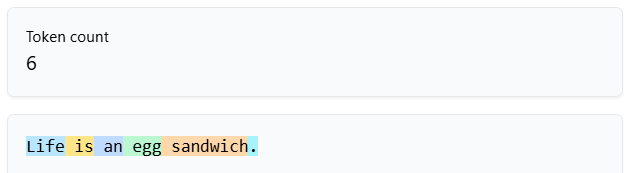
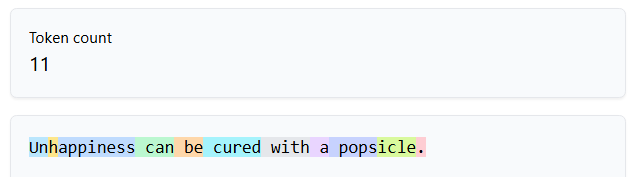
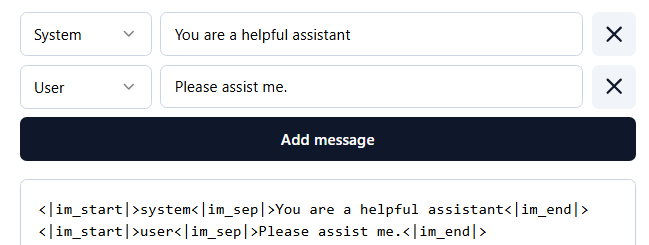
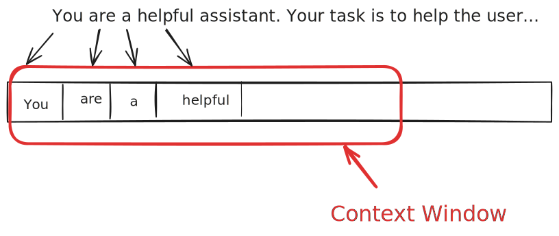

~.toc

- [Large Language Models](#large-language-models)
  - [What is an LLM?](#what-is-an-llm)
    - [LLMs Are Not Databases](#llms-are-not-databases)
  - [Key Concepts Vocabulary](#key-concepts-vocabulary)
    - [Tokenization](#tokenization)
    - [Context Window](#context-window)
    - [The System Prompt](#the-system-prompt)
    - [Knowledge Cutoffs](#knowledge-cutoffs)
  - [Training Process](#training-process)
    - [Pre-training](#pre-training)
    - [Post-training (Fine-tuning)](#post-training-fine-tuning)
    - [Safety Considerations](#safety-considerations)

/~

# Large Language Models

## What is an LLM?

<figure>
    
        
    
</figure>

**Large Language Models (LLMs)** are a kind of AI that are trained to predict the next word in a sequence of text.

They are the technology behind tools like ChatGPT, Claude, and Google Gemini.

~.focusContent.note

**Key Insight**: LLMs are fundamentally prediction engines, not databases or search engines.

Think of it like an extremely sophisticated autocomplete:

- You type: "The weather today is..."
- Your phone suggests: "nice" or "sunny"
- An LLM can continue: "quite pleasant with temperatures reaching 72°F and light winds from the southwest"

/~

### LLMs Are Not Databases

This is crucial to understand:

| Database                  | LLM                           |
| :------------------------ | :---------------------------- |
| Stores exact information  | Generates probable responses  |
| Retrieves facts precisely | Predicts likely continuations |
| Always consistent         | May vary between responses    |
| Can cite sources          | May "hallucinate" information |

**Hallucination**: When an LLM generates information that sounds plausible but is factually incorrect.

## Key Concepts Vocabulary

### Tokenization

**Token**: The basic unit of text that an LLM processes - roughly equivalent to words, but not exactly.

~.focusContent.exercise

Open up the following link and try out a few sentences: [https://tiktokenizer.vercel.app/](https://tiktokenizer.vercel.app/)

You'll see that:

- Each meaningful part of a word is a token

<figure>
    
        
    
</figure>

<figure>
    
        
    
</figure>

- The model knows who is speaking by wrapping the actual messages in special tokens (e.g. `<|user|>` and `<|assistant|>`)

<figure>
    
        
    
</figure>

/~

### Context Window

<figure>
    
        
    
</figure>

The **context window** is the amount of text an LLM can "remember" and work with at one time - like the model's working memory.

It operates like a sliding window that moves through the text as the model generates responses.

**Current Context Window Sizes**:

| Model             | Developer  | Context Window Size | Notes                       |
| ----------------- | ---------- | ------------------- | --------------------------- |
| Claude 4 Opus     | Anthropic  | 200,000 tokens      | Latest flagship model       |
| Claude 4 Sonnet   | Anthropic  | 200,000 tokens      | Current model               |
| Claude 3.5 Sonnet | Anthropic  | 200,000 tokens      | Previous generation         |
| GPT-4 Turbo       | OpenAI     | 128,000 tokens      | Latest GPT-4 variant        |
| GPT-4o            | OpenAI     | 128,000 tokens      | Multimodal model            |
| Gemini 1.5 Pro    | Google     | 2,000,000 tokens    | Exceptionally large context |
| Gemini 1.5 Flash  | Google     | 1,000,000 tokens    | Faster variant              |
| Llama 3.1 405B    | Meta       | 128,000 tokens      | Open source flagship        |
| Llama 3.1 70B     | Meta       | 128,000 tokens      | Open source alternative     |
| Mixtral 8x22B     | Mistral AI | 65,000 tokens       | Mixture of experts          |

**Why This Matters**:

- The model can only reference information within its current context
- Larger context windows allow for more complex tasks
- The more context the model is using, the more computationally expensive it is to generate a response

### The System Prompt

The **system prompt** is a special prompt that guides the assistant's behavior. This is typically used to start any conversation with a chatbot.

Anthropic's system prompts for Claude may be found here: [Claude System Prompts](https://docs.anthropic.com/en/release-notes/system-prompts). Note how this has changed between the first version and the latest!

~.focusContent.demo

The system prompt applies to the web interface for a given model, but there are ways to customize the overall tone and behavior of the model.

Let's build a custom chatbot: [chatbot.py](https://github.com/mpjovanovich-IvyTechDemos/misc/blob/main/chatbot.py)

/~

### Knowledge Cutoffs

**Knowledge cutoff**: The date after which the LLM has no information about world events.

For example:

- GPT-4: October 2023

**Why This Matters**:

- LLMs can't tell you about recent events (without tool use)
- Information about rapidly changing topics may be outdated
- Always verify recent information from current sources

## Training Process

LLMs are created through a multi-stage training process:

### Pre-training

**Goal**: Teach the model to predict the next word

**Process**:

1. Gather massive amounts of text from the internet (books, articles, websites)
2. Train the neural network to predict the next word in sequences
3. This creates a "base model" that understands language patterns

**Training Data Sources**:

- Web pages and articles
- Books and literature
- Academic papers
- Reference materials
- Code repositories

**Result**: A model that can complete text but may not be helpful or safe for conversations.

The models from pre-training are not released to the public. These are not the finished product.

### Post-training (Fine-tuning)

**Goal**: Make the model helpful, harmless, and honest. Focus it on a specific task.

**Key Techniques**:

**Supervised Fine-tuning**:

- Human trainers create example conversations
- Model learns to follow instructions and be helpful

**Reinforcement Learning from Human Feedback (RLHF)**:

- Human raters rank different model responses
- Model learns to generate responses humans prefer
- Helps align the model with human values

**Result**: A conversational AI that can follow instructions, admit uncertainty, and refuse harmful requests.

### Safety Considerations

A final step prior to releasing models to the public is to ensure the model is safe to use.

Currently, the greatest danger to the public is not rogue AI behavior, but humans using the technology to do bad things. This may change as models are given more freedom and capabilities.

~.focusContent.note

Antropic has published a report of their safety studies on the model. The report shows how early and unfiltered versions of the model behave in potentially problematic scenarios, and highlights how the AI think in ways that are much different from human beings:

[Claude 4 System Card](https://www-cdn.anthropic.com/4263b940cabb546aa0e3283f35b686f4f3b2ff47.pdf)

/~
