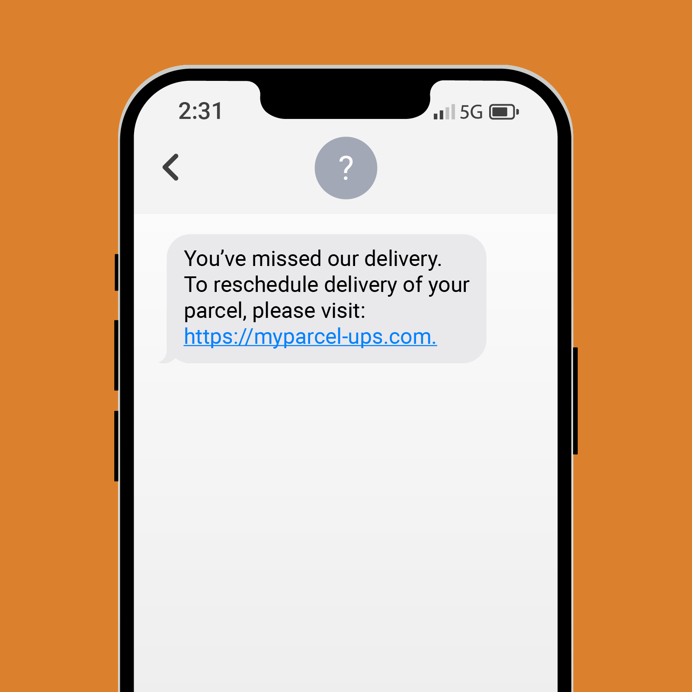
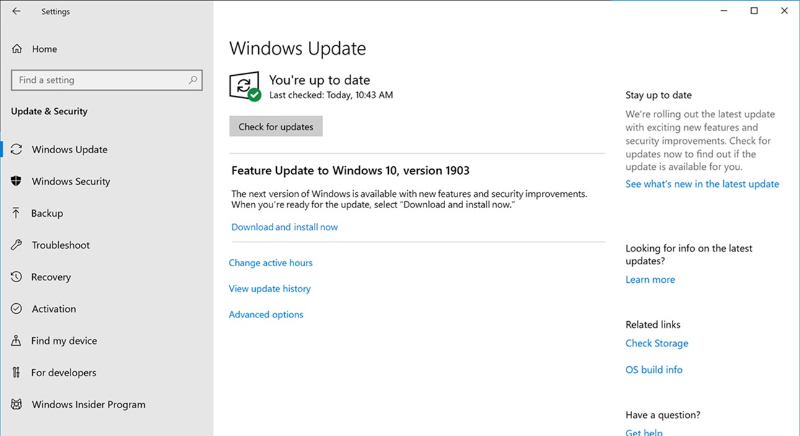
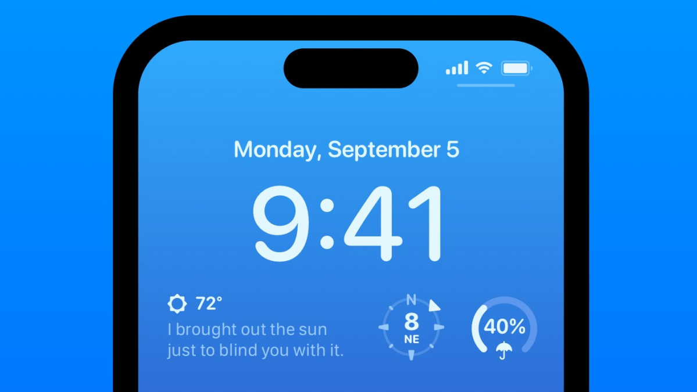

~.toc

- [Networking Communication Patterns](#networking-communication-patterns)
  - [Communication Timing](#communication-timing)
    - [Synchronous](#synchronous)
    - [Asynchronous](#asynchronous)
  - [Communication Models](#communication-models)
    - [Client-Server](#client-server)
    - [Peer-to-Peer (P2P)](#peer-to-peer-p2p)
  - [Data Exchange Patterns](#data-exchange-patterns)
    - [Pull](#pull)
    - [Polling](#polling)
    - [Push](#push)
    - [Persistent Connection](#persistent-connection)

/~

# Networking Communication Patterns

## Communication Timing

### Synchronous

<figure>
    
        
    
</figure>

**Synchronous** communication happens in real-time; both parties communicate with minimal delay.

- The connection is alive for the duration of the conversation.
- Both parties are "waiting" for the other to respond; they do not do other work while waiting.
- Examples: phone calls, video conferencing, live chat

### Asynchronous

<figure>
    
        
    
</figure>

**Asynchronous** communication does not require both parties to be available at the same time.

- The connection is not alive for the duration of the conversation.
- Messages can be stored and retrieved later.
- Examples: email, SMS (text messages)

## Communication Models

### Client-Server

<figure>
    
        
    
</figure>

Recall from [The Internet](internet.html): in the **client-server** model, one device (the client) requests resources or services from another (the server).

- Many clients may connect to one server
- Clients initiate requests; servers respond
- Centralized control (server manages resources)
- May be sync or async
- Examples: web browsing, email, file downloads

### Peer-to-Peer (P2P)

<figure>
    
        
    
</figure>

In the **peer-to-peer** model, each device (peer) can act as both a client and a server, sharing resources directly.

- No central server
- Peers connect directly to each other
- May be sync or async
- Examples: file sharing (BitTorrent), cryptocurrency (Bitcoin), AirDrop, LAN multiplayer games

## Data Exchange Patterns

Assuming the server has some data that the client needs, there are four main patterns for how the client can get that data:

| Pattern               | Who Initiates? | Connection           | Use Cases                        |
| --------------------- | -------------- | -------------------- | -------------------------------- |
| Pull                  | Client         | On-demand            | Web browsing, API requests       |
| Polling               | Client         | Repeated             | Email checking, software updates |
| Push                  | Server         | Persistent/On-demand | Push notifications, live updates |
| Persistent Connection | Both           | Persistent           | Chat, streaming, online gaming   |

### Pull

<figure>
    
        
    
</figure>

With **pull**, the client requests data from the server whenever it needs information.

- The client initiates each data request.
- The server responds only when requested.
- Suitable for on-demand data access.
- Examples: loading a webpage, API requests, downloading files

### Polling

<figure>
    
        
    
</figure>

With **polling**, the client repeatedly requests data from the server at regular intervals to check if anything new is available.

- An automated, repeated form of pull.
- The client sends requests on a schedule (e.g., every few seconds).
- The server responds with new data if available.
- Can be inefficient - most requests may come back with nothing new.
- Examples: email clients checking for new mail, apps checking for software updates, phone lockscreen widgets

### Push

<figure>
    
        
    
</figure>

With **push**, the server sends data to the client as soon as it becomes available, without the client needing to request it each time.

- The server initiates data transfer; the client passively receives updates.
- Avoids the wasted requests of polling.
- Good for broadcast (one to many) and event-driven communication.
- Examples: mobile push notifications, live sports scores, weather alerts

### Persistent Connection

<figure>
    
        
    
</figure>

A **persistent connection** remains open for the duration of the communication, allowing either side to send data at any time.

- The connection stays alive for the entire session.
- Supports multiple messages in both directions.
- Enables real-time or near-real-time communication.
- Often what makes push possible - the server needs an open line to push through.
- Examples: real-time chat, streaming media, online gaming, WebSockets
