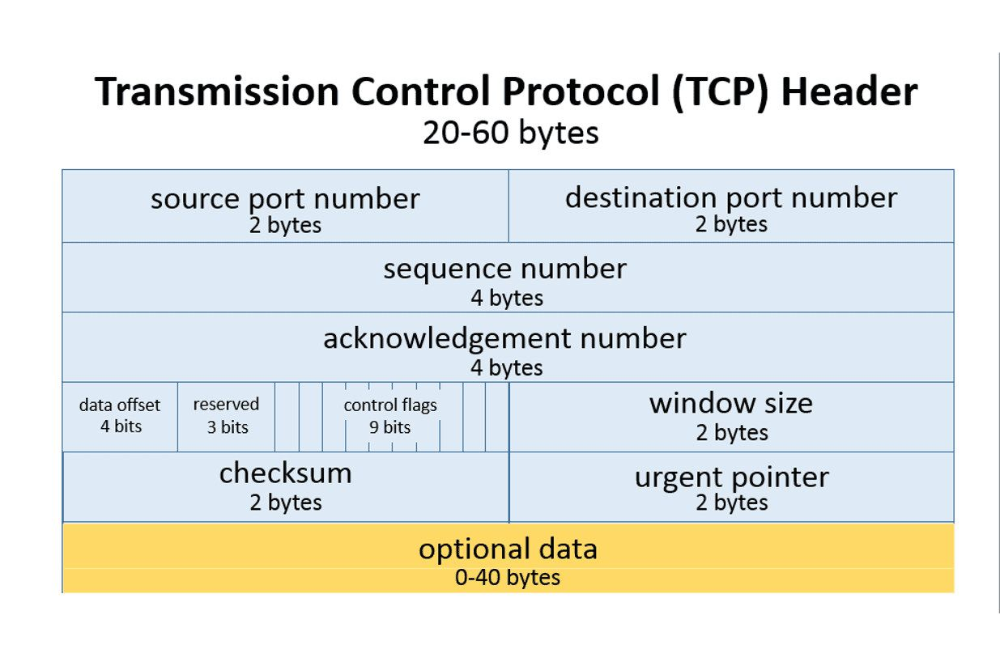
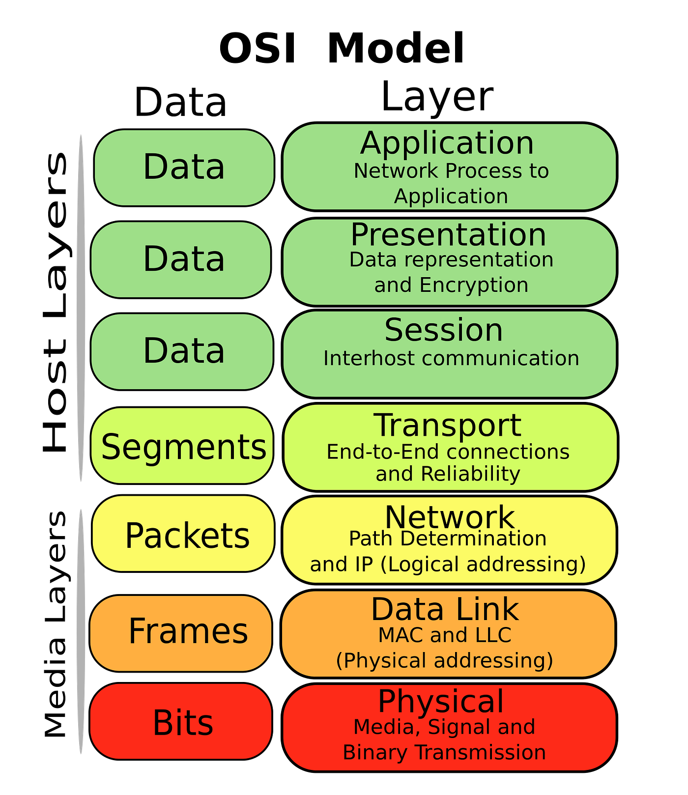

~.toc

- [Networking Protocols](#networking-protocols)
  - [What is a Protocol?](#what-is-a-protocol)
  - [The OSI Model](#the-osi-model)
    - [Encapsulation](#encapsulation)
  - [Protocols by Layer](#protocols-by-layer)
    - [Application Layer](#application-layer)
    - [Transport Layer: TCP vs UDP](#transport-layer-tcp-vs-udp)
    - [Network Layer: IPv4 vs IPv6](#network-layer-ipv4-vs-ipv6)
    - [Data Link and Physical Layers](#data-link-and-physical-layers)

/~

# Networking Protocols

## What is a Protocol?

**Protocols** are standardized rules for communication.

In each of the [communication patterns](networking_communication_patterns.html), the client / server may send messages back and forth to coordinate the transfer of the **payload** (the actual data being transferred).

Protocols define:

- How to establish a connection (handshake)
- How to break the connection (teardown)
- Address of the sender and receiver
- Type / format of payload (html, image, video, etc.)
- Data about the payload (size, compression, encryption, etc.)

~.focusContent.example

**Paper Airplane Protocol**

You have developed a paper airplane mode of communication, that you would like to use to serve song lyrics to your friends.

The server, a computer, is very literal. It uses an algorithm to understand the message that was sent, and responds using the same format.

```
Packet Number
Sender Address
Receiver Address
Action
Payload (text data to be transferred)
Data Length (character count of the payload)
Checksum (md5 hash of the payload)
```

**Diagram**

[Paper Airplane Protocol - DrawIO](https://github.com/mpjovanovich-IvyTechDemos/diagrams/blob/main/PaperAirplaneProtocol.drawio)

**Client**

_Request_

```
1
Desk 4
Desk 11
Get Lyrics
Beatles;Yellow Submarine;Yellow Submarine
41
666180b3e449222c2241b2afe32bfca3
```

**Server**

_Response_

```
1
Desk 11
Desk 4
Data Transfer
In the time that I
18
9eceaa495884413082c94280d965738e
```

```
2
Desk 11
Desk 4
Data Transfer
was born, lived a man
21
690c8054749a1cb7fb448c5804613dc3
```

```
3
Desk 11
Desk 4
Data Transfer
in a submarine. ^ENDMESSAGE^
28
0582957562b0492f8ad2aa0807ea1154
```

/~

~.focusContent.example

 <figure>
    <span>
        
    </span>
</figure>

The TCP header format specifies how the computer should interpret the information. Each field has a set length, position, and purpose.

If the standard was not followed exactly, the data would be misinterpreted.

/~

## The OSI Model

<figure>
    <span>
        
    </span>
</figure>

The **OSI (Open Systems Interconnection) model** is a conceptual framework that splits network communication into seven layers. Each layer has one job, and relies on the layer below it.

| #   | Layer        | What it does                                      | Examples                  |
| --- | ------------ | ------------------------------------------------- | ------------------------- |
| 7   | Application  | Network services used by applications             | HTTP, DNS, SMTP           |
| 6   | Presentation | Data format, encryption, compression              | TLS/SSL, JPEG, UTF-8      |
| 5   | Session      | Opens, manages, and closes sessions               | (usually handled by apps) |
| 4   | Transport    | Reliable (or fast) delivery between programs      | TCP, UDP                  |
| 3   | Network      | Addressing and routing between networks           | IP, routers               |
| 2   | Data Link    | Delivery between devices on the same local network | Ethernet, Wi-Fi, switches |
| 1   | Physical     | Sends raw bits as signals                         | Cables, radio waves, hubs |

~.focusContent.note

The OSI model is mainly a teaching tool. The Internet actually runs on the simpler 4-layer **TCP/IP model**, which combines layers 5-7 into one "Application" layer and layers 1-2 into one "Link" layer.

/~

### Encapsulation

<!-- img: packet encapsulation diagram showing headers added at each layer -->

When data is sent, each layer wraps the data from the layer above it with its own **header** (and sometimes a trailer).

This makes a "sandwich" of information - the application data is at the center, and the data link frame is the outermost wrapper. The physical layer then sends the whole thing as bits.

When data is received, the process runs in reverse: each layer removes its own header and passes the rest up.

~.focusContent.example

Mailing a letter:

- **Application:** You write the letter (the payload)
- **Transport:** You put it in an envelope and number the pages
- **Network:** You write the street address on the envelope
- **Data Link:** The local post office puts it in a bin for the right truck
- **Physical:** The truck drives it down the road

/~

## Protocols by Layer

### Application Layer

Recall from [The Internet](internet.html):

- **HTTP/HTTPS** - requesting and sending web pages
- **DNS** - translating domain names to IP addresses
- **SMTP** - sending email

### Transport Layer: TCP vs UDP

**UDP (User Datagram Protocol)** is the main alternative to TCP. It skips the reliability checks in exchange for speed.

| Attribute            | TCP                       | UDP                                  |
| -------------------- | ------------------------- | ------------------------------------ |
| Connection           | Handshake before sending  | No handshake; just sends             |
| Reliability          | Lost packets are re-sent  | Lost packets are gone                |
| Ordering             | Packets reassembled in order | No ordering guarantee             |
| Speed                | Slower                    | Faster                               |
| Use Cases            | Web pages, email, files   | Streaming, online gaming, video calls |

~.focusContent.note

Why would anyone want lost packets? In a video call, a re-sent packet from two seconds ago is useless - it's better to skip it and keep going.

/~

### Network Layer: IPv4 vs IPv6

Recall that **IP** handles addressing and routing, and that we are running out of IPv4 addresses.

| Attribute       | IPv4                 | IPv6                                      |
| --------------- | -------------------- | ----------------------------------------- |
| Address size    | 32 bits              | 128 bits                                  |
| Total addresses | ~4.3 billion         | ~340 undecillion (3.4 × 10³⁸)             |
| Example         | `192.168.1.1`        | `fe80::215:5dff:fe15:fcaf`                |
| Status          | Still most common    | Growing; designed to replace IPv4         |

### Data Link and Physical Layers

These layers cover how devices physically connect to a local network.

| Technology | Range              | Typical Use                                  |
| ---------- | ------------------ | -------------------------------------------- |
| Ethernet   | ~100 m per cable   | Wired desktops, servers, network equipment   |
| Wi-Fi      | ~30-50 m indoors   | Laptops, phones, home and office networks    |
| Bluetooth  | ~10 m              | Headphones, keyboards, wearables             |

**Wi-Fi Frequency Bands**

| Attribute                | 2.4 GHz                                                     | 5 GHz                                                |
| ------------------------ | ----------------------------------------------------------- | ---------------------------------------------------- |
| Bandwidth / throughput   | Relatively higher (but reduced by congestion)               | Relatively higher                                    |
| Wall penetration & range | Good                                                        | Worse                                                |
| Spectrum congestion      | More congestion / interference, leading to lower throughput | Less congestion / interference due to wider range    |
| Other devices in band    | Competes with microwaves, baby monitors, Bluetooth, etc.    | Does not compete with other devices in the same band |

See the [WiFi App](demos/wifi-interference.html) to explore interference between channels.
