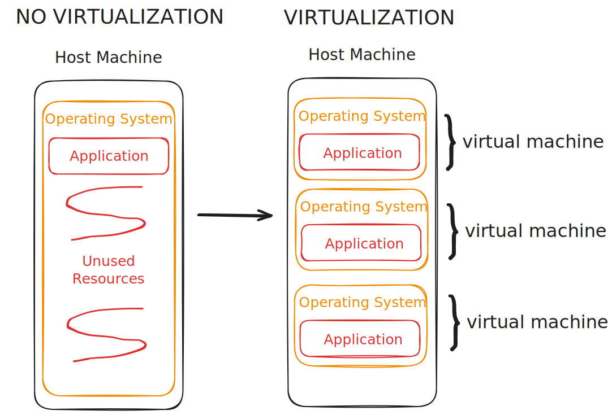

~.toc

/~

# Virtualization

<figure>
    
        
    
</figure>

## What is Virtualization?

**Virtualization** is a technology that allows resources on a single physical machine, the **host machine** to be shared between multiple virtual components.

These shared resources may include:

- CPU (Central Processing Unit)
- Memory (RAM)
- Storage (HDD, SSD)
- Network

These can be used to create **virtual machines** that work the same as a physical computer.

~.focusContent.note

You may also hear the term **container**. This is closely related to virtualization - it offers another way to share resources on the host machine.

/~

## Conceptual Model

<figure>
    
        
    
</figure>

Before virtualization each server or computer could only run one operating system at a time, and was primarily used for a single purpose. For example, it might host a web application.

With virtualization, a single physical machine can host multiple "virtual machines" that operate independently of each other.

## Why Use Virtualization?

<figure>
    
        
    
</figure>

**Cost Savings**: Renting only the amount of resources needed, rather than buying a whole physical machine.

**Resource Efficiency**: Resources are allocated as needed, resulting in less "dead zones" in the hardware.

**Easy Backup and Recovery**: Virtual machines can be easily copied, moved, or restored from backups.

**Temporal Availability**: Virtual machines can be created (provisioned) and destroyed (decommissioned) quickly, rather than being tied to a physical machine.

## Cloud Computing

**Cloud Computing** is a model for delivering computing services over the Internet that are not tied to any physical location.

Virtualization is the foundation technology that makes cloud computing possible.

Cloud computing can take many forms.

~.focusContent.note

### Personal Cloud Use

    
    
    

You've probably used cloud computing in your daily life:

- Microsoft OneDrive
- Google Drive
- iCloud
- Dropbox

/~

There are also many software products that run in the cloud. We will discuss these in more detail in the next section.

### Cloud Use for IT Professionals

IT professionals such as software developers and DevOps engineers use cloud computing and virtualization to:

- Test software in a controlled environment
- Deploy applications quickly
- Scale services up or down based on demand

~.focusContent.example

**Growing an Application On Demand**

<figure>
    
        
    
</figure>

Your team has built a great software application - it has done so well that your server can no longer keep up with all of the users that you have.

Because your application is deployed in the cloud using virtualization, you can easily **scale up** the number of servers to handle the increased load - it's as simple as adding more copies of your application to more virtual servers.

/~

~.focusContent.example

**Software Development**

_Without Virtualization_

You're a software developer who has spent weeks writing an application and are ready to deploy (move the application code) to a server.

But then... it doesn't work because the server isn't running the same way as your personal computer! You stay up all night and drive home at 4am looking foward to your next day that starts in two hours.

<figure>
    
        
    
</figure>

_With Virtualization_

You've learned your lesson and instead you now use a **virtual environment** on your personal computer that exactly matches the server.

You can confidently deploy your application to the server and know that it will work.

<figure>
    
        
    
</figure>

/~
