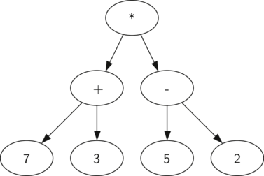

~.toc

- [Tree Structures](#tree-structures)
  - [Tree Terminology](#tree-terminology)
  - [Tree Traversal](#tree-traversal)
- [Abstract Syntax Trees](#abstract-syntax-trees)
  - [Basic Syntax Tree](#basic-syntax-tree)
  - [Variables in Syntax Trees](#variables-in-syntax-trees)
  - [Expanding Function Calls](#expanding-function-calls)
- [Function Composition](#function-composition)
  - [Arithmetic Function Composition](#arithmetic-function-composition)
- [Functions with Multiple Arguments](#functions-with-multiple-arguments)
- [Boolean Logic in Syntax Trees](#boolean-logic-in-syntax-trees)
- [For the Homework](#for-the-homework)

/~

## Tree Structures

A **tree structure** is a data structure that represents a hierarchy of elements. They are used in many areas of computer science.

### Tree Terminology

- **Node**: Any single element in a tree.
- **Root**: The top node in a tree.
- **Parent**: A node that has children.
- **Child**: A node that has a parent.
- **Leaf**: A node that has no children.

### Tree Traversal

There are many algorithms for determining the order in which to visit nodes in a tree.

We will use a **post-order** traversal for syntax trees:

```
Let VISIT(node) be:

BEGIN
    IF the current node is a leaf THEN:
        Return the value
    ELSE:
        IF the current node is a unary operator THEN:
            VISIT(child)
            Apply the operator
            Return the value
        ELSE:
            VISIT(left child)
            VISIT(right child)
            Apply the operator
            Return the value
        END IF
    END IF
END

VISIT(root)
```


In the graphic above, visits are shown in blue, evaluations in red.

Each leaf node (A, C, E, H) would be some operand, and each internal node (B, D, F, G, I) would be some operator.

## Abstract Syntax Trees

An **abstract syntax tree** is a visual representation of the syntax of a programming language for some expression.

### Basic Syntax Tree

Below is a syntax tree containing literals and operators for the expression:

```
(7 + 3) * (5 - 2)
```

<figure>
    <span>
        
    </span>
</figure>

~.focusContent.example

Draw the syntax tree for the following expressions:

```
1) 5 + 3 * 2

2) (5 + 3) * 2

3)  10 / 2 / 2 - 1

4)  10 / (2 / 2) - 1
```

/~

### Variables in Syntax Trees

If a syntax tree includes variables, we treat them just like literals.

~.focusContent.example

1. Draw the syntax tree for the expression:

```
(7 + x) * (y - 2)
```

2. Evaluate the expression for `x = 3` and `y = 5` by plugging in the values.

/~

### Expanding Function Calls

We may need to substitute the function call with its definition within the tree. We just drop it in place.

~.focusContent.example

Given the function:

```
f(x) = x / 2
```

Find the syntax tree for the following expressions:

```
1) 10 * f(4) + 3

2) 10 * f(y) + 3

3) f(2) * f(3)
```

/~

## Function Composition

**Function Composition** is the process of combining two or more functions to produce a new function.

### Arithmetic Function Composition

Given the functions:

```
f(x) = x + 1
g(x) = x * 2
```

An example of function composition is `f(g(x))`.

~.focusContent.example

Given the functions:

```
f(x) = x + 1
g(x) = x * 2
```

1. Draw the syntax tree for `f( g(3) )`.

2. Evaluate the expression.

```
f( g( 3 ) )
  = f( 3 * 2 )
  = f( 6 )
  = 6 + 1
  = 7
```

/~

~.focusContent.example

Given the functions:

```
f(x) = x + 1
g(x) = x * 2
```

Evaluate the following expressions:

```
1) g( f(3) )

2) f( f(2) )

3) f( f( f(6) + 1 ) + 2 ) + 3
```

/~

## Functions with Multiple Arguments

Functions can take multiple arguments. In this case, we plug in the values for each argument in the order they are given.

~.focusContent.example

Given the function:

```
f(x, y) = x + y + 1
```

Evaluate the following expressions:

```
1) f(3, 4)

2) f(1, 2)

3) f(3, f(2, 1))
```

/~

## Boolean Logic in Syntax Trees

We can drop in True and False values into our syntax trees along with logical connectives.

They work the same as we've seen so far.

~.focusContent.example

Draw the syntax tree for the following expressions, evaluating them as you go:

```
1) True and False or False

2) True and (False or False)

3) not True
```

/~

## For the Homework

- Use draw.io to make syntax trees
- Make sure to double check what the question is asking you to do!
