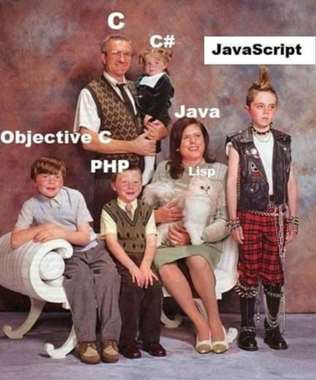

~~wrapHtml(div,schedule){

- [Evolution of Programming Languages](#evolution-of-programming-languages)
  - [First Generation](#first-generation)
  - [Second Generation](#second-generation)
  - [Third Generation](#third-generation)
  - [4th and 5th Generations](#4th-and-5th-generations)
- [Compiled vs Interpreted Code](#compiled-vs-interpreted-code)
  - [Compiled Code](#compiled-code)
    - [Advantages](#advantages)
    - [Disadvantages](#disadvantages)
    - [Examples](#examples)
  - [Interpreted Code](#interpreted-code)
    - [Advantages](#advantages-1)
    - [Disadvantages](#disadvantages-1)
    - [Examples](#examples-1)
- [Language History and Trends](#language-history-and-trends)
  - [Timeline](#timeline)
  - [Popularity Metrics](#popularity-metrics)
  - [Application Domains](#application-domains)

}

# Evolution of Programming Languages

<figure>
    
        
    
</figure>

## First Generation

- **Machine code** = binary code
- What the processor understands
- People don't write machine code, but everything that runs on a computer is first converted to machine code.

## Second Generation

- **Assembly language**
- Primitive instructions that reflect what the processor can do
  - See: [x86 instruction listings](https://en.wikipedia.org/wiki/X86_instruction_listings)
  - ADD = add two numbers
  - MOV = move data from one place to another
  - JMP = jump to another line of code
  - ...
- Still used in very simple computers or at low levels, e.g.:
  - Embedded systems (e.g., IoT devices, cars, microwaves, ...)
  - Microcontrollers
  - Some operating systems
- Is compiled to machine code

## Third Generation

- **Compiled or interpreted code**
- "Human readable" code, like Python
- Is compiled or interpreted to machine code

## 4th and 5th Generations

<figure>
    
        
    
    <figcaption>Us. Professional coders.</figcaption>
</figure>

There are technically 4th and 5th generation languages, but the distinction is less clear. They're typically defined as less instruction-oriented and more problem-oriented.

Don't worry about them. They're for analysts and engineers who don't know how to code.

# Compiled vs Interpreted Code

All code must be converted to machine code before it can be run. The difference is in when and how this conversion happens.

## Compiled Code

A **compiler** is a program that translates code written in a high-level language to a lower level language ahead of time. Compiled languages cannot be run until the compiler has translated the whole program into machine code.

- Takes the actual text of the program and converts it into instructions that the processor can execute.
- Output is either a file that is directly executable or a library that can be used by other programs.

### Advantages

- Faster and more efficient execution (since it knows what to expect ahead of time)
- Can catch errors before the program is run
- Can be optimized for specific hardware
- Can be distributed without the source code

### Disadvantages

- More complex development process

### Examples

- C, C++, Rust, Go, Swift, Java, C#...

Demo:

- Compile a C program with gcc
- Run a Python program line by line

## Interpreted Code

An **interpreter** is a program that reads code and executes it line by line at **runtime**.

- Picks off a statement, translates it to machine code, and runs it.
- Then does the next statement, and so on.

### Advantages

- Fast to develop b/c you don't have an intermediate compilation step.
- Less complexity in the development process.
- Often easier to debug.

### Disadvantages

- Slow execution
- Less efficient use of system resources
- Can't catch errors until the program is run; e.g. Python code broken on line 12 won't be caught until... we hit line 12. This leads to buggy releases.

### Examples

Python, Ruby, JavaScript, PHP, Perl, ...

# Language History and Trends

## Timeline

<figure>
    
        
    
</figure>

https://javaconceptoftheday.com/history-of-programming-languages/

## Popularity Metrics

<figure>
    
        
    
</figure>

https://redmonk.com/kfitzpatrick/2021/03/02/redmonk-top-20-languages-over-time-january-2021/

<figure>
    
        
    
</figure>

---

https://redmonk.com/sogrady/2021/03/01/language-rankings-1-21/

<figure>
    
        
    
</figure>

https://www.devjobsscanner.com/blog/top-8-most-demanded-programming-languages/

<figure>
    
        
    
</figure>

https://www.devjobsscanner.com/blog/top-8-most-demanded-programming-languages/

---

<figure>
    
        
    
</figure>

<figure>
    
        
    
</figure>

https://www.researchgate.net/publication/353521212_Programming_Languages_A_Usage-based_Statistical_Analysis_and_Visualization

---

Critical Thinking Exercise:

**What do the above data tell us?.**

- Be mindful of timeliness of source data.
- What's actually on the axes of these graphs?
- Why might some languages show up more on a particular graph?

**When considering a language to learn:**

- _Be mindful of demand for a particular language in your area (lookin' at you C#, JavaScript/TypeScript, HTML/CSS)._
- Check job listings. Make informal inquiries. Job shadow.

## Application Domains

In no particular order:

- **Web Development**: HTML, CSS, JavaScript, PHP, Python, Ruby, Java, C#, SQL
- **Mobile Development**: Java, Swift, Kotlin, C#, JavaScript
- **Desktop Development**: C++, C#, Java, Python, Swift, Rust
- **Game Development**: C++, C#, Java, JavaScript, Rust
- **Data Science**: Python, R, SQL
- **Scripting**: Python, Bash, PowerShell
