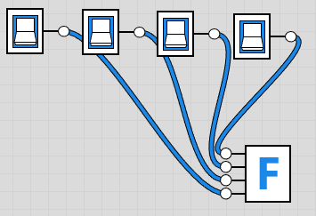

~.toc

- [Hexadecimal Numbers](#hexadecimal-numbers)
  - [Convert: Binary to Hex](#convert-binary-to-hex)
  - [Convert: Hex to Binary](#convert-hex-to-binary)
    - [Example 1](#example-1)
    - [Example 2](#example-2)

/~

# Hexadecimal Numbers

Hexadecimal (hex) offers a nice, compact way to represent binary numbers.

- The prefix **0x** is used to indicate a hexadecimal number.

- Each hex digit represents a **nibble** (4 bits).

- Each nibble is guaranteed to be a number from 0-15; 0-F in hex.

~.focusContent.demo

Using four bits to represent hex digits: [logic.ly](https://logic.ly/demo/)

<figure>
  
</figure>

/~

~.focusContent.lookout

When you see the hexadecimal prefix (0x), know that you're looking at a binary number - even though you're not seeing the zeroes and ones.

_Example: 0x24 does not equal (24)10._

/~

## Convert: Binary to Hex

- Break binary number into groups of 4 bits (called a **nibble**).

- Convert each nibble to binary then to hex.

- Concatenate the results - put them back together.

~.focusContent.example

Convert the binary number to hexadecimal: (11011100)2

1. Break binary number into groups of 4 bits:

- 1101
- 1100

2. Convert each nibble to decimal:

- (1101)2 = 13
- (1100)2 = 12

3. Convert each decimal nibbles to hex:

- 13 = D
- 12 = C

4. Concatenate the results:

(0xDC)16

/~

## Convert: Hex to Binary

For hex to binary, we simply go the other direction - take each hex digit and convert it its binary equivalent.

### Example 1

Convert the hexadecimal number to binary: 0x24

When we see 0x24, we're looking at a byte (8 bits):

| 2   |     |     |     |     | 4   |     |     |     |
| --- | --- | --- | --- | --- | --- | --- | --- | --- |
| ?   | ?   | ?   | ?   |     | ?   | ?   | ?   | ?   |

So we convert to binary...

2 = (0010)2

4 = (0100)2

Then plug in the result:

| 2   |     |     |     |     | 4   |     |     |     |
| --- | --- | --- | --- | --- | --- | --- | --- | --- |
| 0   | 0   | 1   | 0   |     | 0   | 1   | 0   | 0   |

Final result = 00100100

### Example 2

Convert the hexadecimal number to binary: 0xA1

Nothing different here, we just have to know that the letters represent numbers.

A = (10)10 = (1010)2

1 = (1)10 = (0001)2

Plugging in:

| A   |     |     |     |     | 1   |     |     |     |
| --- | --- | --- | --- | --- | --- | --- | --- | --- |
| 1   | 0   | 1   | 0   |     | 0   | 0   | 0   | 1   |

Final result = 10100001
