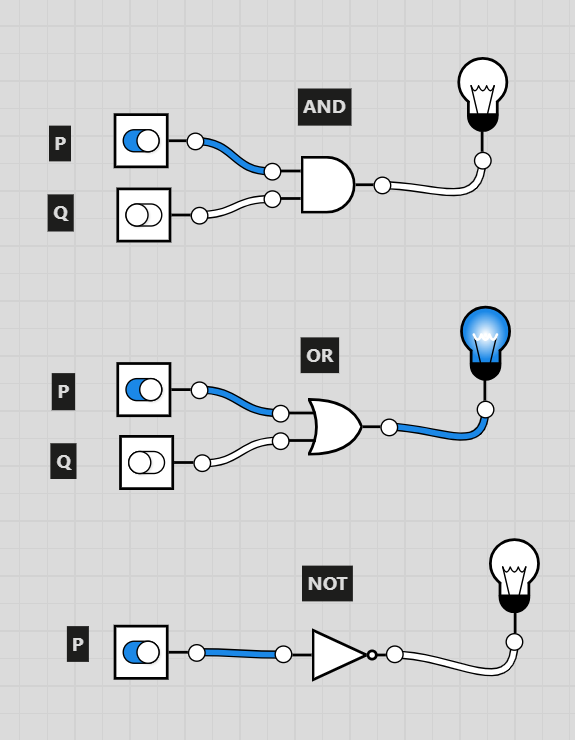
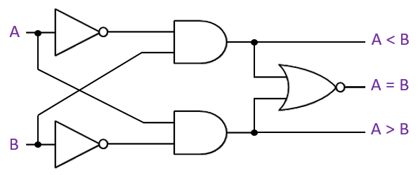

~.toc

- [Logic Gates](#logic-gates)
  - [Foundations](#foundations)
  - [Basic Gates](#basic-gates)
  - [Circuits](#circuits)
    - [Comparing Values](#comparing-values)
      - [One bit magnitude comparator:](#one-bit-magnitude-comparator)
    - [Keeping Values in Memory](#keeping-values-in-memory)
      - [SR (Set-Reset) Latch](#sr-set-reset-latch)
      - [Demo: Building an Arm and Click Camera](#demo-building-an-arm-and-click-camera)
    - [Synchronizing Information](#synchronizing-information)
      - [The Clock](#the-clock)
      - [SR Flip-Flop](#sr-flip-flop)
      - [Demo: Building a Hold Activated Button](#demo-building-a-hold-activated-button)

/~

# Logic Gates

For an excellent logic gate sandbox, see: [Logic.ly](https://logic.ly/demo).

## Foundations

<figure>
 
</figure>

- Computers recognize only two states, based on the presence or absence of an electrical signal.

  - High voltage = 1 = true
  - Low voltage = 0 = false

- A **logic gate** is a device that performs a logical operation on one or more binary inputs and produces a single binary output.

## Basic Gates

The logical connectives that we've learned so far have corresponding logic gates.

The truth table for each gate matches the truth table for the corresponding logical connective.

~.focusContent.demo

Logic.ly

<figure>
  
</figure>

/~

## Circuits

We can combine logic gates to create **circuits**.

These circuits can do things like:

- Arithmetic (addition, subtraction, etc.)
- Comparison (greater than, less than, equal)
- Memory storage
- ...

### Comparing Values

A **magnitude comparator** is a type of combinational circuit that compares two numbers.

#### One bit magnitude comparator:

<figure>
  
</figure>

[One Bit Magnitude Comparator - Logicly](https://github.com/mpjovanovich/ivy_tech/blob/main/SDEV120_Computing_Logic/one_bit_magnitude_comparer.logicly)

_Exercise:_

Assume that A = 1, B = 1.

For each output:

a) Translate the circuit into a boolean expression.

b) Plug the above values into the circuit and solve.

_Hint:_ Remember your truth tables and the fact that 1 = true and 0 = false.

Output: A < B

**a)** ¬A ∧ B

**b)** 0 ∧ 1 = False

Output: A > B

**a)** A ∧ ¬B

**b)** 1 ∧ 0 = False

Output: A = B

**a)**

- ¬( ¬A ∧ B ∨ A ∧ ¬B )
- A ∨ ¬B ∧ ¬A ∨ B

**b)**

- 1 ∨ (0 ∧ 0) ∨ 1
- 1 ∨ 0 ∨ 1 = True

### Keeping Values in Memory

#### SR (Set-Reset) Latch

The **SR latch** is a simple form of flip-flop that can store one bit of information as memory so that it isn't lost when the clock signal changes.

When in the **hold** state, the outputs remain the same.

They will only change when either the **set** or **reset** input is activated.

_Inputs / Outputs:_

- S = Set signal
- R = Reset signal
- Q = Current output
- Qt-1 = Previous output

_Truth Table:_

|                     | S   | R   | Q               |
| ------------------- | --- | --- | --------------- |
| **Set Condition**   | 1   | 0   | 1               |
| **Reset Condition** | 0   | 1   | 0               |
| **Hold Condition**  | 0   | 0   | Qt-1 |

_Circuit:_

[SR Latch - Logicly](https://github.com/mpjovanovich/ivy_tech/blob/main/SDEV120_Computing_Logic/set_reset_latch.logicly)

#### Demo: Building an Arm and Click Camera

~.focusContent.demo

_Scenario:_

In this demo, we'll build a system that requires the user to arm a camera before taking a picture.

The camera has three buttons:

- **Photo** - Takes a picture
- **Arm** - Arms the camera
- **Reset** - Resets the camera to unarmed

_Components_

- An SR latch will store the "armed" state of the camera.
- We will combine the SR latch with the photo button via an AND gate to allow the camera to take a picture only when armed.
- The reset button will be connected to the SR latch to clear the memory and disarm the camera.

_Circuit:_

[Arm and Click Camera](https://github.com/mpjovanovich/ivy_tech/blob/main/SDEV120_Computing_Logic/arm_click_camera.logicly)

/~

### Synchronizing Information

In digital circuits, we need to be precise about when information is updated.

#### The Clock

<figure>
  
</figure>

The **clock** is a special signal that is used to synchronize the operations of a computer. For now, we just need to know:

- The clock pulses electrical signals at regular intervals.
- A high signal is called a **rising edge**. This indicates "true", or 1.
- A low signal is called a **falling edge**. This indicates "false", or 0.
- One up and down pulse (taken together) is called a **clock cycle**.

#### SR Flip-Flop

The **SR flip-flop** extends the SR latch by adding a clock signal.

This signal allows the flip-flop to store information only when the clock signal changes.

_Inputs / Outputs:_

- C = Clock signal
- S = Set signal
- R = Reset signal
- Q = Output

_Truth Table:_

Same as above, except now the output can only change on a rising edge (uptick) of the clock signal.

_Circuit:_

[SR Flip-Flop - Logicly](https://github.com/mpjovanovich/ivy_tech/blob/main/SDEV120_Computing_Logic/set_reset_flip_flop.logicly)

#### Demo: Building a Hold Activated Button

~.focusContent.demo

_Scenario:_

In this demo, we'll build a system that requires the user to hold a button (S) for a full clock cycle before a light turns on.

We will measure the time using the system clock (C). If the button is held for one clock cycle (rise and fall edge), the light will turn on.

There is a reset button (R) that can be used to turn off the light.

_Components:_

- The "on" button and a rising clock signal will set a memory bit using SR flip-flop.
- The "on" button and a falling clock signal will set a memory bit using another SR flip-flop.
- We will use an AND gate to combine the two signals and turn on the light.
- We will hook up the reset button to the two SR latches to clear memory and turn off the light.

_Circuit:_

[Hold Button](https://github.com/mpjovanovich/ivy_tech/blob/main/SDEV120_Computing_Logic/hold_button.logicly)

/~
