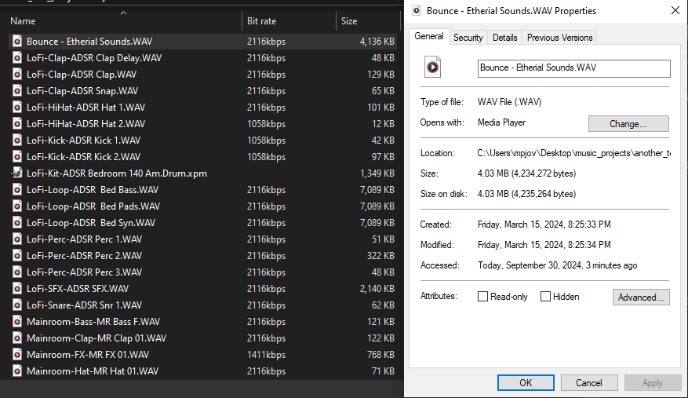
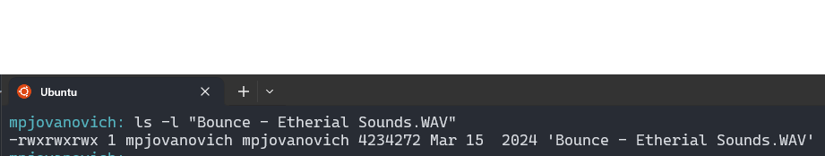

~.toc

- [Metric Prefixes](#metric-prefixes)
  - [Decimal Chart](#decimal-chart)
  - [Binary Chart](#binary-chart)
    - [Prefix Conversions](#prefix-conversions)
      - [Going up the chart:](#going-up-the-chart)
      - [Going down the chart:](#going-down-the-chart)
  - [Decimal Applications](#decimal-applications)
    - [Data transfer rates](#data-transfer-rates)
    - [Device Speeds](#device-speeds)
    - [Physical Hardware Sizes](#physical-hardware-sizes)
    - [Extreme Scales](#extreme-scales)
  - [Binary Applications](#binary-applications)

/~

# Metric Prefixes

- Used to give friendly names to certain multiples in a base.

- Applies to both positive (whole) and negative (fractional) directions.

- Capitalization does matter for prefixes.

## Decimal Chart

Full list: [https://en.wikipedia.org/wiki/Metric_prefix](https://en.wikipedia.org/wiki/Metric_prefix)

We are most interested in the following range:

| Name  | Symbol | Power of 10     | Decimal                   |
| ----- | ------ | --------------- | ------------------------- |
| exa   | E      | 1018 | 1,000,000,000,000,000,000 |
| peta  | P      | 1015 | 1,000,000,000,000,000     |
| tera  | T      | 1012 | 1,000,000,000,000         |
| giga  | G      | 109  | 1,000,000,000             |
| mega  | M      | 106  | 1,000,000                 |
| kilo  | k      | 103  | 1,000                     |
| ---   | ---    | 100  | 1                         |
| deci  | d      | 10-1 | 0.1                       |
| centi | c      | 10-2 | 0.01                      |
| milli | m      | 10-3 | 0.001                     |
| micro | μ      | 10-6 | 0.000001                  |
| nano  | n      | 10-9 | 0.000000001               |

_I did not include deca and hecto. We will leave those for the other scientists._

**Example:** 1 kilobyte (KB) = 1,000 bytes

## Binary Chart

Since computers use base 2, we also have binary prefixes for describing numbers of bytes.

Note the uppercase "B" for bytes and lowercase "b" for bits.

| Name | Symbol | Power of 2     | Bytes                              |
| ---- | ------ | -------------- | ---------------------------------- |
| exbi | EiB    | 260 | 1,152,921,504,606,846,976          |
| pebi | PiB    | 250 | 1,125,899,906,842,624              |
| tebi | TiB    | 240 | 1,099,511,627,776                  |
| gibi | GiB    | 230 | 1,073,741,824                      |
| mebi | MiB    | 220 | 1,048,576                          |
| kibi | kiB    | 210 | 1,024                              |
| byte | B      | 20  | 1                                  |
| ---  | ---    | ---            | ---                                |
| bit  | b      | NA             | _1/8 - there are 8 bits in a byte_ |

**Example:** 1 kibibyte (KiB) = 1,024 bytes

### Prefix Conversions

| Multiples of Bytes |
| ------------------ |
| 1 byte = 8 bits    |
| 1 KiB = 1,024 B    |
| 1 MiB = 1,024 KiB  |
| 1 GiB = 1,024 MiB  |

#### Going up the chart:

Multiply by 1,024 (210) to go up a level, except for bits. Cancel units until you reach the desired level.

_Example_

Convert GiB to bits:

<math xmlns="http://www.w3.org/1998/Math/MathML" display="block">
  <mstyle displaystyle="true" scriptlevel="0">
    <mrow data-mjx-texclass="ORD">
      <mtable rowspacing=".5em" columnspacing="1em" displaystyle="true">
        <mtr>
          <mtd>
            <mn>1.4</mn>
            <mi>G</mi>
            <mi>i</mi>
            <mi>B</mi>
            <mo>&#x22C5;</mo>
            <mfrac>
              <mrow>
                <mn>1024</mn>
                <mi>M</mi>
                <mi>i</mi>
                <mi>B</mi>
              </mrow>
              <mrow>
                <mn>1</mn>
                <mi>G</mi>
                <mi>i</mi>
                <mi>B</mi>
              </mrow>
            </mfrac>
            <mo>&#x22C5;</mo>
            <mfrac>
              <mrow>
                <mn>1024</mn>
                <mi>K</mi>
                <mi>i</mi>
                <mi>B</mi>
              </mrow>
              <mrow>
                <mn>1</mn>
                <mi>M</mi>
                <mi>i</mi>
                <mi>B</mi>
              </mrow>
            </mfrac>
            <mo>&#x22C5;</mo>
            <mfrac>
              <mrow>
                <mn>1024</mn>
                <mi>B</mi>
              </mrow>
              <mrow>
                <mn>1</mn>
                <mi>K</mi>
                <mi>i</mi>
                <mi>B</mi>
              </mrow>
            </mfrac>
            <mo>&#x22C5;</mo>
            <mfrac>
              <mrow>
                <mn>8</mn>
                <mi>b</mi>
              </mrow>
              <mrow>
                <mn>1</mn>
                <mi>B</mi>
              </mrow>
            </mfrac>
            <mo>=</mo>
            <mn>12</mn>
            <mo>,</mo>
            <mn>025</mn>
            <mo>,</mo>
            <mn>908</mn>
            <mo>,</mo>
            <mn>428</mn>
            <mi>b</mi>
          </mtd>
        </mtr>
      </mtable>
    </mrow>
  </mstyle>
</math>

<!-- $$
1.4 GiB \cdot \frac{1024 MiB}{1 GiB} \cdot \frac{1024 KiB}{1 MiB} \cdot \frac{1024 B}{1 KiB} \cdot \frac{8 b}{1 B} = 12,025,908,428 b
$$ -->

#### Going down the chart:

Divide by 1,024 (210) to go down a level, except for bits. Cancel units until you reach the desired level.

- 1 gibibyte (GiB) = 1,024 mebibytes
- 1 mebibyte (MiB) = 1,024 kibibytes
- 1 kibibyte (KiB) = 1,024 bytes
- 1 byte = 8 bits

_Example_

Convert bits to GiB:

<math xmlns="http://www.w3.org/1998/Math/MathML" display="block">
  <mstyle displaystyle="true" scriptlevel="0">
    <mrow data-mjx-texclass="ORD">
      <mtable rowspacing=".5em" columnspacing="1em" displaystyle="true">
        <mtr>
          <mtd>
            <mn>12</mn>
            <mo>,</mo>
            <mn>025</mn>
            <mo>,</mo>
            <mn>908</mn>
            <mo>,</mo>
            <mn>428</mn>
            <mi>b</mi>
            <mo>&#x22C5;</mo>
            <mfrac>
              <mrow>
                <mn>1</mn>
                <mi>B</mi>
              </mrow>
              <mrow>
                <mn>8</mn>
                <mi>b</mi>
              </mrow>
            </mfrac>
            <mo>&#x22C5;</mo>
            <mfrac>
              <mrow>
                <mn>1</mn>
                <mi>K</mi>
                <mi>i</mi>
                <mi>B</mi>
              </mrow>
              <mrow>
                <mn>1024</mn>
                <mi>B</mi>
              </mrow>
            </mfrac>
            <mo>&#x22C5;</mo>
            <mfrac>
              <mrow>
                <mn>1</mn>
                <mi>M</mi>
                <mi>i</mi>
                <mi>B</mi>
              </mrow>
              <mrow>
                <mn>1024</mn>
                <mi>K</mi>
                <mi>i</mi>
                <mi>B</mi>
              </mrow>
            </mfrac>
            <mo>&#x22C5;</mo>
            <mfrac>
              <mrow>
                <mn>1</mn>
                <mi>G</mi>
                <mi>i</mi>
                <mi>B</mi>
              </mrow>
              <mrow>
                <mn>1024</mn>
                <mi>M</mi>
                <mi>i</mi>
                <mi>B</mi>
              </mrow>
            </mfrac>
            <mo>=</mo>
            <mn>1.4</mn>
            <mi>G</mi>
            <mi>i</mi>
            <mi>B</mi>
          </mtd>
        </mtr>
      </mtable>
    </mrow>
  </mstyle>
</math>
<!-- 
$$
12,025,908,428 b \cdot \frac{1 B}{8 b} \cdot \frac{1 KiB}{1024 B} \cdot \frac{1 MiB}{1024 KiB} \cdot \frac{1 GiB}{1024 MiB} = 1.4 GiB
$$ -->

## Decimal Applications

### Data transfer rates

Base 10 is preferred in networking, because we're thinking of a bit transfer rate - how many bits are passing through a network or device per some unit of time.

Internet and device speeds are often measured in bits per second (e.g. 1 Gbps).

### Device Speeds

Clock speeds are often measured in hertz (Hz), which is a unit of frequency. This is the number of cycles per second.

Modern processors are in the gigahertz range (e.g. 3 GHz).

### Physical Hardware Sizes

Manufacturers often use imperial units for physical hardware sizes, but the metric system is used in some cases.

### Extreme Scales

<figure>
  
</figure>

Processor architectures are often discussed at the nanoscale, because we are manipulating atoms and subatomic particles (electrons).

At the nanoscale, electrical properties are important. For example, the thickness of a transistor gate oxide in a MOSFET is on the order of nanometers.

## Binary Applications

The binary prefixes were established by the International Electrotechnical Commission (IEC) in 1999. Not everyone uses them, but they provide more clarity when discussing computer memory sizes.

File sizes listed in base 10 can be misleading.

~.focusContent.example

Do the three reported memory sizes tie out in this example?

<figure>
    
        
    
</figure>

<figure>
    
        
    
</figure>

/~
