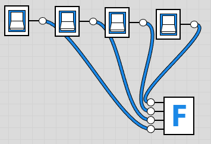

~~wrapHtml(div,schedule){

- [Numbering Systems](#numbering-systems)
  - [Everyday Numbering Systems](#everyday-numbering-systems)
    - [Base 10](#base-10)
    - [Base 12 and 24](#base-12-and-24)
    - [Base 60](#base-60)
  - [Binary](#binary)
    - [Why use it?](#why-use-it)
    - [Applications](#applications)
  - [Hexadecimal](#hexadecimal)
    - [Why use it?](#why-use-it-1)
    - [Applications](#applications-1)

}

# Numbering Systems

We can use any number of symbols to represent the same numeric value.

Example: write the number “ten” in base 1 through 10

| Base | Symbols                                            | Representation 10(10) |
| :--- | :------------------------------------------------- | -------------------------------: |
| 1    | { 1 }                                              |                       1111111111 |
| 2    | { 0, 1 }                                           |                             1010 |
| 3    | { 0, 1, 2 }                                        |                              101 |
| 4    | { 0, 1, 2, 3 }                                     |                               22 |
| 5    | { 0, 1, 2, 3, 4 }                                  |                               20 |
| 6    | { 0, 1, 2, 3, 4, 5 }                               |                               14 |
| 7    | { 0, 1, 2, 3, 4, 5, 6 }                            |                               13 |
| 8    | { 0, 1, 2, 3, 4, 5, 6, 7 }                         |                               12 |
| 9    | { 0, 1, 2, 3, 4, 5, 6, 7, 8 }                      |                               11 |
| 10   | { 0, 1, 2, 3, 4, 5, 6, 7, 8, 9 }                   |                               10 |
| ...  | ...                                                |                              ... |
| 16   | { 0, 1, 2, 3, 4, 5, 6, 7, 8, 9, A, B, C, D, E, F } |                                A |

To indicate the base of a number, we use a subscript. These are not the same number:

- 10(2)
- 10(10)

## Everyday Numbering Systems

### Base 10

- Our "counting" numbering system.
- Numbers in base 10 are called **_decimal_** numbers.
- Probably evolved from counting on fingers.

### Base 12 and 24

- Used for time
  - 12 hours in half day
  - 24 hours in day

### Base 60

- Used for time
  - 60 seconds in minute
  - 60 minutes in hour

## Binary

Numbers in base 2 are called **_binary_** numbers: { 0, 1 }

### Why use it?

- Digital signal can be in one of two states:
  - **_Off = 0_**
  - **_On = 1_**

### Applications

TODO

_Arithmetic Logic Unit (ALU)_

The Arithmetic Logic Unit (ALU) is the part of the Central Procesing Unit (CPU) that performs arithmetic and logical operation.

... half-adder, full-adder, etc ...

... Bitwise operations ...

... Bitmasking ...

... Error detection ...

... Parity ...

... Encoding and Decoding ...

## Hexadecimal

Numbers in base 16 are called **_hexadecimal_** numbers: { 0, 1, 2, 3, 4, 5, 6, 7, 8, 9, A, B, C, D, E, F }

### Why use it?

Hexadecimal (hex) offers a nice, compact way to represent binary numbers.

<figure>
    
        
    
    <figcaption>
        Four bits to hex.
    </figcaption>
</figure>

- Break binary number into groups of 4 bits (called a **nibble**).
  - Each nibble is guaranteed to be a number from 0-15; 0-F in hex.
- Convert each nibble to hex.
- Concatenate the results - put them back together.

Demo:

Using four bits to represent hex digits.

- [logic.ly](https://logic.ly/demo/)

<figure>
    
        
    
    <figcaption>
        Four bits to hex.
    </figcaption>
</figure>

### Applications

TODO
