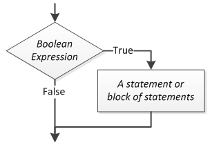
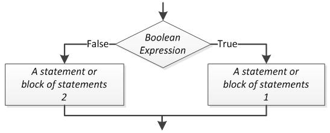
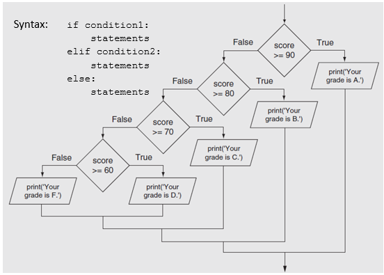

~.toc

- [Decision](#decision)
  - [Comparison Operators in Python](#comparison-operators-in-python)
  - [Single Alternative](#single-alternative)
    - [Example Algorithm](#example-algorithm)
      - [Pseudocode](#pseudocode)
    - [Python `if` Statement](#python-if-statement)
      - [Demo Programs](#demo-programs)
  - [Dual Alternative](#dual-alternative)
    - [Example Algorithm](#example-algorithm-1)
      - [Pseudocode](#pseudocode-1)
    - [Python `if, else` Statement](#python-if-else-statement)
      - [Demo Programs](#demo-programs-1)
  - [Nested Decision Structures](#nested-decision-structures)
    - [Example Algorithm](#example-algorithm-2)
      - [Pseudocode](#pseudocode-2)
  - [Fallthrough Decisions](#fallthrough-decisions)
    - [Example Algorithm](#example-algorithm-3)
      - [Pseudocode](#pseudocode-3)
    - [Python `if, elif, else` Statement](#python-if-elif-else-statement)
      - [Demo Programs](#demo-programs-2)

/~

# Decision

**Selection** is the process of taking an action based on a condition.

This decision must resolve to a **boolean** value, which is either `true` or `false`.

In other words, it must use an **boolean expression** to make the decision.

## Comparison Operators in Python

Comparison operators are used to compare two values and return a boolean value (True or False).

These are most often what appear in the `if` expressions.

| Operator | Description              |
| -------- | ------------------------ |
| ==       | Equal to                 |
| !=       | Not equal to             |
| >        | Greater than             |
| <        | Less than                |
| >=       | Greater than or equal to |
| <=       | Less than or equal to    |

~.focusContent.lookout

**Assignment vs Comparison Operators**

A common mistake is to use a single equal sign for comparison rather than a double equal sign.

Be careful to use `==` when comparing!

/~

## Single Alternative

A **single alternative decision structure** yields control to a process only if some boolean expression is true.



### Example Algorithm

Price a Pool Day Pass - v1

#### Pseudocode

```plaintext
BEGIN
    Start with the adult day rate

    IF visitor has a season pass:
        Waive the day rate
    END IF

    Print the amount due
END
```

### Python `if` Statement

Anything inside the code block (indented at the if’s level) will be evaluated only if the “if” expression evaluates to true.

The expression for the if statement can be arbitrarily complex - the only constraint is that it must evaluate to True or False.

```python
if x:
    # do something
```

#### Demo Programs

~.focusContent.demo

**Check if even**

Check if a number is even. (We will do even or odd in a single program shortly.)

/~

~.focusContent.demo

**Order processing logic**

Write a program given the following logic:

- Default ship date = 5 days from order date
- If payment not received, ship date = 14 days from order date
- If out of stock, ship date = 30 days from order date
- If rush order, ship date = 1 days from order date

/~

## Dual Alternative

A **dual alternative decision structure** yields control to one of two processes based on the truthfulness of a given boolean condition.



Dual alternative example: Open communication channel with landing aircraft.

- “Runway is clear?”
  - True - Direct aircraft to land.
  - False - Send aircraft to hold pattern.

### Example Algorithm

Price a Pool Day Pass - v2

#### Pseudocode

```plaintext
BEGIN
    Start with the adult day rate

    IF session is open swim:
        Charge the day rate
    ELSE
        Charge the day rate plus a lane fee
    END IF

    IF visitor has a season pass:
        Waive the day rate
    END IF

    Print the amount due
END
```

### Python `if, else` Statement

```python
if x:
    # do something
else:
    # do something else
```

#### Demo Programs

~.focusContent.demo

**Check if even or odd**

Check if a number is even/odd.

/~

## Nested Decision Structures

We can put decision structures into the flow of execution from another decision. These are called nested decisions.

```
BEGIN
    IF it is cold outside:
        IF it is snowing:
            Wear boots
        ELSE:
            Wear shoes
    ELSE:
        Wear sandals
END
```

### Example Algorithm

Price a Pool Day Pass - v3

#### Pseudocode

```plaintext
BEGIN
    IF session is open swim:
        IF visitor is a child:
            Set the day rate to the child rate
        ELSE
            Set the day rate to the adult rate
        END IF
    ELSE
        Set the day rate to the adult rate
        Add a lane fee

        IF lane is reserved for the full hour:
            Add a reservation fee
        END IF
    END IF

    IF visitor has a season pass:
        Waive the day rate
    END IF

    Print the amount due
END
```

## Fallthrough Decisions

We can chain together arbitrary amounts of decisions to represent “fallback logic” - if, else if, else if, … else.



~.focusContent.demo

What happens if we use regular `if` statements instead of `else if`?

What would the pseudocode look like if we did not have `else if`, and instead just used a series of `if` statements?

/~

### Example Algorithm

Price a Pool Day Pass - v4

#### Pseudocode

```plaintext
BEGIN
    IF session is open swim:
        Charge the day rate
    ELSE IF session is a lap lane:
        Charge the day rate plus a lane fee
    ELSE
        Do not admit the visitor
    END IF

    IF visitor has a season pass:
        Waive the day rate
    END IF

    Print the amount due
END
```

### Python `if, elif, else` Statement

```python
if x:
    # do something
elif y:
    # do something else
else:
    # do something else
```

#### Demo Programs

- [Percent to Grade Program](https://github.com/mpjovanovich/ivy_tech/blob/main/SDEV120_Computing_Logic/grade_calc_if_elif_else.py)
- Simple calculator
