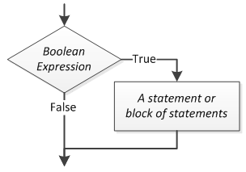

~.toc

- [Decision](#decision)
  - [Single Alternative](#single-alternative)
    - [Example Algorithm](#example-algorithm)
      - [Pseudocode](#pseudocode)
      - [Flowchart](#flowchart)
    - [Python `if` Statement](#python-if-statement)
      - [Demo Programs](#demo-programs)
  - [Dual Alternative](#dual-alternative)
    - [Example Algorithm](#example-algorithm-1)
      - [Pseudocode](#pseudocode-1)
      - [Flowchart](#flowchart-1)
    - [Python `if, else` Statement](#python-if-else-statement)
      - [Demo Programs](#demo-programs-1)
  - [Nested Decision Structures](#nested-decision-structures)
    - [Example Algorithm](#example-algorithm-2)
      - [Pseudocode](#pseudocode-2)
      - [Flowchart](#flowchart-2)
- [SDEV 140 Only](#sdev-140-only)
  - [Fallthrough Decisions](#fallthrough-decisions)
    - [Example Algorithm](#example-algorithm-3)
      - [Pseudocode](#pseudocode-3)
      - [Flowchart](#flowchart-3)
    - [Python `if, elif, else` Statement](#python-if-elif-else-statement)
      - [Demo Programs](#demo-programs-2)

/~

# Decision

**Selection** is the process of taking an action based on a condition.

This decision must resolve to a **boolean** value, which is either `true` or `false`.

In other words, it must use an **boolean expression** to make the decision.

## Single Alternative

A **single alternative decision structure** yields control to a process only if some boolean expression is true.



### Example Algorithm

Charge Customer for Item - v1

#### Pseudocode

```plaintext
BEGIN
    Begin point of sales transaction
    Scan all items

    IF customer is a rewards member:
        Apply discount
    END IF

    Complete point of sales transaction
END
```

#### Flowchart

_Do in class. Keep for later._

### Python `if` Statement

Anything inside the code block (indented at the if’s level) will be evaluated only if the “if” expression evaluates to true.

The expression for the if statement can be arbitrarily complex - the only constraint is that it must evaluate to True or False.

```python
if x:
    # do something
```

#### Demo Programs

~.focusContent.demo

Check if a number is even. (We will do even or odd in a single program shortly.)

/~

~.focusContent.demo

1.  Order processing logic

Write a program given the following logic:

- Default ship date = 5 days from order date
- If payment not received, ship date = 14 days from order date
- If out of stock, ship date = 30 days from order date
- If rush order, ship date = 1 days from order date

/~

## Dual Alternative

A **dual alternative decision structure** yields control to one of two processes based on the truthfulness of a given boolean condition.


Dual alternative example: Open communication channel with landing aircraft.

- “Runway is clear?”
  - True - Direct aircraft to land.
  - False - Send aircraft to hold pattern.

### Example Algorithm

Charge Customer for Item - v2

#### Pseudocode

```plaintext
BEGIN
    Begin point of sales transaction
    Scan all items

    IF customer is a rewards member:
        Apply discount

    Get payment method

    IF payment method is credit card:
        Swipe card
    ELSE
        Take cash
    END IF

    End point of sales transaction
END
```

#### Flowchart

_Do in class._

### Python `if, else` Statement

```python
if x:
    # do something
else:
    # do something else
```

#### Demo Programs

~.focusContent.demo

Check if a number is even/odd.

/~

## Nested Decision Structures

We can put decision structures into the flow of execution from another decision. These are called nested decisions.

```
BEGIN
    IF it is cold outside:
        IF it is snowing:
            Wear boots
        ELSE:
            Wear shoes
    ELSE:
        Wear sandals
END
```

### Example Algorithm

Charge Customer for Item - v3

#### Pseudocode

```plaintext
BEGIN
    Begin point of sales transaction
    Scan all items

    IF customer is a rewards member:
        Apply discount

    Get payment method

    IF payment method is credit card:
        Swipe card

        IF payment is declined:
            Deny payment
            Shelve items for restocking
    ELSE
        Take cash

        IF change is due:
            Give change
    END IF

    End point of sales transaction
END
```

#### Flowchart

_Do in class._

# SDEV 140 Only

## Fallthrough Decisions

We can chain together arbitrary amounts of decisions to represent “fallback logic” - if, else if, else if, … else.


~.focusContent.demo

What happens if we use regular `if` statements instead of `else if`?

What would the pseudocode look like if we did not have `else if`, and instead just used a series of `if` statements?

/~

### Example Algorithm

Charge Customer for Item - v3

#### Pseudocode

```plaintext
BEGIN
    Begin point of sales transaction
    Scan all items

    IF customer is a rewards member:
        Apply discount

    Get payment method

    IF payment method is credit card:
        Swipe card
    ELSE IF payment method is cash:
        Take cash
    ELSE
        Deny payment
        Shelve items for restocking
    END IF

    End point of sales transaction
END
```

#### Flowchart

_Do in class._

### Python `if, elif, else` Statement

```python
if x:
    # do something
elif y:
    # do something else
else:
    # do something else
```

#### Demo Programs

- [Percent to Grade Program](https://github.com/mpjovanovich/ivy_tech/blob/main/SDEV120_Computing_Logic/grade_calc_if_elif_else.py)
- Simple calculator
