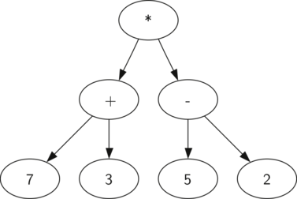

~~wrapHtml(div,schedule){

- [Syntax and Expressions](#syntax-and-expressions)
  - [Syntax](#syntax)
    - [Natural Language Syntax](#natural-language-syntax)
    - [Programming Language Syntax](#programming-language-syntax)
  - [Literals and Variables](#literals-and-variables)
  - [Operators](#operators)
    - [Comparison Operators in Python](#comparison-operators-in-python)
    - [Logical Operators in Python](#logical-operators-in-python)
  - [Expressions](#expressions)
  - [Statements](#statements)
  - [Tree Structures](#tree-structures)
    - [Tree Terminology](#tree-terminology)
    - [Tree Traversal](#tree-traversal)
  - [Abstract Syntax Trees](#abstract-syntax-trees)
    - [Basic Syntax Tree](#basic-syntax-tree)
    - [Variables in Syntax Trees](#variables-in-syntax-trees)
    - [Expanding Function Calls](#expanding-function-calls)
  - [Function Composition](#function-composition)
    - [Arithmetic Function Composition](#arithmetic-function-composition)
  - [Functions with Multiple Arguments](#functions-with-multiple-arguments)
  - [Boolean Logic in Syntax Trees](#boolean-logic-in-syntax-trees)
  - [For the Homework](#for-the-homework)

}

# Syntax and Expressions

In this lecture, we'll explore how to build a programming language from the ground up. To do so we'll need to understand the basic components of code: syntax, literals, variables, operators, expressions, and statements.

## Syntax

**Syntax** is the set of rules that defines how symbols can be arranged to form valid code.

### Natural Language Syntax

English has its own set of rules.

~~example {

"I went to the store last Saturday."

Expressions: "(I) (went) (to the store) (last Saturday)."

How many ways can we rearrange the words to form a gramatically valid sentence?

}

### Programming Language Syntax

Each programming language has its own syntax.

~~example {

```python
x = 5 # Synactically correct
5 = x # Syntax error - we assign from right to left
```

}

## Literals and Variables

The most basic components of code are literals and variables.

- **Literals** are fixed values.
- **Variables** (and constants) are placeholders for values.

```python
# Say "hello" using a string literal:
print("hello")

# Assign a string literal to a variable, then use it to say "hello":
greeting = "hello"
print(greeting)
```

## Operators

Code is primarily made up of operators, operands, expressions, and statements.

**Operators** are symbols that perform operations on values.

- Arithmetic operators: `+`, `-`, `*`, `/`, `//`, `%`, `**`
- Comparison operators: `==`, `!=`, `<`, `>`, `<=`, `>=`
- Logical operators: `and`, `or`, `not`

**Operands** are the values that operators act on.

- `5`, `x`, `True`

### Comparison Operators in Python

A comparison always returns a boolean value, either `True` or `False`.

| Operator | Description              |
| -------- | ------------------------ |
| ==       | Equal to                 |
| !=       | Not equal to             |
| <        | Less than                |
| >        | Greater than             |
| <=       | Less than or equal to    |
| >=       | Greater than or equal to |

```python
# Comparing two literals
print(5 == 5) # True
print(5 != 5) # False
```

### Logical Operators in Python

| Operator | Description |
| -------- | ----------- |
| and      | conjunction |
| or       | disjunction |
| not      | negation    |

```python
print( True and False ) # False
print( True or False ) # True
print( not True ) # False
```

## Expressions

Expressions are combinations of literals, variables, and operators that evaluate to a value.

They **return** something.

```python
# Returns 2
3 - 1

# Returns value of x + value of y
x + y

# Returns True if x is equal to y, False if not
x == y
```

## Statements

Statements are also combinations of literals, variables, and operators.

They **do** something.

```python
# Assigns value to x
x = 9
# Assigns value y
y = 3

# Branches based on the comparison of x and y
if x > y:

    # Calls a function
    print('x is greater than y')
```

## Tree Structures

A **tree structure** is a data structure that represents a hierarchy of elements. They are used in many areas of computer science.

### Tree Terminology

- **Root**: The top node in a tree.
- **Parent**: A node that has children.
- **Child**: A node that has a parent.
- **Leaf**: A node that has no children.

### Tree Traversal

There are many algorithms for determining the order in which to visit nodes in a tree:

<!-- TODO: gif -->

- **Pre-order**: Visit the root node first.
- **In-order**: Visit the left child, then the root, then the right child.
- **Post-order**: Visit the left child, then the right child, then the root.

## Abstract Syntax Trees

An **abstract syntax tree** is a visual representation of the syntax of a programming language for some expression.

<!-- The algorith that we will use to traverse our syntax tree is the **post-order** algorithm. -->

### Basic Syntax Tree

Below is a syntax tree containing literals and operators for the expression:

```
(7 + 3) * (5 - 2)
```

<figure>
    <span>
        
    </span>
</figure>

~~example{

Draw the syntax tree for the following expressions:

```
1) 5 + 3 * 2

2) (5 + 3) * 2

3)  10 / 2 / 2 - 1

4)  10 / (2 / 2) - 1
```

}

### Variables in Syntax Trees

If a syntax tree includes variables, we treat them just like literals.

~~example{

1. Draw the syntax tree for the expression:

```
(7 + x) * (y - 2)
```

2. Evaluate the expression for `x = 3` and `y = 5` by plugging in the values.

}

### Expanding Function Calls

We may need to substitute the function call with its definition within the tree. We just drop it in place.

~~example{

Given the function:

```
f(x) = x / 2
```

Find the syntax tree for the following expressions:

```
1) 10 * f(4) + 3

2) 10 * f(y) + 3

3) f(2) * f(3)
```

}

~~example{

Given the function:

```
f(x) = f(x) = x * 2 + 2
```

Find the syntax tree for the following expressions:

```
1) 10 * f(4) + 3

2) 10 * f(y) + 3

3) f(2) * f(3)
```

}

## Function Composition

**Function Composition** is the process of combining two or more functions to produce a new function.

### Arithmetic Function Composition

Given the functions:

```
f(x) = x + 1
g(x) = x * 2
```

An example of function composition is `f(g(x))`.

~~example{

Given the functions:

```
f(x) = x + 1
g(x) = x * 2
```

1. Draw the syntax tree for `f( g(3) )`.

2. Evaluate the expression.

```
f( g( 3 ) )
  = f( 3 * 2 )
  = f( 6 )
  = 6 + 1
  = 7
```

}

~~example{

Given the functions:

```
f(x) = x + 1
g(x) = x * 2
```

Evaluate the following expressions:

```
1) g( f(3) )

2) g( f(2) + 4 )

3) f( f(2) )

4) f( f( f(6) + 1 ) + 2 ) + 3
```

}

## Functions with Multiple Arguments

Functions can take multiple arguments. In this case, we plug in the values for each argument in the order they are given.

~~example{

Given the function:

```
f(x, y) = x + y + 1
```

1. Draw the syntax tree for the expression.

2. Evaluate the following expressions:

```
1) f(3, 4)

2) f(1, 1)

2) f(3, f(2, 1))
```

}

## Boolean Logic in Syntax Trees

We can drop in True and False values into our syntax trees along with logical connectives.

They work the same as we've seen so far.

~~example{

Draw the syntax tree for the following expressions, evaluating them as you go:

```
1) True and False or False

2) True and (False or False)

3) True and (x or y)

4) not True

5) z and not (x and y)
```

}

Here's an example with function composition:

Given the functions:

```
f(x, y) = x and y
g(x, y) = x or y
```

Evaluate `f( g(True, False), True)` by plugging the values into the functions:

```
f( g( True, False ), True)
= f( True or False, True)
= f( True, True )
= True and True
= True
```

~~example{

Given the functions:

```
f(x, y) = x and y
g(x, y) = x or y
```

Evaluate the following expressions:

```

1. g( f(True, False), False)

2. f( f(True, False), False )

3. g( f(True, False), g(True, True) )

```

}

## For the Homework

- Use draw.io to make syntax trees
- Make sure to double check what the question is asking you to do!
