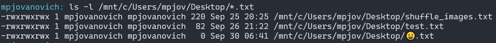

~.toc

- [Text Data Types](#text-data-types)
  - [Characters](#characters)
  - [ASCII](#ascii)
  - [Unicode](#unicode)
    - [Applications](#applications)
  - [Text vs Binary Files](#text-vs-binary-files)
  - [Checksums, Digests, and Hashes](#checksums-digests-and-hashes)

/~

# Text Data Types

Since computers only have binary to work with, we **encode** text by assigning characters to numbers in a lookup table. This is called a **character set**.

## Characters

Recall that text is made up of **characters**: letters, numbers, and symbols.

~.focusContent.example

**Whitespace** characters are an easy-to-miss source of computer errors. They include the space, tabs, carriage return, and line feed.

One example is Python, which uses indentation to define code blocks. If you mix tabs and spaces, you will get an error.

```python
if True:
	print("Hello")
    print("World")
```

All text editors should have a way to show whitespace characters. In notepad++ try going to `View > Show Symbol > Show All Characters`.

Try dropping the snippet above and looking at the characters.

/~

## ASCII

The **American Standard Code for Information Interchange** (ASCII) is a character set that uses 7 bits to represent 128 characters. It was developed in the 1960s and is still in use today.

[https://www.ascii-code.com/](https://www.ascii-code.com/)

- A = 65
- B = 66
- a = 97
- b = 98
- space = 20
- etc.

## Unicode

**Unicode Transformation Format**, or just **Unicode**, was developed to address the limitations of ASCII. It has several encoding schemes, the most common being **UTF-8** (Unicode Transformation Format).

UTF-8 uses 8 bits to represent characters. Other schemes use 16 or 32 bits.

_Example_:

Open a web page and view the source code.

```html
<meta charset="UTF-8" />
```

### Applications

**Languages**

_Latin_: A, B, C, ..., Z, a, b, c, ..., z

_Greek_: α, β, γ, ..., ω

_Cyrillic_: А, Б, В, ..., Я

_Hebrew_: א, ב, ג, ..., ת

_Arabic_: ا, ب, ج, ..., ي

**Symbols**

©, ®, ™, €, £, ¥, ¢, etc.

**Math**

∞, ∑, √, π, etc.

**Emoji**

- 😀, 🎉, 🚀, ❤️, etc.



**Oddballs**

- ♔, ♕, ♖, ♗, ♘, ♙, ♚, ♛, ♜, ♝, ♞, ♟
- ♠, ♡, ♢, ♣
- ♩, ♪, ♫, ♬
- ...

## Text vs Binary Files

Although everything is stored as binary, we can categorize files as either **text** or **binary**.

**Text files** are human-readable and can be opened in a text editor.

**Binary files** are not human-readable and must be opened in a program that understands the file format. These files may or may not contain text. E.g. Microsoft Word files are binary files. Try opening one in a text editor.

~.focusContent.demo

We can use the `xxd` program in bash to view the contents of a file in hexadecimal.

```bash
# View a text file in class
xxd -b some_file.txt

# View a binary file in class
xxd -b some_file.bin

# Look at the hex notation for our text file to show why we use hex
xxd some_file.txt
```

/~

## Checksums, Digests, and Hashes

Now that we know more about how text is encoded, let's look at an application.

- A **checksum** is calculated by adding the bytes in a message and storing the result in a separate byte. Useful for checking small amount of data.

- A **digest** is a fixed-size string that represents the contents of a file. The function used to calculate the digest is called a **hash function**. Useful for checking larger amounts of data.

~.focusContent.demo

```bash
# We create an awesome program, and host it on our website.
# We provide a checksum and MD5 digest for users to verify the
# file's integrity.
echo "Hey, I'm the file." > test.exe
sum test.exe    # Checksum
md5sum test.exe # MD5 digest

# Bad actor changes the file and distributes it,
# pretending it's authentic.
echo "I've come to ruin your computer." > test2.exe

# Our friend downloads the file and checks the checksum
# to make sure it's the same as the original.
sum test2.exe
md5sum test2.exe
```

/~
