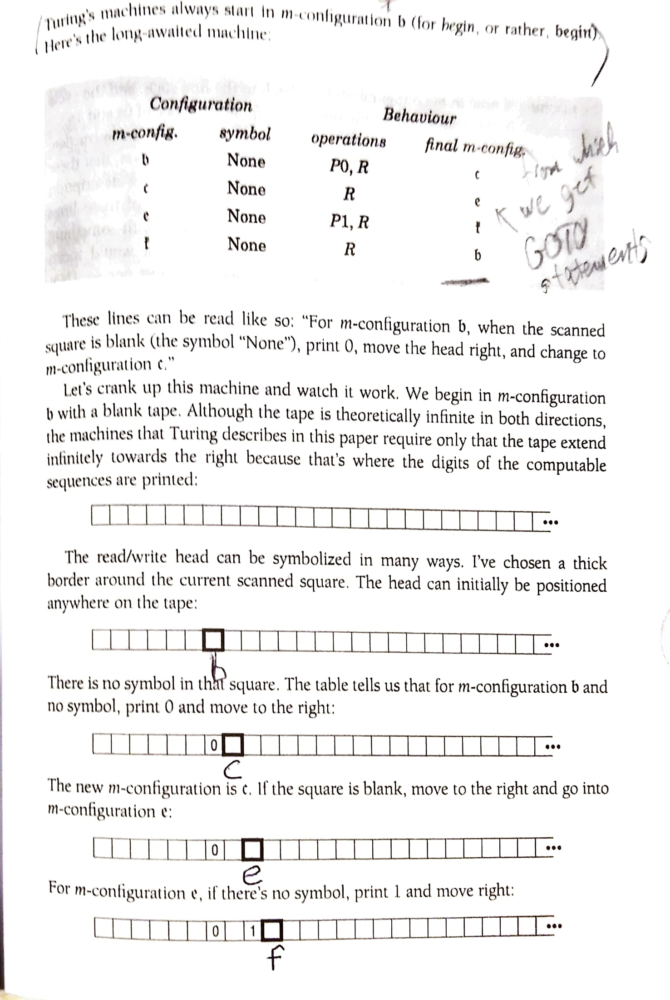

~~wrapHtml(div,schedule){

- [Computability](#computability)
  - [Alan Turing](#alan-turing)
  - [The Halting Problem](#the-halting-problem)
- [The Turing Machine](#the-turing-machine)
  - [Consequences for Modern Computing](#consequences-for-modern-computing)

}

# Computability

<figure>
    
        
    
</figure>

> We may compare a man in the process of computing a real number to a machine which is only capable of a finite number of conditions... - Alan Turing

**Computability** refers to ability to solve a problem in a finite number of steps.

## Alan Turing

Alan Turing lived in Britain during World War II. He was a mathematician and cryptanalyst. Among his accomplishments are:

- Helped break the encryption from German "Enigma" machine during WWII to decode German messages.
- Was foundational in showing the limits of what computers can and cannot do. In doing so he laid the groundwork for the development of modern computing.
- Pioneered the field of artificial intelligence (from which we get the "Turing Test").
- Worked in biology, specifically in the field of morphogenesis (how biological forms develop).

## The Halting Problem

Turing wasn't trying to build a computer in the modern sense. He was working on a math problem that had to do with logical propositions (the Entscheidungsproblem, or "decision problem").

The **Halting Problem** asks: "Is there a general algorithm that can take another algorithm along with its input and determine whether the algorithm will halt (stop running) or run forever?"

_Example:_

- Let's say we have a program that we know prints ones and/or zeroes based on a set of rules and inputs. We want to know if the program will ever print a zero. If we give this set of rules and inputs to another program, can it determine if the first program will ever print a zero?

Turing showed that there are some problems that are fundamentally unsolvable by any algorithm in finite time. This is known as the **Church-Turing Thesis**.

# The Turing Machine

Turing created what we now call the **Turing Machine**: a theoretical device that can simulate the logic of any computer algorithm. It's not a physical machine, just a concept.

It consists of:

- A tape that can be read from and written to, and extended infinitely in both directions.
- A head that can move left or right along the tape.
- A set of states that the machine can be in.
- A starting state.
- A set of rules that determine what the machine does based on its current state and the symbol it reads from the tape; basically a lookup table to determine what to do next.

_Example:_

<figure>
    
        
    
    <figcaption>Charles Petzold - The Annotated Turing, p81</figcaption>
</figure>

- This machine prints an alternating sequence of zeroes and ones: 01010101...
- Turing always leaves blank squares between the printed symbols.
- In this example the "symbol" column in the table are all "None", but for meaningful programs they would be filled various symbols that are used to control the calculations.

## Consequences for Modern Computing

- Turing's oddly mechanistic approach to solving the problem paved the way for the development of mechanized computing.
- Turing formalized the concept of an algorithm.
- Programs are algorithms.
- We give them inputs and they produce outputs.
