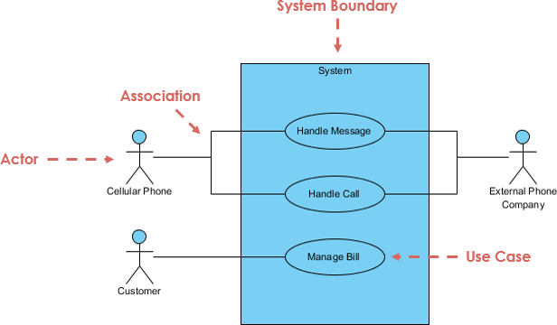
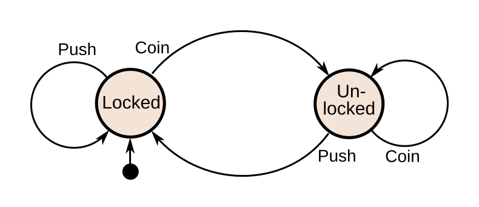
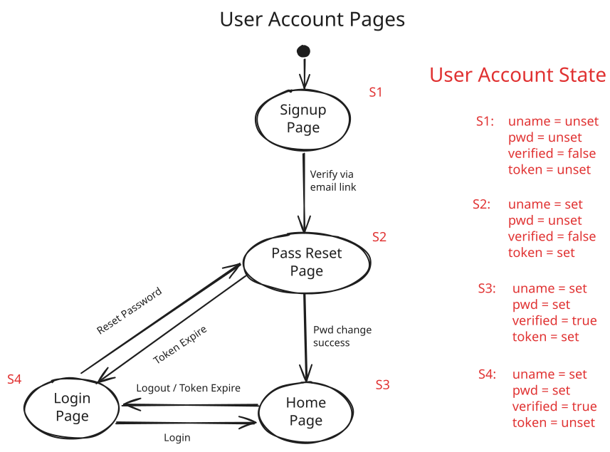
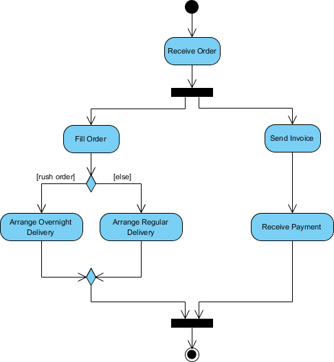
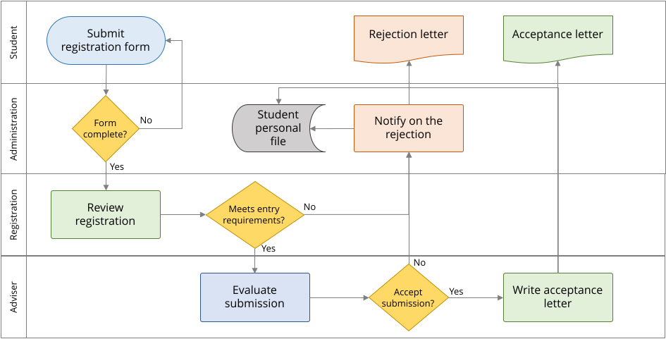
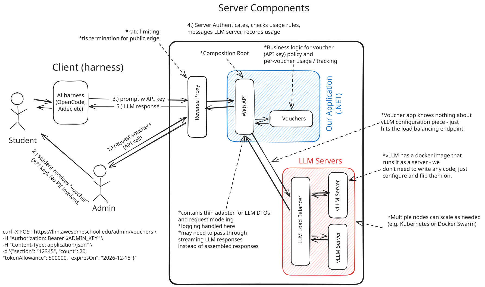

~.toc

- [Unified Modeling Language (UML)](#unified-modeling-language-uml)
  - [Background](#background)
  - [What is UML?](#what-is-uml)
    - [Do We Really Need to Know All This?](#do-we-really-need-to-know-all-this)
    - [When to Use UML](#when-to-use-uml)
  - [Diagram Types](#diagram-types)
    - [Use Case Diagram](#use-case-diagram)
      - [Description](#description)
      - [Key components](#key-components)
    - [Class Diagram](#class-diagram)
      - [Description](#description-1)
      - [Key components](#key-components-1)
    - [Sequence Diagram](#sequence-diagram)
      - [Description](#description-2)
      - [Key components](#key-components-2)
    - [State Diagram](#state-diagram)
      - [Description](#description-3)
      - [Key components](#key-components-3)
    - [Activity Diagram](#activity-diagram)
      - [Description](#description-4)
      - [Key components](#key-components-4)
    - [Hybrids](#hybrids)
      - [Swimlane Diagram](#swimlane-diagram)
      - [Custom](#custom)

/~

# Unified Modeling Language (UML)

Reference: [UML Diagrams](https://drawio-app.com/blog/uml-diagrams)

Free tools for creating UML diagrams:

| Tool                                      | Typical use                         |
| :---------------------------------------- | :---------------------------------- |
| [Excalidraw](https://excalidraw.com/)     | Informal sketches / whiteboarding   |
| [Draw.io](https://drawio-app.com/)        | General UML and other diagrams      |
| [Lucidchart](https://www.lucidchart.com/) | General UML and other diagrams      |
| [Mermaid](https://mermaid.js.org/)        | Text-based diagrams in Markdown     |
| [DB Diagram](https://dbdiagram.io/)       | Database schemas / ER diagrams only |

## Background

Prior to UML...

- Different notations and diagrams
- Everyone confused

Now, with UML...

- Can take a diagram to anyone on earth in tech field and they will understand it

## What is UML?

_Not_ a programming language

- **_Set of diagrams and notations_** used to model IT systems.
- Universal, culture invariant, and so much fun!

**_Hooray standards!_**

### Do We Really Need to Know All This?

Per [IBM: An introduction to the Unified Modeling Language](https://developer.ibm.com/articles/an-introduction-to-uml/):

> The most useful, standard UML diagrams are: use-case diagram, class diagram, sequence diagram, statechart diagram, activity diagram, component diagram, and deployment diagram.

Different domains use some more than others.

### When to Use UML

- Planning new systems / functionality
- Documenting existing systems
- Training new team members
- Communicating with stakeholders
- Safety critical systems
- Regulatory compliance

## Diagram Types

<figure>
 
</figure>

### Use Case Diagram

<figure>
 
</figure>

#### Description

- Represent functionality, actors, and how these relate to each other in the context of a system.
- "High level" scope; not much detail.
- Useful for planning new functionality.
- Useful for communicating with stakeholders.

#### Key components

- Actors
- Use cases
- Relationships between actors and use cases
  - \*Optionally, relationships between use cases (includes / extends)
- System boundaries

### Class Diagram

<figure>
 
</figure>

#### Description

- Shows how entities (classes) in a system relate to each other.
- Classes contain self-describing attributes and methods.
- Connectors between classes show **cardinality**; how many of one class can be related to another class.
  - https://www.uml-diagrams.org/multiplicity.html
  - Also... Crow's feet notation.

| Multiplicity | Option | Cardinality                             |
| :----------- | :----- | :-------------------------------------- |
| 0..0         | 0      | Collection must be empty                |
| 0..1         |        | No instances or one instance            |
| 1..1         | 1      | Exactly one instance                    |
| 0..\*        | \*     | Zero or more instances                  |
| 1..\*        |        | At least one instance                   |
| 5..5         | 5      | Exactly 5 instances                     |
| m..n         |        | At least m but no more than n instances |

~.focusContent.exercise

**Concrete and abstract entities:**

- Entities can be concrete or abstract. From above:
  - Concrete examples:
    - Person
    - ??? (what else?)
  - Abstract examples:
    - Comment
    - ??? (what else?)

/~

#### Key components

- Classes
- Attributes
- Methods
- Relationships between classes (cardinality)

~.focusContent.exercise

**For dog walking service, how would we show…**

- Dog walker and client (person)?
- Dogs that he/she is scheduled to walk?
- Relationships between classes?
- Any other classes needed?

/~

### Sequence Diagram

<figure>
 
</figure>

#### Description

- Shows interactions between objects in a system...
  - over time
  - for a specific use case

What has to happen before another thing happens? Who is involved?

#### Key components

- Actors
- Lifelines
- Messages
- Activation boxes

### State Diagram

<figure>
 
</figure>

#### Description

Shows states of a system and how it transitions between them.

#### Key components

- States
- Transitions

~.focusContent.exercise

**Planning a user registration and login workflow:**

Each page can be modeled as a state, shown here by a set of four variables:

| Variable   | Description                                                       |
| :--------- | :---------------------------------------------------------------- |
| `uname`    | The username of the user                                          |
| `pwd`      | The password of the user                                          |
| `verified` | Whether the user has verified their email                         |
| `token`    | The authentication token (a hidden field used for authentication) |

Transitions show how users get from one page to another.

<figure>
    
        
    
</figure>

/~

### Activity Diagram

<figure>
 
</figure>

#### Description

- Models the flow of control from one activity to another.
- Shows logic without implementation detail.

#### Key components

- Activities
- Transitions
- Branching / merging (indicates processes that may run concurrently, then meet back up)
- Forking / joining (much like flowchart decision)

### Hybrids

#### Swimlane Diagram

<figure>
 
</figure>

- Like an activity diagram... with swimlanes.
- Swimlanes show boundaries between actors / roles in system.

#### Custom

It’s useful to have a baseline knowledge of UML if you work with software at all. Even rough sketches can save valuable communication time.

Mix and match to suit your needs.

<figure>
 
</figure>
