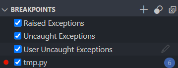

~.toc

- [Error Handling and Input Validation](#error-handling-and-input-validation)
  - [Exception Handling](#exception-handling)
    - [VS Code Exception Settings](#vs-code-exception-settings)
    - [Try / Except Blocks](#try--except-blocks)
      - [General Syntax](#general-syntax)
      - [The Exception Object](#the-exception-object)
    - [Types of Exceptions](#types-of-exceptions)
  - [Validation](#validation)
    - [Validating with Try / Except](#validating-with-try--except)
    - [Looping Until Valid Input](#looping-until-valid-input)
      - [Data Type Validation](#data-type-validation)
      - [Range Validation](#range-validation)
      - [Categorical Validation](#categorical-validation)

/~

# Error Handling and Input Validation

**Validation** is the process of ensuring that data is correct and useful.

**Exception handling** is the process of responding to errors that occur during program execution.

These often go hand-in-hand.

## Exception Handling

Exceptions are a concept in many programming languages.

When a runtime error occurs, an exception is **thrown**.

The exception is either **caught** by an exception handler or the program crashes.

### VS Code Exception Settings

- In VS Code, you can enable or disable exception breaking
- This will cause the debugger to stop when any exception is thrown
- Useful to see exactly where error is occurring



### Try / Except Blocks

_Also called a `try` / `catch` block in some languages._

- Use a `try` block to contain code that might cause an exception
- Use an `except` block to handle the exception
- The except block keeps the program from crashing

We might use and except block to:

- Log the error
- Display an error message to the user
- Attempt to recover from the error

#### General Syntax

```python
x = 1
y = 0

try:
    # Code that might cause an exception
    print(x / y)
except:
    # What to do if an exception occurs
    print("This is a description of the error...")
```

#### The Exception Object

When an exception occurs, an **exception object** is created.

This object contains information about the exception.

```python
try:
    print(1 / 0)
except Exception as e:
    print(e)
```

### Types of Exceptions

We can choose to handle specific types of exceptions. Useful when:

- We want to handle different exceptions differently
- We want to ignore certain exceptions
- We want to handle some exceptions and let others crash the program
- We want the program to **fail gracefully**
  - Close the program in a controlled manner
  - Take above actions before closing
  - Release resources (e.g. close files, network connections, etc.)

```python
try:
    ## Will throw a ZeroDivisionError
    print(1 / 0)

    ## Will throw a ValueError
    print(int("abc"))

    ## Will throw a FileNotFoundError
    file = open("does_not_exist.txt")

    ## Will throw a NameError - no handler so program will crash
    print(variable_does_not_exist)

except ZeroDivisionError:
    print("Cannot divide by zero.")

except ValueError:
    print("Invalid value.")

except FileNotFoundError:
    print("File not found.")
```

## Validation

Validation is the process of ensuring that the data that was entered is correct.

### Validating with Try / Except

- Handle the ValueError exception
  - e.g. `int()`, `float()`, `str()`, `bool()`, etc.

```python
try:
    number = int(input("Enter a number: "))
except ValueError:
    ## Handle invalid input
    print("Invalid number.")
```

### Looping Until Valid Input

Most of the time we want to continue to prompt the user for input until they provide valid input. We can do that with a `while` loop.

#### Data Type Validation

```python
## Get a number from a user - don't let them
## pass until they did:
number = 0

## We will loop indefinitely until we explicitly quit
## the loop with "break"
while True:
    try:
        ## This will go to the except block if the input
        ## is not a number.
        number = float(input('Enter an int: '))

        ## If we made it here then we know the number is valid,
        ## so break out of the loop.
        break
    except ValueError:
        ## Let the user know they messed up, then go back to
        ## the top of the loop
        print('Must enter an integer.')

## We have a valid number, and can now continue the program
print(number)
```

#### Range Validation

```python
number = int(input("Enter a number between 1 and 10: "))

while number < 1 or number > 10:
    ## Handle invalid input
    print("Invalid number.")
    number = int(input("Enter a number between 1 and 10: "))
```

#### Categorical Validation

```python
pet_type = input("Enter a pet type for sitting service (dog, cat): ")
while pet_type != "dog" and pet_type != "cat":
    ## Handle invalid input
    print("Invalid pet type.")
    pet_type = input("Enter a pet type for sitting service (dog, cat): ")
```
