~.toc

- [Version Control Strategies](#version-control-strategies)
  - [Agile](#agile)
    - [GitFlow](#gitflow)
  - [Continuous](#continuous)
    - [Trunk Based Development](#trunk-based-development)

/~

# Version Control Strategies

## Agile

In iterative development methodologies like Agile, the unit of change is a **user story**, or just "story".

- Branch is created for the story (feature).
- Merged when the story is complete.
- Releasable code after merge to main branch.

### GitFlow

**GitFlow** is one iterative branching strategy that uses two main branches: `main` and `develop`...

[GitFlow - GitGraph](https://www.mermaidchart.com/app/projects/50ccdbd5-11ab-4c6a-b810-f62058c91282/diagrams/8db2a2a5-a8da-4850-a3b3-c85edb5b60b4/version/v0.1/edit)

## Continuous

In continuous development methodologies like DevOps, the unit of change is a **commit**.

- Short-lived branches are created for a small unit of change.
- Changes are merged as soon as possible, often multiple times a day.
- Releasable code is ensured after each commit.

### Trunk Based Development

**Trunk Based Development** is a continuous branching strategy that uses a single main branch (trunk).

[CI - GitGraph](https://www.mermaidchart.com/app/projects/50ccdbd5-11ab-4c6a-b810-f62058c91282/diagrams/97cfc040-eac0-42b1-bed4-7215c51d1d5f/version/v0.1/edit)

