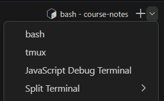

- [Terminal Emulators](#terminal-emulators)
  - [Native Shells](#native-shells)
  - [VS Code Terminal](#vs-code-terminal)
  - [Navigation](#navigation)
    - [Absolute Paths](#absolute-paths)
    - [Relative Paths](#relative-paths)
- [Shell Commands](#shell-commands)
  - [Utility Commands](#utility-commands)
    - [Clear the Terminal](#clear-the-terminal)
    - [Exit the Terminal](#exit-the-terminal)
  - [Directory Traversal](#directory-traversal)
    - [Print Which Directory You Are In](#print-which-directory-you-are-in)
    - [List the Contents of a Directory](#list-the-contents-of-a-directory)
    - [Change Directory](#change-directory)
  - [File Manipulation](#file-manipulation)
    - [Create a New Folder](#create-a-new-folder)
    - [Remove a Directory](#remove-a-directory)
    - [Create a New File](#create-a-new-file)
    - [Copy a File](#copy-a-file)
    - [Move a File](#move-a-file)
    - [Rename a File](#rename-a-file)
    - [Delete a File](#delete-a-file)
  - [What Should I Be Able to Do?](#what-should-i-be-able-to-do)

# Terminal Emulators

- A **terminal** is a program that allows you to interact with the operating system.

- A **shell** is a program that interprets commands.

The combination of a terminal and a shell is called a **terminal emulator**.

## Native Shells

Each operating system has a default shell:

- **bash** (Bourne Again SHell, but just call it bash): Unix-based systems (Linux and Mac)

- **zsh** (Z SHell): Mac

- **PowerShell**: Windows

## VS Code Terminal

Visual Studio Code has an integrated terminal. If you've close the terminal you can always get back to it from the top bar by clicking View > Terminal.

You can see what shell you are using on the Terminal tab:

<figure>
  
</figure>

You can change the shell in VS Code using the dropdown arrow next to the plus sign:

<figure>
  
</figure>

## Navigation

A side note on navigation is necessary here...

### Absolute Paths

Absolute paths start at the **root directory**. This is the top-most directory in the file system.

- On Windows, this is `C:\`
- On Mac and Linux, this is `/`

Absolute Path Examples:

- `C:\Users\John\Documents\test.txt`
- `/home/john/Documents/test.txt`

### Relative Paths

Relative paths start at the current directory.

Relative paths start at:

- The working directory from the terminal if we're in the terminal.
- The current directory of a file if we're coding.

Relative Path Examples:

- `Documents\test.txt`
- `SomeFolder/OtherFolder/test.txt`

# Shell Commands

We will use bash commands for all examples, because many cloud platforms and virtual environments use Unix-based systems.

You can also use bash commands on Windows after you have installed Git via **git bash**. This also works in VS Code's integrated terminal.

Some may work in other terminals such as `zsh` or `PowerShell`, but this is not guaranteed.

**_\*Don't run commands blindly. Make sure you understand what they do before running them. You can wipe your entire system clean with one short command._**

### Utility Commands

#### Clear the Terminal

```bash
# clear = Clear the Terminal
clear
```

#### Exit the Terminal

```bash
# exit = Exit the Terminal
exit
```

### Directory Traversal

#### Print Which Directory You Are In

```bash
# pwd = Print Working Directory
pwd
```

#### List the Contents of a Directory

```bash
# ls = List
ls                      # List the current directory
ls -l                   # List the current directory in long format
ls -a                   # List the current directory, including hidden files
ls /home/john/Documents # List the contents of a specific directory
```

#### Change Directory

`.` is the current directory.
`..` is the parent directory relative to the current directory.

```bash
# cd = Change Directory
cd ..
cd ../images
cd /home/john/Documents
```

## File Manipulation

### Create a New Folder

Will be created in the current directory in this case.

```bash
# mkdir = Make Directory
mkdir test
```

### Remove a Directory

\*Be sure to back up any files prior to removing them! It's better to be safe than sorry. You can always delete them later.

If it's empty:

```bash
# rmdir = Remove Directory
# Must be empty
rmdir test
```

If it's not empty:

```bash
# rm -r = Remove Directory Recursively (Along with All Folders and Files Inside It
# You've been warned...
rm -r test
```

### Create a New File

Will be created in the current directory in this case. Can also be used to set a file's "last modified" timestamp.

```bash
touch test.txt
```

### Copy a File

First argument is the source file, second argument is the destination file. Will overwrite if the destination file already exists.

```bash
# cp = Copy
cp test.txt test2.txt
```

### Move a File

First argument is the source file, second argument is the destination file.

```bash
# mv = Move
mv test.txt ../test.txt
```

### Rename a File

First argument is the old name, second argument is the new name. Will overwrite if the destination file already exists.

```bash
# mv = Move (but also used for renaming files)
mv test.txt test2.txt
```

### Delete a File

```bash
# rm = Remove
rm test.txt
```

## What Should I Be Able to Do?

- Print the current directory.
- List the contents of a directory.
- Switch directories using relative and absolute paths.
- Create a new folder.
- Create a new file.
- Copy a file.
- Rename a file.
- Move a file.
- Delete a file.
