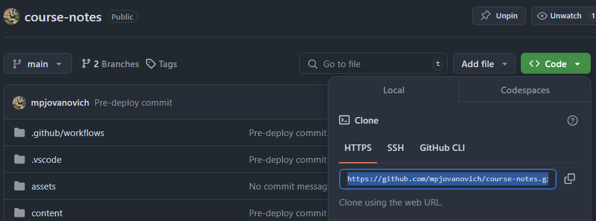
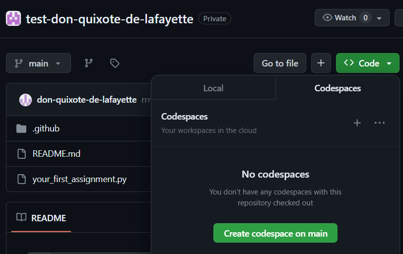
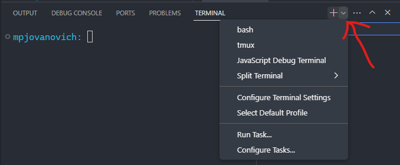
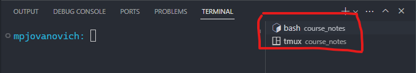
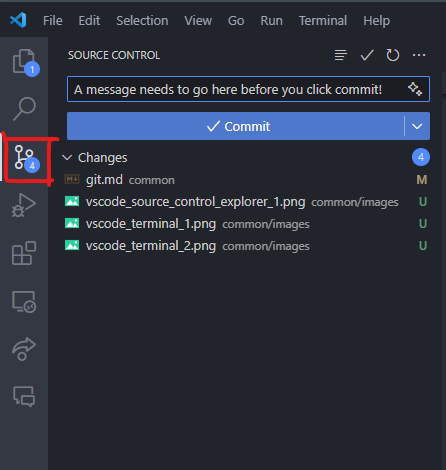
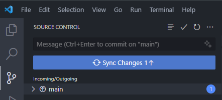
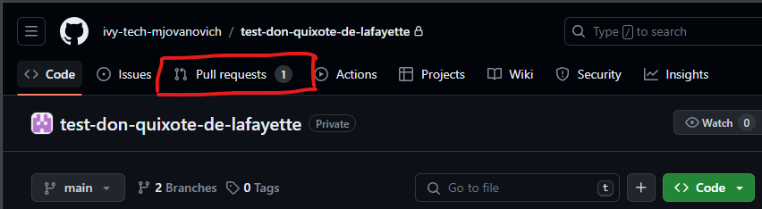
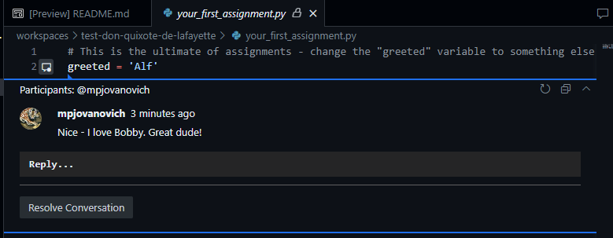
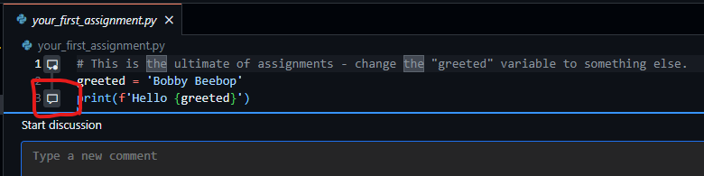

~.toc

- [Source Control / Version Control](#source-control--version-control)
  - [Distributed Version Control](#distributed-version-control)
    - [Solo Projects](#solo-projects)
    - [Collaborative Projects](#collaborative-projects)
- [Synchronizing Changes via Git](#synchronizing-changes-via-git)
  - [Remote to Local Synchronization](#remote-to-local-synchronization)
    - [Creating a New Repository](#creating-a-new-repository)
    - [Cloning a Repository](#cloning-a-repository)
    - [Pulling Changes](#pulling-changes)
  - [Local to Remote Synchronization](#local-to-remote-synchronization)
    - [Working Directory](#working-directory)
    - [Staging Area](#staging-area)
    - [Local Repository](#local-repository)
    - [Remote Repository](#remote-repository)
    - [File States](#file-states)

/~

# Source Control / Version Control

In these notes we will introduce Git as a version control system.

**Version control** or **source control** allows us (among other things) to be able to know what our project looked like at any point in time, e.g. last year, by keeping track of all the changes we've made to files over time.

- Stores files and their history
- Tracks changes to files over time
- Allow for point in time recovery and comparison
- Allows more than one person to work on (or examine) the same file at the same time.

### Distributed Version Control

<figure style="text-align: center;">
    
</figure>

Git is a very common version control tool that you'll almost certainly come across in your career.

---

<figure style="text-align: center;">
    
    <figcaption>"Server" is the remote (github.com). "Workstations 1-3" are local machines (your computer, your teammates' computer, etc.). Each workstation has a copy of the repository.</figcaption>
</figure>

---

Git is a **distributed** version control system. The code is saves on multiple machines, and every user has a copy of the entire history of the project on his or her own computer.

Specifically:

- **Remote**: The main machine that hosts the project.
- **Local**: Personal machine of a user.

GitHub.com is the remote that we will use.

#### Solo Projects

For small solo projects, this usually means that there is a copy of the project on:

- Your local (personal) machine
- github.com

#### Collaborative Projects

For collaborative projects, this usually means that there is a copy of the project on:

- Your local (personal) machine
- The machines of your teammates / coworkers
- github.com or another remote host server

# Synchronizing Changes via Git

Changes made on a local machine are not automatically reflected on the remote repository.

Likewise, changes made on the remote repository (e.g. by a teammate) are not automatically reflected on a local machine.

## Remote to Local Synchronization

<figure>
  
</figure>

### Creating a New Repository

The easiest way to create a new repository is via the GitHub website. You can set the visibility and the name of the repository. Both can be changed later.

### Cloning a Repository

```bash
git clone https://github.com/[username]/[repository_name].git
```

When we want to create a local copy of a remote repository, we use the `git clone` command.

We can use this to:

- Create a copy of someone else's work
- Create a local copy of our own project

You can find the URL to clone a repository by clicking the green "Code" button on the repository page and copying the URL.

<figure style="">
    
</figure>

**Steps to clone a repository:**

1. Navigate to the repository page.
2. Click the green "Code" button.
3. Copy the URL.
4. In your terminal, change to the directory where you want to clone the repository. It will create a subdirectory with the name of the repository.
5. Run the `git clone` command with the URL.

_Note: In this course we use GitHub Classroom to create repositories, so you won't need to do this manually; however you should know how to do this if you work in the field of computing._

### Pulling Changes

```bash
git pull
```

After you have cloned a repository, you need a way to keep it up to date with the remote repository. For this we use the `git pull` command.

This is always a good idea to do before you start working on the project to make sure that your local copy is up to date, especially if:

- You're working in a team.
- You're working from multiple computers that each have their own copy of the repository (e.g. home and work).

~.focusContent.demo

Here we will:

- Create a new repository
- Clone it to our local machine
- Make some changes using the GitHub website
- Pull the changes down to our local machine

/~

## Local to Remote Synchronization

<figure>
  
</figure>

Getting our changes from the local machine to the remote machine is a little more complicated, but becomes easy once you understand the way that Git works.

---

We can think of files that are tracked by Git as being in different "areas".

### Working Directory

All of the files that you are currently working on comprise your **working directory**. Saving files here does not automatically track the changes with Git.

### Staging Area

```bash
git add [file_name]
```

When we want to commit changes to the repository, we first add the files that we want to commit to the **staging area**. Changes in the staging area are tracked by git but are not yet in the local repository.

The purpose of the staging area is to allow you to group one or more changes together before committing them to the local repository as a single unit.

To add a file to the staging area, we use the `git add` command:

### Local Repository

```bash
git commit -m "[commit_message]"
```

The files in the local repository are the ones that have been committed. This does not mean that the files have been pushed to the remote repository.

To commit the changes in the staging area to the local repository, we use the `git commit` command.

This command requires a message to be provided between quotes. For starter personal projects this may not seem important, but it's best practice to provide a brief but concise message describing the changes that were made. The messages are used to quickly identify the changes when looking back at the commit history.

### Remote Repository

```bash
git push
```

Finally, we need to push the changes from the local repository to the remote repository. It's usually best to do this immediately after committing the changes to the local repository.

~.focusContent.demo

Here we will:

- Modify an existing file in the repository
- Add a new file to the repository
- Commit the changes to the local repository
- Push the changes to the remote repository

\*We will look at how to check what files are in what state in the next section.

/~

---

### File States

Each file that is tracked by Git can be in one of four states, which roughly correspond to the areas that we discussed earlier:

**Unmodified**:

The file has not been modified since it was last committed.

**Modified**:

The file has been modified but not yet added to the staging area.

**Staged**:

The file has been added to the staging area but not yet committed.

**Committed**:

The file has been committed to the local repository (at which point is is again "unmodified").

~.focusContent.demo

Here we will:

- Modify an existing file in the repository and save it on the file system
- Check the status of the repositoryusing `git status`
- Commit the changes to the local repository
- Check the status of the repository using `git status`
- Push the changes to the remote repository
- Check the status of the repository using `git status`

/~

<!-- ---

## TODO

These notes aren't finished, so I'll have to highlight the basics in class where needed.

- Clone
- Add
- Commit
- Push
  - Status
  - Diff
- Pull
- Merge
  - Merge conflicts
- Branch
- .gitignore -->

<!-- TODO: Move to "GitHub Classroom" notes. -->

<!-- ### GitHub Classroom Assignments

- Each assignment will have a link.
- When you click the link, it will create a repository for you.

<p style="font-weight: bold; font-size: 2rem; color: #f00;">
ALL REPOSITORIES FROM THE COURSE WILL BE DELETED AFTER THE COURSE HAS ENDED!
</p>

If you with to save your work you must fork your existing repository to your personal GitHub account.

#### Finding Repos for the Course

- You'll be put in an **organization** for the course.
- Click profile icon in top right, then click **Your organizations**:


- Click the organization for the course; it will have your repos. -->

<!-- TODO: CLI notes -->

<!-- TODO: Move to "GitHub Codespaces" notes. -->

<!-- ## GitHub Codespaces

- **GitHub Codespaces** is a virtual development environment that runs in the browser.
- Run it by clicking the green button in the top right of the repository page:
- Allows you to run VS Code in the browser.
  - Uses https://vscode.dev/ - online IDE

### Creating a Codespace

- To create
  - Go to your repository
  - Click the "Code" button
  - Click the Codespaces tab



### Closing a Codespace

GitHub gives you an allocated amount of minutes to use per month. While active, codespaces will use some of your minutes.

- To close while in the Codespace
  - Bring up the command palette with `Ctrl + Shift + P`
  - Type `Codespaces: Close Current Codespace`
- To close from the repository page
  - Go to your repository
  - Click the "Code" button
  - Click the Codespaces tab
  - Delete any active codespaces
- To check if you have existing codespaces
  - Go to: https://github.com/codespaces
  - Delete any active codespaces

**As long as your code has been pushed to GitHub, it is safe (and encouraged) to close/delete a codespace whenever you're done with a work session.**

You can always start a new one.

### Checking Your Balance

- Go to https://github.com/settings/billing/summary
- Scroll down to Codespaces:


- Note that hours listed are **core hours**.
- We use 2 core machines, so 1 hour of Codespaces usage is 2 hours of core hours.
- You should have 90 hours of Codespaces usage per month. -->

<!-- TODO: move to VS Code notes -->

<!-- ## VS Code

<figure>
 
</figure>

### VS Code Terminal

#### Terminals and Shells

Git commands are in the form `git [your_command_here] --[optional_flags_here]`.

Git commands are typed into a **terminal** which runs a **shell**.

- A **terminal** provides a user interface into a shell.

  - This is what you type commands into.
  - Like the part of the car that you see and interact with.

- A **shell** is a program that executes text **commands**.

  - This is what actually runs the command.
  - Like the "engine" of a car.
  - Usually use `bash` or `zsh` shells.

The CLI for Git can be accessed in a VS Code terminal:

- `Ctrl + ~` or `View > Terminal`.

Make sure that you are in the root directory of your project:

- Use the `pwd` command to see the current directory.

Make sure that you have the correct shell selected, _bash_ or _zsh_:





### VS Code Source Control Panel

The GUI for Git can be accessed in the VS Code Source Control Panel:



- The number in the circle indicates the number of files that have been changed.
- A commit message is required before you press the button.

After committing, you can push to GitHub with the Sync button:

 -->

<!-- ## Instructor Feedback for Assignments

### Grading Results

- After grading, your instructor will leave feedback on your assignment in GitHub.
- You may access this feedback via the GitHub website.
- Check the **Pull requests** tab:



- You will se general comments, and line-by-line comments.
- Comments can also be viewed in a Codespace.




### Asking for Help

If requesting help via email, it will help your instructor if you leave inline comments. You may do this by opening a Codespace and clicking the message icon to the left of the line number that you'd like to comment on:



## Installation

- [Git (installation and documentation)](https://git-scm.com/) -->
