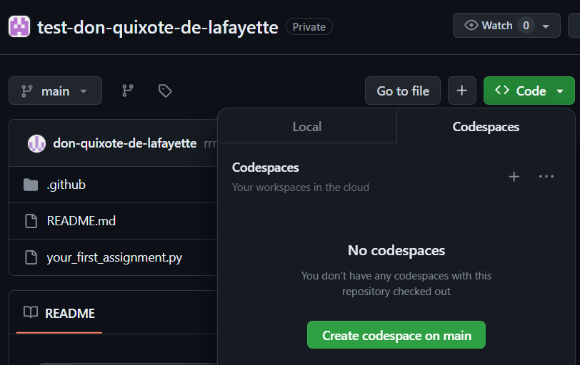
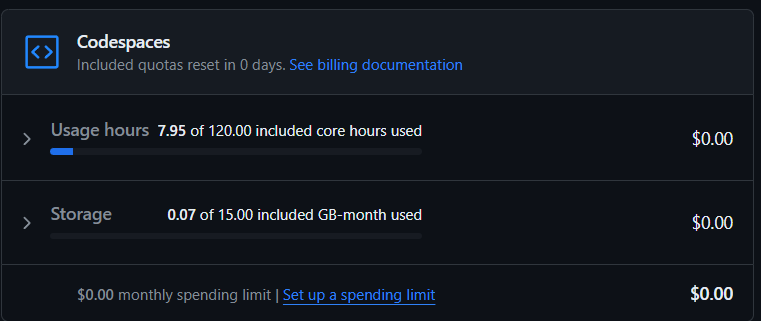
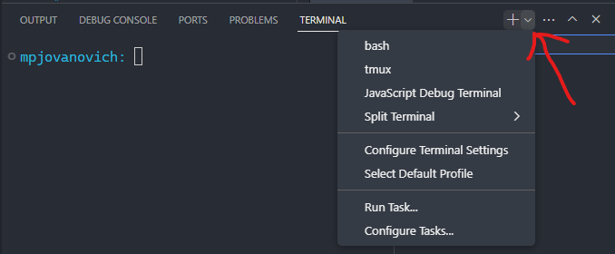
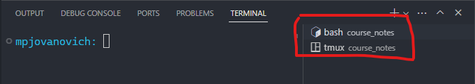
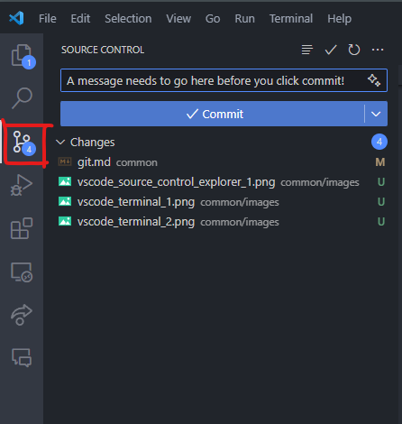
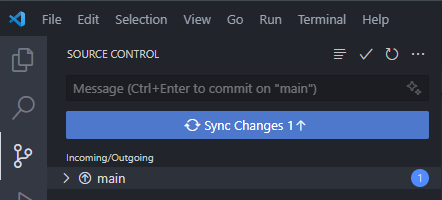
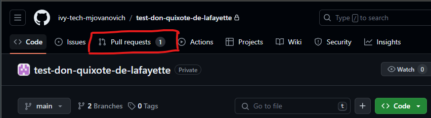
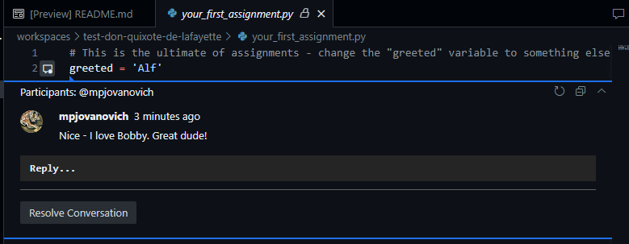
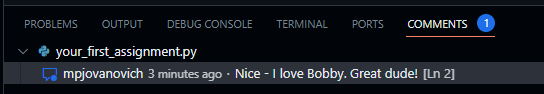
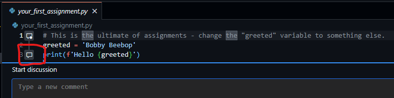

~~wrapHtml(div,schedule){

- [Source Control / Version Control](#source-control--version-control)
    - [Distributed Version Control](#distributed-version-control)
      - [Solo Projects](#solo-projects)
      - [Collaborative Projects](#collaborative-projects)
  - [The Git Workflow](#the-git-workflow)
  - [TODO](#todo)

}

# Source Control / Version Control

In these notes we will introduce Git as a version control system.

**Version control** or **source control** allows us (among other things) to be able to know what our project looked like at any point in time, e.g. last year, by keeping track of all the changes we've made to files over time.

- Stores files and their history
- Tracks changes to files over time
- Allow for point in time recovery and comparison
- Allows more than one person to work on (or examine) the same file at the same time.

### Distributed Version Control

<figure style="text-align: center;">
    
</figure>

Git is a very common version control tool that you'll almost certainly come across in your career.

---

<figure style="text-align: center;">
    
    <figcaption>"Server" is the remote. "Workstations 1-3" are local machines. Each workstation has a copy of the repository.</figcaption>
</figure>

---

Git is a **distributed** version control system. The code is saves on multiple machines, and every user has a copy of the entire history of the project on his or her own computer.

Specifically:

- **Remote**: The main machine that hosts the project.
- **Local**: Personal machine of a user.

GitHub.com is the remote that we will use.

#### Solo Projects

For small solo projects, this usually means that there is a copy of the project on:

- Your local (personal) machine
- github.com

#### Collaborative Projects

For collaborative projects, this usually means that there is a copy of the project on:

- Your local (personal) machine
- The machines of your teammates / coworkers
- github.com or another remote host server

## The Git Workflow

Project files may be different between the remote and local repository, and may be in a variety of states:

- **Modified**: Changed since last commit.
- **Staged**: Added to the next commit.
- **Committed**: Part of a commit.

---

## TODO

These notes aren't finished, so I'll have to highlight the basics in class where needed.

- Clone
- Add
- Commit
- Push
  - Status
  - Diff
- Pull
- Merge
  - Merge conflicts
- Branch
- .gitignore

<!-- TODO: Move to "GitHub Classroom" notes. -->

<!-- ### GitHub Classroom Assignments

- Each assignment will have a link.
- When you click the link, it will create a repository for you.

ALL REPOSITORIES FROM THE COURSE WILL BE DELETED AFTER THE COURSE HAS ENDED!

If you with to save your work you must fork your existing repository to your personal GitHub account.

#### Finding Repos for the Course

- You'll be put in an **organization** for the course.
- Click profile icon in top right, then click **Your organizations**:

- Click the organization for the course; it will have your repos. -->

<!-- TODO: CLI notes -->

<!-- TODO: Move to "GitHub Codespaces" notes. -->

<!-- ## GitHub Codespaces

- **GitHub Codespaces** is a virtual development environment that runs in the browser.
- Run it by clicking the green button in the top right of the repository page:
- Allows you to run VS Code in the browser.
  - Uses https://vscode.dev/ - online IDE

### Creating a Codespace

- To create
  - Go to your repository
  - Click the "Code" button
  - Click the Codespaces tab

### Closing a Codespace

GitHub gives you an allocated amount of minutes to use per month. While active, codespaces will use some of your minutes.

- To close while in the Codespace
  - Bring up the command palette with `Ctrl + Shift + P`
  - Type `Codespaces: Close Current Codespace`
- To close from the repository page
  - Go to your repository
  - Click the "Code" button
  - Click the Codespaces tab
  - Delete any active codespaces
- To check if you have existing codespaces
  - Go to: https://github.com/codespaces
  - Delete any active codespaces

**As long as your code has been pushed to GitHub, it is safe (and encouraged) to close/delete a codespace whenever you're done with a work session.**

You can always start a new one.

### Checking Your Balance

- Go to https://github.com/settings/billing/summary
- Scroll down to Codespaces:

- Note that hours listed are **core hours**.
- We use 2 core machines, so 1 hour of Codespaces usage is 2 hours of core hours.
- You should have 90 hours of Codespaces usage per month. -->

<!-- TODO: move to VS Code notes -->

<!-- ## VS Code

~~fig(20){https://cdn.thenewstack.io/media/2021/10/4f0ac3e0-visual_studio_code.png}

### VS Code Terminal

#### Terminals and Shells

Git commands are in the form `git [your_command_here] --[optional_flags_here]`.

Git commands are typed into a **terminal** which runs a **shell**.

- A **terminal** provides a user interface into a shell.

  - This is what you type commands into.
  - Like the part of the car that you see and interact with.

- A **shell** is a program that executes text **commands**.

  - This is what actually runs the command.
  - Like the "engine" of a car.
  - Usually use `bash` or `zsh` shells.

The CLI for Git can be accessed in a VS Code terminal:

- `Ctrl + ~` or `View > Terminal`.

Make sure that you are in the root directory of your project:

- Use the `pwd` command to see the current directory.

Make sure that you have the correct shell selected, _bash_ or _zsh_:

### VS Code Source Control Panel

The GUI for Git can be accessed in the VS Code Source Control Panel:

- The number in the circle indicates the number of files that have been changed.
- A commit message is required before you press the button.

After committing, you can push to GitHub with the Sync button:

 -->

<!-- ## Instructor Feedback for Assignments

### Grading Results

- After grading, your instructor will leave feedback on your assignment in GitHub.
- You may access this feedback via the GitHub website.
- Check the **Pull requests** tab:

- You will se general comments, and line-by-line comments.
- Comments can also be viewed in a Codespace.

### Asking for Help

If requesting help via email, it will help your instructor if you leave inline comments. You may do this by opening a Codespace and clicking the message icon to the left of the line number that you'd like to comment on:

## Installation

- [Git (installation and documentation)](https://git-scm.com/) -->
