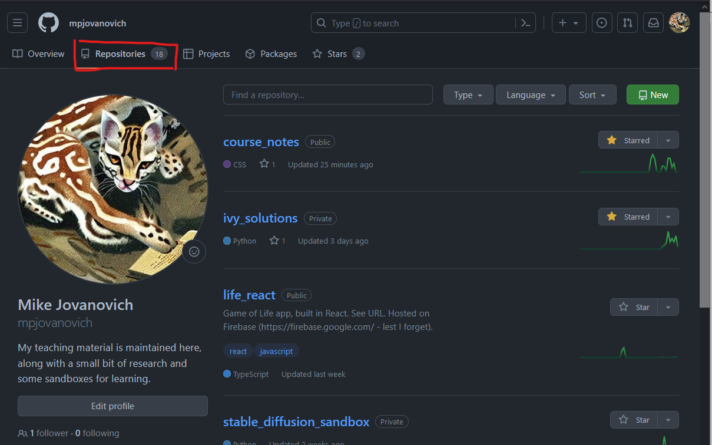

~~wrapHtml(div,schedule){

- [GitHub](#github)
- [Repositories](#repositories)
  - [Adding Files via the User Interface (UI)](#adding-files-via-the-user-interface-ui)
- [Visibility](#visibility)
  - [Public](#public)
  - [Private](#private)

}

# GitHub

<figure style="text-align: center;">
    
</figure>

**GitHub** is a website that typically hosts Git **repositories**.

You could use GitHub simply as a remote backup for any file and never learn Git, but an understanding of Git basics will make you a better developer.

# Repositories

A **repository**, or **repo**, is a collection of files and their history.

- One repository per project.

- Roughly equivalent to a folder on your computer.

- A user can have many repositories.

You can access them via the "Repositories" tab.

It's a good idea to start keeping track of your work in git repositories. Not only will it help keep your work from being lost, but it will also help you better learn Git.

## Adding Files via the User Interface (UI)

Files can be uploaded to the repository via drag and drop, or the upload (+) button:

Any new files you add will be added to the repository. Any changes you make to existing files will overwrite the previous version.

# Visibility

<figure style="text-align: center;">
  
</figure>

Repositories can be **public** or **private**.

You will be asked which you want when you create the repository. You can change it later in the repository settings.

## Public

- Anyone can see the repository. You can go to my GH account and see all of my public repos.
- Do this when you want others to see your work:
  - Collaborating on a project
  - Showing portfolio projects

## Private

- Only you can see the repository.
- Do this when you want to keep your work private:
  - Personal projects
  - Confidential projects (e.g. company projects)
  - Incomplete work (don't give your GH link out on your resume and have messy repos showing)

You can only see your private repositories if you are logged in.
