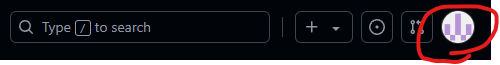
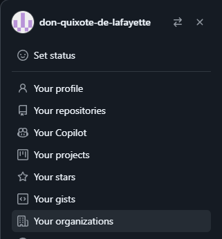
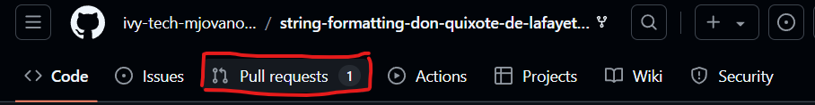
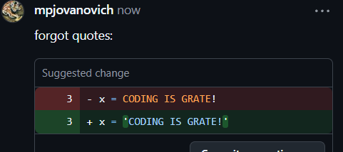
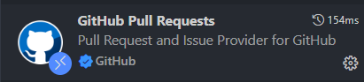
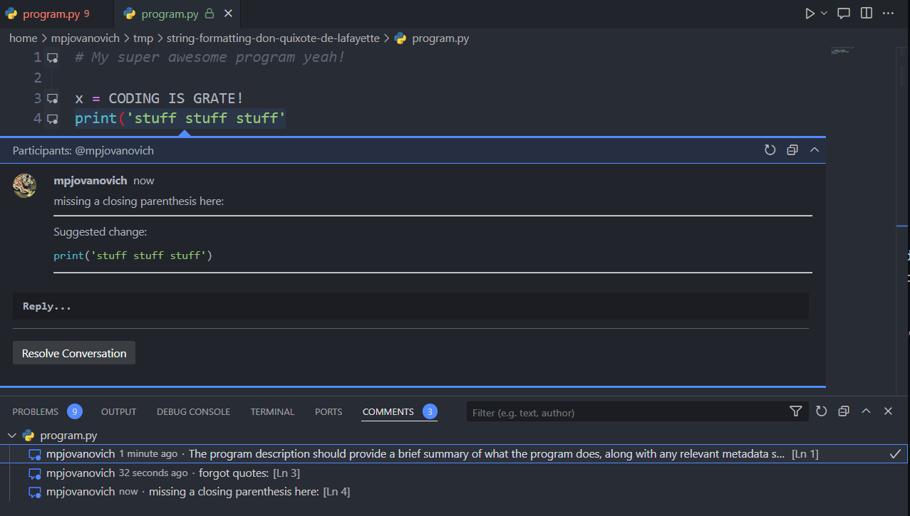

~.toc

- [GitHub Classroom](#github-classroom)
  - [Accepting Assignments](#accepting-assignments)
  - [Submitting Assignments](#submitting-assignments)
  - [Finding Your Repository (Organizations)](#finding-your-repository-organizations)
  - [Viewing Instructor Feedback](#viewing-instructor-feedback)
    - [GitHub Web](#github-web)
    - [VS Code Extension](#vs-code-extension)

/~

# GitHub Classroom

GitHub Classroom allows you to keep track of repositories that are created by your instructor for the course.

## Accepting Assignments

1. Assignments will be provided via a link in the course Canvas page for the "Lab" assignments. Once you've clicked the link, find your name in the list and click the green "Accept this assignment" button.

2. From there you can follow the blue link to the repository that was created for you.

3. Click the green "Code" button and make sure you are on the "Local" tab.

4. Copy the URL for the repository.

5. Clone the repository to your local machine. Make sure that you are in the directory where you want to clone the repository before executing the clone command.

<figure>

</figure>

## Submitting Assignments

To submit assignments you will simply push your changes to the remote repository.

Whatever shows up in the repository is what will be graded, so if you are unsure if your changes are submitted you can log into GitHub and check the repository.

You do not need to do anything in Canvas to submit assignments.

## Finding Your Repository (Organizations)

Repositories for the class will not show up in your list of personal repositories. To view them:

1. Click on your avatar (circle with a pixel image) in the top right corner.

<figure>

</figure>

2. Click on "Your organizations".

<figure>

</figure>

3. Choose "ivy-tech-mjovanovich".

4. Scroll down to the "Repositories" section.

You will see repositories listed with the name of the assignment followed by your username. You may click these links to view your repository.

## Viewing Instructor Feedback

### GitHub Web

Instructor feedback is given in the form of a **pull request**. To view it:

1. Click on the "Pull requests" tab.

<figure>

</figure>

2. Click the "Feedback" link.

You will see any comments, and possibly recommended changes in the following format:

<figure>

</figure>

### VS Code Extension

<figure>

</figure>

Optionally, you can install the "GitHub Pull Requests" extension for VS Code. This will allow you to view pull request comments directly within VS Code, which may make it easier to interpret.

You can install the extension from the Extensions Marketplace in VS Code (left sidebar, click the Extensions icon).

To view comments, click on the "Comments" tab of the bottom toolbar (the one that has the terminal in it).

<figure>

</figure>
