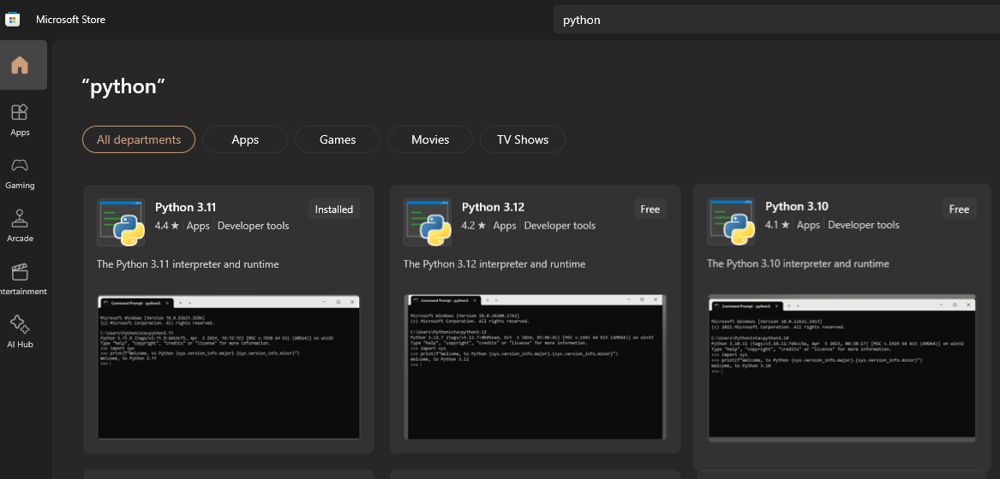

~.toc

- [Install Python](#install-python)
  - [Windows](#windows)
  - [Mac and Linux](#mac-and-linux)
- [Check if it Works](#check-if-it-works)
  - [Windows](#windows-1)
  - [Mac and Linux](#mac-and-linux-1)

/~

# Install Python

## Windows

<figure style="">

</figure>

- Open the Start Menu.
- Open Microsoft Store.
- Search for Python.
- Install the latest 3.x version.

## Mac and Linux

Install from: [Python.org](https://www.python.org/downloads/)

# Check if it Works

## Windows

Open a terminal (cmd or PowerShell) and type `python`. You may have to type `python3`.

You should see something like this:

```
Python 3.11.9 (tags/v3.11.9:de54cf5, Apr  2 2024, 10:12:12) [MSC v.1938 64 bit (AMD64)] on win32
Type "help", "copyright", "credits" or "license" for more information.
>>>
```

Type `quit()` to exit.

## Mac and Linux

Open a terminal and type `python`.

You should see something like this:

```
Python 3.11.9 (main, Apr 24 2024, 14:59:56) [GCC 12.3.1 20240227] on linux
Type "help", "copyright", "credits" or "license" for more information.
>>>
```

Type `quit()` to exit.
