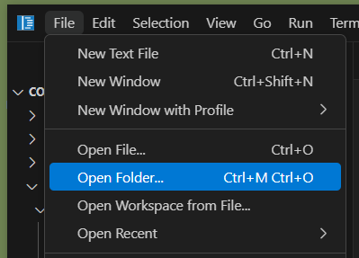
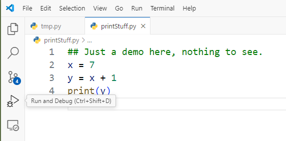
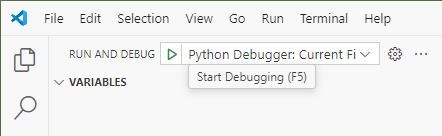
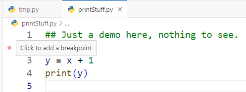
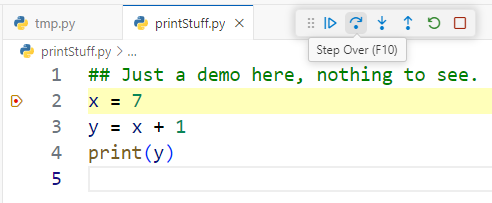
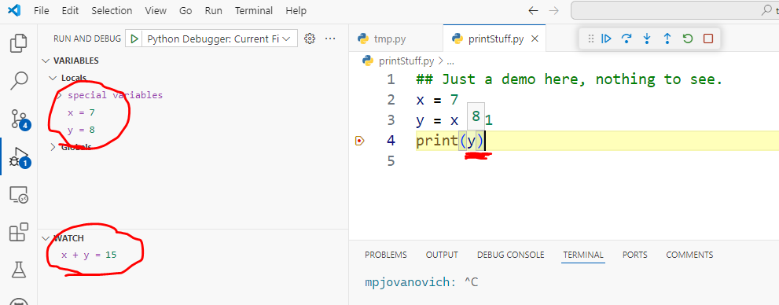

~.schedule

- [Debugging in VS Code](#debugging-in-vs-code)
  - [Switch to the Directory Containing the Code File](#switch-to-the-directory-containing-the-code-file)
  - [Begin Debugging](#begin-debugging)
  - [Breakpoints](#breakpoints)
  - [Stepping Through Code](#stepping-through-code)
  - [Watching Variables](#watching-variables)

/~

# Debugging in VS Code

We will assume that we're using Python for these examples.

## Switch to the Directory Containing the Code File

You can open a code file by double clicking it, but VS Code functions better if you open the directory containing the file.

<figure>
  
</figure>

If prompted about whether you trust the workspace, click "Yes".

_Be aware of where your files are saved! If your computer is saving to the cloud (OneDrive, Google Drive, etc.), you may not be able to debug the files._

## Begin Debugging

Find the Debug icon (looks like a bug) in the Activity Bar on the left side of the screen. Click on it.

<figure>
  
</figure>

Then click on the green play button.

_Note: there is another play button in the upper right corner of the screen. For consistency I recommend using the one in the Activity Bar._

<figure>
  
</figure>

You may then be prompted from the top bar once or twice to select the Python interpreter and choose the current file. Both times chose the default (topmost) option.

If it worked you should see any output in the terminal, something like this:

```
mpjovanovich:  cd /home/mpjovanovich/tmp ; /usr/bin/env /bin/python3 ...
8
```

## Breakpoints

The real power of debugging comes from setting breakpoints. These stop the execution of the program at specific lines and allow you to see the values of variables. You can then step through the code one line at a time to see how it executes.

To do this click in the margin to the left of the line you want to set the breakpoint on. A red dot should appear.

<figure>
  
</figure>

When starting out, it's often best to set the breakpoint on the first line that isn't a comment.

## Stepping Through Code

After setting a breakpoint and starting the debugger you should see the program halt at the breakpoint, and a new toolbar should appear at the top with several buttons.

<figure>
  
</figure>

The option descriptions can be seen by hovering over the buttons.

- **_Continue (play button)_**: Continues execution until the next breakpoint, if any. It basically "unpauses" the program.

- **_Step Over (curved right arrow button)_**: Will step to the next line of code.

- **_Step Into (down arrow button)_**: Will step to the next line of code, but if that line contains a function call it will step into the function and continue execution from there. It's the same as "step over" if you're not on a line with a function call.

- **_Step Out (left arrow button)_**: Will step out of the current function if you're in one.

- **_Restart (green circle button)_**: Will restart the program from the beginning.

- **_Stop (red square button)_**: Will stop the program. Make sure to do this before you try to run the debugger again. You can tell the debugger running if you see the debug toolbar showing and the status bar at the bottom has changed color.

## Watching Variables

Being able to see the values of variables as the program runs is extremely useful.

There are several places to check these values:

<figure>
  
</figure>

**_Hovering (Tool Tip)_**

Hovering over a variable will show you its value at that point in the program.

**_Variables View_**

All variables in scope are shown here.

**_Watch View_**

You can add your own custom expressions to watch by either:

- clicking the plus button
- highlighting an expression, right clicking, and choosing "Add to Watch"

This is useful for watching "subexpressions" that are part of a larger expression.
